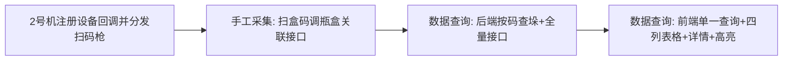

# P02-02 手工采集与 P02-04 数据查询 补充实现计划

## 一、现状与缺口概览

| 模块              | 已有                                                           | 缺口                                                                                                       |
| --------------- | ------------------------------------------------------------ | -------------------------------------------------------------------------------------------------------- |
| **P02-02 手工采集** | FXML + Controller（规格、提示、双 ListView、统计、开始/停止/清零、`onScanCode`） | ① 扫码枪数据未注入到手工采集；② 扫盒码时未调后端瓶盒关联（写库+落冷）；③ 2 号机未注册设备数据回调                                                    |
| **P02-04 数据查询** | FXML + Controller（正向/反向双模式、模拟数据、表格列与需求不一致）                   | ① 需求为**单一查询**（输入码→所属垛全量）；② 左侧应为**四列分层表格**（瓶/盒/箱/垛）+ 输入码红色；③ 右侧**选中行详情**（码、采集时间、产品编号、产品名称、生产单号）；④ 未对接真实后端 |

---

## 二、P02-02 手工采集 补充项

### 2.1 扫码枪数据注入（2 号机侧）

- **结论**：石湾 2 号机主界面为 [ShiwanM2MainWindow.fxml](miduo-frontend/src/main/resources/fxml/ShiwanM2MainWindow.fxml)，主控为 [ShiwanM2MainController.java](miduo-frontend/src/main/java/com/miduo/cloud/frontend/controller/ShiwanM2MainController.java)。当前**仅** [MainController](miduo-frontend/src/main/java/com/miduo/cloud/frontend/controller/MainController.java) 注册了 `DeviceConnectionManager.setDataReceiveHandlerWithOrder`，且 `handleBarcodeScannerData` 只分发给 `CodeQueryController` / `CodeReplaceController`，**未**分发给手工采集。
- **需做**：
  1. 在 **ShiwanM2MainController** 的 `initialize` 中注册设备数据回调（若 2 号机使用 `DeviceConnectionManager` 接收扫码枪，则在此注册 `setDataReceiveHandlerWithOrder`；若 2 号机目前未注册，则需新增注册并统一由 2 号机主控分发）。
  2. 在 2 号机主控内实现 **category=7（扫码枪）** 的分发逻辑（与技术分析一致）：
    - 若当前为**手工采集 Tab** 且**已开始采集** → 将扫码数据交给 [ShiwanM2ManualController.onScanCode](miduo-frontend/src/main/java/com/miduo/cloud/frontend/controller/ShiwanM2ManualController.java)（方法已存在，参数为 `String code`）。
    - 否则 → 走「查询码/码替换」逻辑：若当前为数据查询 Tab 则填入查询输入框并触发查询；若为数据替换 Tab 则填入对应输入框。
  3. 获取当前 Tab 与手工采集「是否已开始采集」：主控需能访问 `mainTabPane.getSelectionModel().getSelectedIndex()` 与手工采集 Tab 的 Controller 引用；手工采集 Controller 需提供 `boolean isCaptureRunning()` 或等价方法供主控判断。

### 2.2 扫盒码时调用后端瓶盒关联 + 落冷

- **需求**（[P02-02-手工采集.md](.requirement/V1.2石湾产线采集关联/页面子文档/P02-02-手工采集.md) + 技术分析）：每完成一组瓶盒关联（扫够 N 瓶后扫盒码），**立即写入与自动采集相同的表结构**并执行**落冷**（热表→冷表）；与 1 号机瓶盒写入同库同表。
- **现状**：[ShiwanM2ManualController](miduo-frontend/src/main/java/com/miduo/cloud/frontend/controller/ShiwanM2ManualController.java) 在扫盒码分支（`waitingBottle == false`）仅做前端展示（“盒码关联成功” + 生产总数 + 当前已读归零），**未调用任何后端接口**。
- **需做**：
  1. 在扫盒码分支内，在更新 UI 之前，先调用**后端瓶盒关联接口**：入参至少包含**本组瓶码列表**（当前已扫的 N 个瓶码）、**盒码**、采集时间戳、必要业务参数（如订单号/产品号若后端需要）。接口语义：写库 + 落冷，返回成功/失败及可选原因。
  2. 根据返回结果：成功则保留现有 UI 逻辑（成功文案、总数+1、当前已读归零）；失败则在数据接收区追加一条失败提示，且**不**增加生产总数、**不**归零当前已读（或按产品要求决定是否归零），并可选提示重扫盒码。
  3. 后端**石湾 2 号机手工采集瓶盒关联接口**：直接写入 **CodeRelationUpload** 表。瓶码写入 `SmallSerialNumber`，盒码写入 `MediumSerialNumber`；OrderNo、ProductNO、AddTime 取当前 2 号机**生产订单号**、**选择的产品编码**、**当前时间**；Status=0、Type=1。其余必填字段（如 BiggerSerialNumber、BigSerialNumber、DxCode、SalesCode、VirtualSerialNumber、TagNo 等）按表结构填默认/占位；若业务仍需落冷，则在写表后对瓶/盒码执行热表→冷表。接口路径与入参在技术分析/接口文档中明确。

### 2.3 可选：HID 扫码枪与隐藏输入框

- 技术分析提到「可选支持 HID：手工采集页隐藏输入框 + 回车事件注入同一条码」。若采用 HID 方案，可在手工采集 Tab 内增加隐藏输入框并监听回车，将当前输入作为一条码交给 `onScanCode`，与串口扫码枪行为一致。本计划不强制实现，可按后续需求补充。

---

## 三、P02-04 数据查询 补充项

### 3.1 需求对齐（与当前实现的差异）

- **文档要求**（[P02-04-数据查询.md](.requirement/V1.2石湾产线采集关联/页面子文档/P02-04-数据查询.md) + 技术分析 262-264 行）：
  - **单一查询**：输入任意一层码（瓶/盒/箱/垛）→ 查该码所属**垛**的完整数据（垛-箱-盒-瓶）。
  - **左侧**：分层表格，列依次为**序号、第一层（瓶码）、第二层（盒码）、第三层（箱码）、第四层（垛码）**；与**输入码**相同的单元格用**红色字体（#F44336）**；支持滚动/分页。
  - **右侧**：选中行详情 — 码、采集时间、产品编号、产品名称、生产单号；空状态提示「请点击左侧记录查看详细信息」。
  - **触发**：手动输入、扫码枪、回车触发查询。
- **当前实现**（[ShiwanM2QueryTab.fxml](miduo-frontend/src/main/resources/fxml/ShiwanM2QueryTab.fxml) + [ShiwanM2QueryController.java](miduo-frontend/src/main/java/com/miduo/cloud/frontend/controller/ShiwanM2QueryController.java)）：
  - 「正向查询」「反向查询」两个按钮，两套结果面板（正向：码值+采集时间表；反向：上级链路 + 同级表），**模拟数据**，无后端调用。
  - 无「按码→所属垛全量」的单一样式，无四列分层表，无右侧选中行详情，无输入码红色高亮。

### 3.2 前端改造要点

1. **查询模式统一为单一查询**
  - 保留一个「查询」按钮 + 回车触发；可移除「正向查询」「反向查询」双按钮，或保留为一个查询动作（文档为单一查询，建议统一为一种）。
  - 行为：输入码 → 调用后端「按码反查所属垛 → 按垛查全量关联行」接口（见下），得到该垛下所有关联行。
2. **左侧表格改为四列分层 + 输入码高亮**
  - 列：序号、第一层（瓶码）、第二层（盒码）、第三层（箱码）、第四层（垛码）。
  - 每行一条关联记录，各列填对应层级码值；若该行在该层级无数据则留空。
  - 表格渲染时：若单元格码值等于**本次查询输入的码**，则该单元格文字样式设为红色（#F44336）。可基于 `TableRow`/`TableCell` 或自定义 CellFactory 比较 `queryInput.getText().trim()` 与单元格值实现。
3. **右侧详情区 + 选中联动**
  - 右侧区域展示「具体信息」：未选行时显示「请点击左侧记录查看详细信息」；选中左侧表格某行后，展示该行的：码（瓶/盒/箱/垛有则显示）、采集时间、产品编号、产品名称、生产单号（与文档一致）。
  - 需在控制器中绑定 TableView 的 `getSelectionModel().selectedItemProperty()`，在选中变化时更新右侧详情控件（或绑定到同一 DTO 的详情字段）。
4. **状态与清空**
  - 顶部查询状态：未查询 / 正在查询… / 查询成功（已查询到 X 条）/ 未找到该码信息 / 查询服务异常；清空按钮清空输入框、左侧表格、右侧详情并恢复空状态。
5. **扫码枪与回车**
  - 若 2 号机主控将 category=7 在「非手工采集或未开始采集」时路由到数据查询 Tab，则扫码数据填入 `queryInput` 并触发同一次查询；回车在输入框上已可触发查询（当前为 `onForwardQuery`，需改为上述单一查询方法）。

### 3.3 后端接口需求

- **按码反查所属垛**：输入任意层级码，返回该码所属的**垛码**（或垛 ID）。若无则返回 404/空，前端展示「未找到该码信息」。
- **按垛查全量关联行**：输入垛码（或垛 ID），返回该垛下所有关联行，每条包含：瓶码、盒码、箱码、垛码（按层级可能部分为空）、采集时间、产品编号、产品名称、生产单号等，便于前端组「每行四列 + 详情」。
- **新增石湾专用查询接口**：入参为码值。在 **CodeRelationUpload** 表中查询 `SmallSerialNumber`（瓶码）、`MediumSerialNumber`（盒码）、`BigSerialNumber`（箱码）、`BiggerSerialNumber`（垛码）——即 [数据库设计.md](docs/石湾开发文档/数据库设计.md) 第 75-78 行对应字段——任一与入参相同的记录；查到后取该记录的 **BiggerSerialNumber**（垛码），再按 BiggerSerialNumber 查询出所有相同垛码的记录，将对应数据信息（含层级码与详情字段）返回给前端，供四列分层表格与右侧详情展示。

---

## 四、数据与依赖说明

- **数据库**：手工采集写入 **CodeRelationUpload** 表（瓶→SmallSerialNumber、盒→MediumSerialNumber，OrderNo/ProductNO/AddTime/Status/Type 见 2.2）；数据查询从 CodeRelationUpload 按码字段反查垛码再按垛查全量。
- **2 号机设备回调**：若当前 2 号机启动后未注册 `DeviceConnectionManager` 的回调，则扫码枪数据不会进入任何控制器；需在 [ShiwanM2MainController](miduo-frontend/src/main/java/com/miduo/cloud/frontend/controller/ShiwanM2MainController.java) 中完成注册并实现上述 category=7 的分发逻辑，保证手工采集与数据查询都能收到扫码数据。

---

## 五、实施顺序建议

1. **第一步**：在 ShiwanM2MainController 中注册设备数据回调，实现 category=7 向手工采集（已开始采集时）与数据查询/替换 Tab 的分发；手工采集 Controller 暴露 `isCaptureRunning()`（或等价）。
2. **第二步**：后端提供或确认手工采集瓶盒关联接口（写库+落冷）；前端在扫盒码时调用并根据结果更新 UI。
3. **第三步**：后端提供或确认「按码→垛→全量关联行」查询接口及返回结构。
4. **第四步**：数据查询前端改为单一查询、四列分层表格、输入码红色、右侧选中行详情，并对接上述查询接口；保留清空、帮助、状态与扫码/回车触发。

---

## 六、涉及文件一览

| 类型    | 文件                                                                                                                                                                                                                                            |
| ----- | --------------------------------------------------------------------------------------------------------------------------------------------------------------------------------------------------------------------------------------------- |
| 前端-主控 | [ShiwanM2MainController.java](miduo-frontend/src/main/java/com/miduo/cloud/frontend/controller/ShiwanM2MainController.java)（注册回调、category=7 分发、获取当前 Tab 与手工采集状态）                                                                              |
| 前端-手工 | [ShiwanM2ManualController.java](miduo-frontend/src/main/java/com/miduo/cloud/frontend/controller/ShiwanM2ManualController.java)（扫盒码调接口、成功/失败 UI、暴露 isCaptureRunning）                                                                          |
| 前端-查询 | [ShiwanM2QueryController.java](miduo-frontend/src/main/java/com/miduo/cloud/frontend/controller/ShiwanM2QueryController.java)、[ShiwanM2QueryTab.fxml](miduo-frontend/src/main/resources/fxml/ShiwanM2QueryTab.fxml)（单一查询、四列表格、红色高亮、右侧详情、接口对接） |
| 后端    | 手工采集：写 CodeRelationUpload（SmallSerialNumber/MediumSerialNumber + OrderNo/ProductNO/AddTime/Status=0/Type=1）；数据查询：石湾专用接口，入参码值→查码字段得垛→按 BiggerSerialNumber 查全量返回。                                                                               |

以上为 P02-02 与 P02-04 的补充实现计划，实施前请先确认后端接口的提供方式与表结构，再按顺序开发与联调。