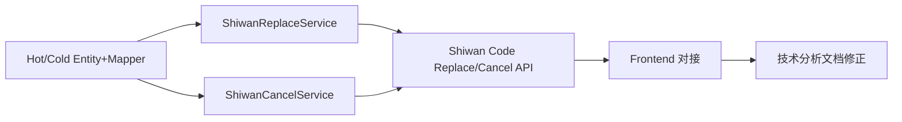

# P02-05 数据替换 / P02-06 取消关联 实现方案

## 一、需求与现状小结

- **P02-05 数据替换**：仅外码（瓶/盒/箱）；原码须在系统中存在，新码须同层级、在对应码包**热表**、未使用、非原码；已上传(IsUpload=0) 则先调云端再改本地；盖/箱有内码时需同步替换云端内码；确认弹窗+密码 123456。
- **P02-06 取消关联**：单码（瓶/盒→子查父取消上级单元）与多码（盒/箱/垛列表，按垛→箱→盒顺序）；已上传则先取消云端再取消本地；取消后码**回迁**（冷表→热表）；二次确认+密码 123456。
- **前端**：[ShiwanM2ReplaceTab.fxml](miduo-frontend/src/main/resources/fxml/ShiwanM2ReplaceTab.fxml)、[ShiwanM2CancelTab.fxml](miduo-frontend/src/main/resources/fxml/ShiwanM2CancelTab.fxml) 与对应 Controller 已实现，当前为模拟逻辑，需改为调用石湾后端接口。
- **数据库**：[数据库设计.md](docs/石湾开发文档/数据库设计.md) 中已有 CodeRelationUpload、CodePackageItemHot、CodePackageItemCold；**IsUpload** 以库表为准：**0=已上传，1=未上传**（技术分析文档中“IsUpload为1的”表示已上传需改为 IsUpload=0）。
- **码层级与 CodeRelationUpload 对应关系**（石湾）：SmallSerialNumber=瓶码(小标)、MediumSerialNumber=盒码(中标)、BigSerialNumber=箱码(大标)、BiggerSerialNumber=垛码(跺标)。PackageType：1 盖外码小标，2 盒外码中标，3 箱外码大标。

---

## 二、接口命名与云端接口设计

### 2.1 数据替换 - 标识服务中心接口（拟名）

- **接口名称**：`外码替换` / `ReplaceOuterCode`（与“仅外码、不替换内码”一致）。
- **建议路径**：`POST /api/ident/replace-outer-code`（或由标识服务中心实际路径替换，如 `/api/sign/.../ReplaceOuterCode`）。
- **请求体**：`{ "oldCode": "", "newCode": "" }`（与现有文档一致）。
- **响应**：建议统一为 `{ "errcode": "0", "errmsg": "OK", "parameter": { "updatecount": 1, "deletecount": 1 } }`（原文档中 `parameter` 为数组写法有误，应为对象）。
- **有内码时**：盖码、箱码替换时若需同步云端内码，可由同一接口在服务端根据码类型处理，或单独增加“内码同步”接口（如 `POST /api/ident/sync-inner-code`，参数 oldCode/newCode），由后端在“已上传且为盖/箱”时按需调用。

### 2.2 取消关联 - 云端接口（暂无，建议设计）

- **接口名称**：`解除关联` / `CancelCodeRelation`。
- **建议路径**：`POST /api/ident/cancel-code-relation`。
- **请求体**：按“单元”维度取消，建议：
  - 单次取消一个单元：`{ "unitType": "box|carton|pallet", "code": "箱码|盒码|垛码" }`；
  - 或批量：`{ "items": [ { "unitType": "box", "code": "xxx" }, ... ] }`。
- **响应**：`{ "errcode": "0", "errmsg": "OK" }`；失败时 `errcode` 非 0，`errmsg` 为原因。
- **说明**：客户端按“垛→箱→盒”顺序逐条调用；若云端暂无该接口，后端可先只做本地取消+回迁，云端调用处留空或返回成功，待对接时再补。

---

## 三、后端实现（miduo-variant-shiwan）

### 3.1 码包热表/冷表

- **Entity + Mapper**：在石湾 variant 中新增：
  - `CodePackageItemHot` / `CodePackageItemCold` 的 PO 与 Mapper（表结构见 [数据库设计.md](docs/石湾开发文档/数据库设计.md)）。
  - 若项目已有通用 mybatis 配置，Mapper 放在 shiwan 包下并扫描即可。
- **Service 能力**：
  - 按 `PackageType` + `CodeValue` 查热表是否存在（新码校验用）。
  - 按 `ImportId` + `PackageType` + `CodeValue` 在冷表存在则从冷表删除并在热表插入（回迁）；落冷则反向（若采集/关联流程在石湾侧有落冷逻辑，可同用此能力）。

### 3.2 数据替换服务（ShiwanReplaceService）

- **校验**：
  - 原码：在 CodeRelationUpload 中存在（IsDel=0），且能确定层级（瓶/盒/箱）及所属码包 ImportId。
  - 新码：与原码同层级；在对应 PackageType 的**热表**中存在；未在 CodeRelationUpload 中使用（即不在冷表或关联表中作为已用码）；新码≠原码。
- **执行顺序**：
  1. 查该原码关联是否已上传：CodeRelationUpload 中对应记录 IsUpload=0 视为已上传。
  2. **未上传**：校验通过后直接改本地（见下）。
  3. **已上传**：先调标识服务中心「外码替换」接口，成功后再改本地；若码类型为盖(瓶)或箱，且需求要求同步内码，再调内码同步接口（若有）。
  4. **改本地**：根据原码所在层级更新 CodeRelationUpload 中对应字段（SmallSerialNumber / MediumSerialNumber / BigSerialNumber），注意可能多条（同垛/同箱下的多行）；不改 BiggerSerialNumber（垛码为虚拟，不替换）。
  5. **冷热表**：原码若在冷表则从冷表删除；新码从热表删除并写入冷表（即“新码被使用”的落冷）。
  6. 记录 OperateLog（操作类型：数据替换；原码、新码、原因、结果）。

### 3.3 取消关联服务（ShiwanCancelService）

- **单码模式**：输入瓶码或盒码 → 在 CodeRelationUpload 中子查父（瓶→盒→箱→垛），得到“上级单元”（盒/箱/垛），取消该上级单元及其下全部。
- **多码模式**：输入盒/箱/垛码列表，识别后按**垛→箱→盒**排序去重（若盒属于某箱，取消箱时已包含该盒，后续跳过）。
- **执行顺序**：
  1. 对每个待取消单元查是否已上传（IsUpload=0）；已上传则先调云端「解除关联」接口，成功后再处理本地。
  2. 本地：CodeRelationUpload 中该单元及其下级的关联行做逻辑删除（IsDel=1 或按现有 Status=已解除 等约定）；被取消的码从冷表删除并写回热表（回迁）。
  3. 记录 OperateLog（操作类型：取消关联；单元类型、码、影响范围、结果）。
- **校验**：有上级未取消时不允许确认（前端已做禁用+提示）；后端可再次校验避免越级取消。

### 3.4 石湾专用 API 与配置

- **Controller**：在 `miduo-variant-shiwan` 下新增，例如：
  - `POST /api/shiwan/code/replace`：请求体含 oldCode、newCode、reason；返回统一 ApiResult。
  - `POST /api/shiwan/code/cancel/single`：单码取消（body 含 code）。
  - `POST /api/shiwan/code/cancel/batch`：多码取消（body 含 codeList）。
  - 可选：`GET /api/shiwan/code/recognize`：单码/多码识别（子查父、可取消性、影响范围），供前端“识别”按钮使用。
- **配置**：标识服务中心 baseUrl、外码替换路径、内码同步路径（若有）、取消关联路径写入配置文件（如 application-shiwan.yml 或现有配置），由 Service 读取后调用。

---

## 四、前端对接

- **ShiwanM2ReplaceController**：
  - 移除 `simulateReplace`；在确认密码通过后调用 `POST /api/shiwan/code/replace`，传 oldCode、newCode、reason。
  - 根据返回成功/失败刷新右侧结果区；失败时展示后端返回的 errmsg。
  - 确认弹窗中说明文案按需求：已上传先云端后本地、有内码会同步云端内码。
- **ShiwanM2CancelController**：
  - 单码：识别后调用“识别”接口（若有）或直接在后端识别；确认后调 `POST /api/shiwan/code/cancel/single`。
  - 多码：识别后调 `POST /api/shiwan/code/cancel/batch`。
  - 根据返回更新取消结果列表与识别区；部分失败时展示每条失败原因。

---

## 五、技术分析文档与约定修正

- 在 [赋码采集关联系统T1.2.0（石湾版）技术分析PM2603.md](docs/石湾开发文档/赋码采集关联系统T1.2.0（石湾版）技术分析PM2603.md) 中：
  - **3.6 P02-05**：将“IsUpload为1的”改为“**IsUpload 为 0 的**”表示已上传（与数据库 0=上传/已上传 一致）。
  - **3.3 标识服务中心**：补充完整接口名称与路径建议（如 `外码替换`、`POST /api/ident/replace-outer-code`），并修正响应中 `parameter` 为对象。
  - 新增 **取消关联 - 云端接口** 小节：接口名称、路径、请求/响应示例（采用上文 2.2 设计），并注明“若暂无则由客户端先做本地取消+回迁”。

---

## 六、实现顺序建议

1. 新增 CodePackageItemHot / CodePackageItemCold 的 PO、Mapper 及基础查询/回迁/落冷方法。
2. 实现 ShiwanReplaceService（含云端外码替换/内码同步占位、本地更新、冷热表变更、日志）。
3. 实现 ShiwanCancelService（含云端取消占位、本地逻辑删除、回迁、日志）。
4. 在 miduo-variant-shiwan 中新增 Controller 暴露 `/api/shiwan/code/replace`、`/api/shiwan/code/cancel/single`、`/api/shiwan/code/cancel/batch`（及可选 recognize）。
5. 前端 Replace/Cancel 两处 Controller 改为调用上述 API，并处理成功/失败与提示。
6. 更新技术分析文档（IsUpload 表述、数据替换接口命名与响应、取消关联云端接口设计）。

---

## 七、风险与依赖

- **标识服务中心**：实际 baseUrl、路径、认证方式需与运维/标识服务约定；内码同步是否单独接口需确认。
- **取消关联云端**：若暂无接口，后端仅做本地取消+回迁，接口设计仍写入文档便于后续对接。
- **石湾与智美斋**：石湾使用独立 `/api/shiwan/code/`*，与现有 `/api/code/replace` 互不影响；若石湾启动时未加载 shiwan variant，需确保路由仅在该 variant 下注册。

