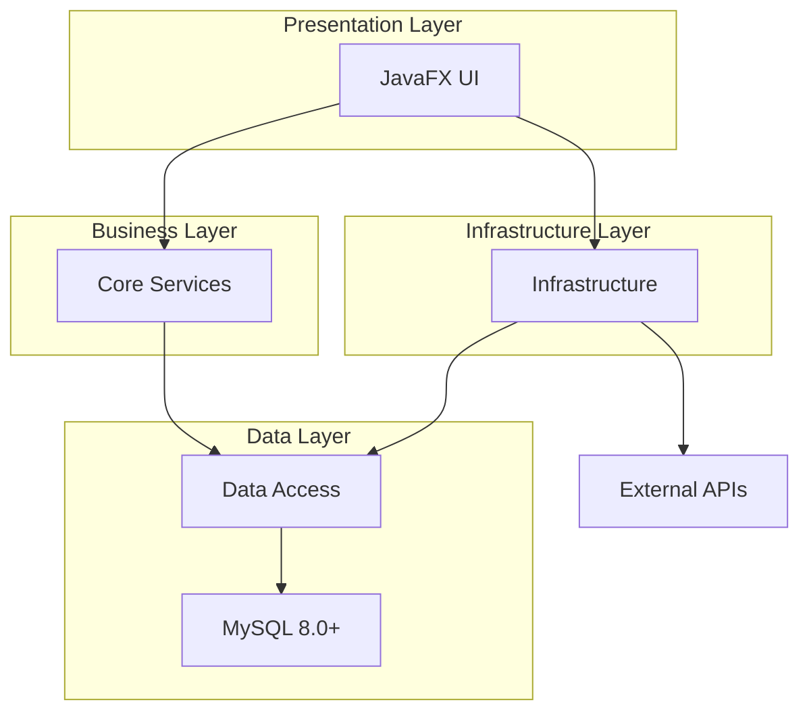

# 产线采集关联软件 PRD（产品需求文档）

## 1. 项目概述

### 1.1 项目背景
随着制造业数字化转型的深入推进，生产线的数据采集和追溯能力成为企业提升生产效率、保证产品质量的关键要素。目前企业在产线采集关联软件方面面临以下挑战：

**现状问题**：
- **依赖第三方供应商**：目前生产线改造使用的采集关联软件主要由第三方合作方提供，存在技术依赖风险，定制化需求响应缓慢，维护成本高昂
- **自研软件能力不足**：企业现有的自研采集关联软件功能过于简单，仅能满足基础的数据采集需求，缺乏复杂业务场景的处理能力
- **技术架构落后**：现有自研软件技术栈相对陈旧，处于初级开发阶段，扩展性和维护性较差
- **标准化程度低**：缺乏统一的技术标准和开发规范，各产线软件功能参差不齐，难以形成规模化应用
- **适配性不足**：现有软件对不同设备、不同产线的适配能力有限，无法快速响应多样化的生产需求

**发展需求**：
企业急需构建一套标准化、模块化、具有强大功能和高适配性的自主可控采集关联软件平台，以摆脱对第三方供应商的过度依赖，提升数字化转型的自主创新能力。该软件需要直接与生产线设备对接，在Windows工控机环境下稳定运行，并具备快速部署、灵活配置、易于维护的特点。

### 1.2 项目目标
构建一套自主可控、标准化的产线采集关联软件平台，实现：

- **技术升级**：采用现代化Java技术栈，建立标准化架构和开发规范
- **业务追溯**：自动采集各层级码关联关系，实现生产过程全程追溯
- **数据集成**：与标识平台对接，确保数据一致性和完整性
- **自主可控**：减少第三方依赖，降低运营成本和技术风险

### 1.3 项目价值
- **技术自主**：掌握核心技术，升级到现代化Java架构
- **效率提升**：自动化采集减少人工操作，提高生产效率
- **质量保障**：实现产品全程追溯，快速定位质量问题
- **成本降低**：减少第三方软件费用，提高定制化响应速度
- **规模复用**：标准化平台支持多产线部署，降低边际成本

### 1.4 项目范围
**包含范围**：
- 基于Java技术栈的跨平台桌面应用程序开发
- 生产任务管理、多层级码采集、数据上传等业务功能
- 设备驱动集成、异常处理、日志管理等技术支撑
- 完整的源代码交付和技术文档体系

**不包含范围**：
- 硬件设备采购和生产线物理改造
- 现有第三方软件升级改造
- 网络环境搭建和服务器部署
- 用户培训服务

## 2. 用户分析

### 2.1 目标用户群体

- **生产线操作员**：负责日常生产操作，使用软件进行生产任务执行
- **生产管理员**：负责生产计划制定、任务分配、数据查询分析
- **质量管理员**：负责产品质量追溯、问题排查、数据统计

### 2.2 用户需求分析

#### 2.2.1 生产线操作员需求
- 简单易用的桌面操作界面，适应工控机鼠标键盘操作
- 快速响应的设备交互，支持工业环境下的稳定运行
- 清晰的状态提示和报警信息，支持声光报警
- 最小化的人工干预，支持无人值守运行

#### 2.2.2 生产管理员需求
- 完整的生产任务管理功能
- 实时的生产进度监控
- 异常情况的及时预警

#### 2.2.3 质量管理员需求
- 完整的产品追溯链路
- 快速的问题定位能力
- 详细的质量统计报表
- 数据修正和维护功能

## 3. 用户界面设计

### 3.1 设计原则
- **工业化设计**：采用专业的桌面应用风格，模拟Windows桌面应用界面
- **操作优化**：针对工控机环境进行优化，按钮尺寸和间距适合鼠标键盘操作
- **信息层次**：清晰的信息架构，重要信息突出显示
- **操作效率**：减少操作步骤，提供快捷操作方式
- **状态反馈**：及时的操作反馈和状态提示
- **一致性**：统一的设计语言和交互模式

### 3.2 界面风格设计

#### 3.2.1 桌面应用风格
- **标题栏设计**：
  - 应用标题显示
  - 窗口控制按钮（最小化、最大化、关闭）
  - 纯色背景效果
- **菜单栏设计**：
  - 传统桌面应用菜单结构
  - 下拉菜单和子菜单支持
  - 快捷键提示
- **工具栏设计**：
  - 功能分组的文字按钮
  - 按钮悬停和点击效果
  - 工具提示显示
- **状态栏设计**：
  - 系统状态信息显示
  - 实时时间显示
  - 版本信息显示

#### 3.2.2 界面设计
- **标准版本**：完整的桌面应用界面，包含所有功能元素，采用现代化设计元素，纯色背景和阴影效果

### 3.3 布局设计

#### 3.3.1 主界面布局
- **三栏布局**：左侧信息面板、中间数据展示区、右侧控制面板
- **响应式设计**：支持不同分辨率的工控机屏幕
- **面板宽度**：左侧340px、中间自适应（最小600px）、右侧336px
- **内容居中**：整体内容最大宽度1276px，超出时居中显示

#### 3.3.2 功能页面布局
- **全宽布局**：充分利用屏幕空间
- **表格展示**：专业的数据表格设计
- **分页控制**：底部分页栏设计，支持总数量显示、每页数量切换(10/20/50/100条，默认20条/页)、手动输入页码、当前页/总页数显示
- **操作区域**：顶部工具栏和筛选栏

### 3.4 交互设计

#### 3.4.1 页面导航
- **工具栏导航**：通过主界面工具栏按钮直接跳转到功能页面
- **面包屑导航**：显示当前位置和路径
- **返回机制**：功能页面通过关闭按钮返回主界面
- **状态保持**：页面跳转后保持主界面状态

#### 3.4.2 操作反馈
- **即时反馈**：操作按钮点击后立即显示状态变化
- **进度提示**：长时间操作显示进度条
- **消息提示**：成功、警告、错误消息的统一提示
- **确认对话框**：重要操作的二次确认机制

### 3.5 视觉设计

#### 3.5.1 色彩方案
- **主色调**：蓝色系（#4a90e2）专业稳重
- **辅助色**：灰色系用于背景和边框
- **状态色**：绿色（成功）、红色（错误）、橙色（警告）、蓝色（信息）
- **纯色效果**：标题栏和按钮的纯色背景

#### 3.5.2 字体设计
- **主字体**：Microsoft YaHei，适合中文显示
- **等宽字体**：Courier New，用于代码和数据显示
- **字体大小**：10px-20px范围，适合工控机屏幕

#### 3.5.3 图标设计
- **纯文字按钮**：使用纯文字作为功能按钮，简洁明了
- **状态标签**：不同状态使用不同颜色表示
- **操作按钮**：编辑、删除、复制等操作使用文字按钮

## 4. 详细功能需求

### 4.1 主界面 - 任务执行控制

#### 4.1.1 功能概述
作为产线采集关联软件的主界面，为生产线操作员提供任务执行过程中的控制操作界面，支持任务的启用/停用、订单结单、强制满垛等操作，实时显示任务执行状态、数据采集记录、操作日志和报警信息。

#### 4.1.2 界面布局
- **桌面应用标题栏**：应用标题和窗口控制按钮
- **菜单栏**：文件、配置、数据、帮助等功能菜单
- **工具栏**：产品管理、任务管理、数据上传、查询码、码替换、清屏等功能按钮
- **左侧栏**：当前生产信息、实时上传数据区
- **中间栏**：数据接收区、操作日志、报警信息
- **右侧栏**：单位实时统计、任务控制
- **状态栏**：系统状态、时间显示等信息

#### 4.1.3 核心功能

**当前生产信息模块**：
- 生产单号：只读显示 + 选择按钮，支持订单选择对话框
- 产品编号、产品名称、产品规格：只读显示，来源于选择的订单
- 采集规格：可编辑输入框，垛:箱二级比例
- 计划数量：只读显示，来源于选择的订单
- 生产批次：可编辑输入框
- 类型：下拉选择框（有箱码、无箱码）

**实时上传数据区**：
- 垛码信息显示：P20241201001、P20241201002等
- 数量信息：1200箱等
- 上传状态：上传中（蓝色）、上传成功（绿色）、待上传（灰色）、上传失败（红色）

**数据接收区**：
- 时间 + 内容 + 状态的三列布局
- 时间精确到毫秒（2024-12-01 09:15:23.456）
- 状态类型说明：
  - 读取码状态：合格（存入数据库）、无码（规定间隔时间内未读取到码，存入数据库标记无效）、重码（不存入码关系表，写入日志）、错码（不存入码关系表，写入日志）、系统生成（存入数据库）
  - 托盘码关联状态：成功（生成虚拟垛标并建立完整码关系，推送第三方系统）、失败（箱码数据正常生成虚拟垛标存入，托盘码字段为空）
- 状态颜色区分：合格/成功/系统生成（绿色）、无码（灰色）、重码/错码/失败（红色）

**单位实时统计**：
- 当前箱数：红色突出显示，80px大字体
- 每托盘箱数：蓝色突出显示，80px大字体
- 已生产托盘数、完成度百分比

**任务控制模块**：

*生产任务控制*：
- 启用/停用切换按钮：支持启用和停用状态切换
- 订单结单：针对生产中的订单，停用后输入固定密码确认完成，订单状态变为已完成

*读码剔除控制*（环节1）：
- 读码剔除：开启/关闭读码剔除功能，控制剔除设备对无码、重码、错码的剔除动作
  - 开启状态：合格码返回通过指令，无码/重码/错码返回剔除指令
  - 关闭状态：所有码都返回通过指令

*数据采集控制*（环节2）：
- 添加码：针对当前托盘添加系统生成的箱码（按无码规则生成）
- 清除码：清除上一个采集的箱码，当前箱码数自动减1
- 指定当前箱数：弹框输入目标箱数，系统自动调整（删除多余或生成虚拟箱码）

*托盘关联控制*：
- 强制满托盘：忽略采集规格要求，以当前箱数立即形成一托盘
  - 关联成功：生成虚拟垛标，建立完整码关系，推送第三方系统
  - 关联失败：生成虚拟垛标，托盘码字段为空
- 删除本托盘无码：删除当前托盘中的无码数据，箱数相应减少
- 关闭报警：发送指令停止报警机制

#### 4.1.4 生产订单选择功能
- **对话框特性**：模态对话框，宽度1000px
- **筛选功能**：生产单号筛选、预计完工时间范围筛选
- **订单列表**：表格显示，单选模式，分页显示
- **状态过滤**：仅显示"计划"和"生产中"状态的订单

#### 4.1.5 验收标准
- 任务控制操作响应时间 ≤ 500ms
- 数据更新频率每2秒刷新
- 统计数据实时更新延迟 ≤ 1秒

### 4.2 任务管理功能

#### 4.2.1 功能概述
为生产管理人员提供生产任务的完整生命周期管理界面，支持任务的查看、修改、移除等操作，以及任务的手动添加和自动同步功能。

#### 4.2.2 界面布局
- **桌面应用标题栏**：应用标题和窗口控制
- **操作按钮栏**：添加任务、自动同步
- **筛选栏**：生产订单搜索、生产批次搜索、产品名称搜索
- **主工作区**：任务列表表格展示
- **分页栏**：标准分页控制（总数量显示、每页数量切换10/20/50/100条默认20条/页、导航按钮、手动输入页码、当前页/总页数显示）

#### 4.2.3 任务列表表格设计

| 列名 | 宽度 | 显示内容 | 操作 |
|------|------|---------|------|
| 生产单号 | 120px | 订单编号，可点击查看详情 | 查看详情 |
| 产品编号 | 100px | 产品唯一编码 | - |
| 产品名称 | 120px | 产品完整名称 | - |
| 产品规格 | 100px | 产品规格描述 | - |
| 计划数量 | 80px | 数字，千分位格式 | - |
| 完成数量 | 80px | 数字，千分位格式 | - |
| 采集规格 | 80px | 产品采集规格 | - |
| 生产批次 | 100px | 生产批次号 | - |
| 生产日期 | 100px | YYYY-MM-DD | - |
| 预计完工时间 | 120px | YYYY-MM-DD HH:MM | - |
| 下单日期 | 100px | YYYY-MM-DD | - |
| 进度状态 | 80px | 彩色状态标签 | - |
| 备注 | 120px | 任务相关备注 | - |
| 操作 | 120px | 修改、移除按钮 | 修改/移除 |

#### 4.2.4 状态标签设计

| 状态 | 背景色 | 文字色 | 说明 |
|------|-------|-------|------|
| 待生产 | #e3f2fd | #1976d2 | 任务创建但未开始生产 |
| 生产中 | #e8f5e8 | #388e3c | 任务正在执行生产 |
| 已完成 | #f3e5f5 | #7b1fa2 | 任务已完成生产 |
| 异常 | #ffebee | #d32f2f | ❌ | 任务执行异常 |

**注意**：系统自动过滤已完成状态的任务，确保界面聚焦于需要关注的活跃任务。

#### 4.2.5 核心操作功能

**添加任务**：
- 弹出任务添加模态对话框
- 生产订单自动生成（格式：PO年月日随机数）
- 产品选择后自动填充相关信息
- 表单验证，必填字段检查

**修改任务**：
- 点击修改按钮显示编辑界面
- 除生产订单号外的所有字段可编辑

**移除任务**：
- 确认对话框防止误操作
- 任务从列表中移除，实时更新

**自动同步**：
- 从外部系统同步任务数据
- 显示同步进度和结果

#### 4.2.6 验收标准
- 任务列表加载时间 ≤ 2秒
- 搜索响应时间 ≤ 1秒
- 任务操作成功率 ≥ 99%

### 4.3 产品管理功能

#### 4.3.1 功能概述
为生产管理人员提供产品信息的完整生命周期管理界面，支持产品的查看、添加、修改、删除等操作，重点支持采集规格的配置。

#### 4.3.2 界面布局
- **桌面应用标题栏**：应用标题和窗口控制
- **工具栏**：手动添加、自动同步、搜索功能
- **产品列表容器**：产品数据表格展示
- **分页栏**：标准分页控制（总数量显示、每页数量切换10/20/50/100条默认20条/页、导航按钮、手动输入页码、当前页/总页数显示）
- **产品详情面板**：右侧滑出编辑面板（350px-400px宽度）

#### 4.3.3 产品列表表格设计

| 列名 | 宽度 | 显示内容 | 说明 |
|------|------|---------|------|
| 产品编号 | 120px | 链接形式，点击查看详情 | 产品唯一标识 |
| 产品名称 | 150px | 产品完整名称 | 产品标识 |
| 产品规格 | 120px | 产品规格描述 | 规格信息 |
| 采集规格 | 100px | 智能解析显示 | 垛:箱:盒:瓶格式 |
| 操作 | 120px | 编辑、复制、删除按钮 | 产品操作 |

#### 4.3.4 采集规格配置系统

**配置界面设计**：
- 水平排列的四个输入框：垛、箱、盒、瓶
- 实时预览功能
- 不涉及的包装层级可留空

**配置规则**：
- 格式：垛:箱:盒:瓶
- 示例：1:1:12:24 表示1垛包含1箱，1箱包含12盒，1盒包含24瓶
- 验证：至少填写2种采集规格，并要求最前面的采集规格必须为1

#### 4.3.5 产品表单字段

| 字段名称 | 类型 | 必填 | 说明 |
|---------|------|------|------|
| 产品编号 | 文本输入 | ✅ | 必填，唯一性验证 |
| 产品名称 | 文本输入 | ✅ | 必填，长度限制 |
| 产品规格 | 文本输入 | ❌ | 可选字段 |
| 采集规格 | 特殊输入 | ✅ | 支持多级配置 |
| 计量单位 | 下拉选择 | ✅ | 瓶、盒、罐、杯、袋、包 |
| 产品描述 | 文本域 | ❌ | 可选字段 |

#### 4.3.6 验收标准
- 产品列表加载时间 ≤ 2秒
- 搜索响应时间 ≤ 1秒
- 产品操作成功率 ≥ 99%

### 4.4 数据上传功能

#### 4.4.1 功能概述
为生产管理人员提供生产数据的上传和管理界面，支持生产订单数据的查看、管理和上传操作，实现生产数据的完整管理和追溯功能。

#### 4.4.2 界面布局
- **桌面应用标题栏**：应用标题和窗口控制
- **顶部功能区**：一键上传、码替换、码删除、查询码功能
- **主内容区**：左右分栏布局
  - 左侧：生产订单列表展示（40%宽度）
  - 右侧：生产任务数据详情（60%宽度）

#### 4.4.3 生产订单列表设计

| 列名 | 宽度 | 显示内容 | 操作 |
|------|------|---------|------|
| 生产订单 | 120px | 订单编号，蓝色链接 | 选择订单 |
| 产品名称 | 100px | 产品完整名称 | - |
| 计划数量 | 80px | 数字，千分位格式 | - |
| 完成数量 | 80px | 数字，千分位格式 | - |
| 生产日期 | 100px | YYYY-MM-DD格式 | - |
| 生产状态 | 80px | 彩色状态标签 | - |
| 上传状态 | 80px | 彩色状态标签 | - |
| 操作 | 80px | 数据上传链接 | 数据上传 |

#### 4.4.4 生产任务数据区设计

| 列名 | 宽度 | 显示内容 | 说明 |
|------|------|---------|------|
| 第一层 | 120px | 单品码信息 | 最小包装单位码 |
| 采集时间 | 140px | YYYY-MM-DD HH:mm:ss.fff | 第一层采集时间 |
| 第二层 | 120px | 盒码信息 | 中级包装单位码 |
| 采集时间 | 140px | YYYY-MM-DD HH:mm:ss.fff | 第二层采集时间 |
| 第三层 | 120px | 箱码信息 | 高级包装单位码 |
| 采集时间 | 140px | YYYY-MM-DD HH:mm:ss.fff | 第三层采集时间 |
| 第四层 | 120px | 垛码信息 | 最高级包装单位码 |
| 赋码时间 | 140px | YYYY-MM-DD HH:mm:ss.fff | 第四层赋码时间 |

#### 4.4.5 核心操作功能

**一键上传功能**：
- 批量处理所有未上传完成的订单
- 显示批量上传进度
- 完成统计显示

**单个订单同步**：
- 针对单个订单的精确操作
- 状态检查避免重复上传

**托盘完成自动推送**：
- 托盘关联成功后自动推送数据给第三方系统
- 推送内容：托盘码、商品编号、本托盘数量
- 支持推送失败重试机制
- 记录推送状态和结果

**码替换功能**：
- 输入原码值和新码值
- 验证新码的有效性和唯一性
- 记录操作日志

**码删除功能**：
- 二次确认防止误删
- 显示码的关联信息和影响范围

**查询码功能**：
- 支持手动输入和扫码输入
- 显示完整的关联链路信息
- 支持四层级码的查询

#### 4.4.6 验收标准
- 数据上传成功率 ≥ 99.5%
- 上传失败自动重试次数 ≥ 3次
- 查询响应时间 ≤ 3秒
- 托盘完成推送成功率 ≥ 99%
- 推送响应时间 ≤ 5秒

### 4.5 码替换功能

#### 4.5.1 功能概述
为生产管理人员和维护人员提供码替换功能界面，适合处理码损坏、码错误等异常情况。

#### 4.5.2 界面布局
- **桌面应用标题栏**：应用标题和窗口控制
- **主内容区**：码替换表单区域（最大宽度600px，居中显示）
- **状态栏**：操作统计和时间信息

#### 4.5.3 表单字段设计
- **原码输入**：支持手动输入和扫码输入，必填字段
- **新码输入**：支持手动输入和扫码输入，必填字段
- **替换原因输入**：文本域，可选字段，用于记录操作日志

#### 4.5.4 操作按钮设计
- **清空按钮**：灰色背景，清空所有输入字段
- **确认替换按钮**：蓝色背景，触发替换确认流程

#### 4.5.5 确认对话框设计
- 显示替换信息确认：原码值、新码值、替换原因
- 警告文字：此操作不可恢复，请仔细核对后确认！
- 取消和确认替换按钮

#### 4.5.6 验收标准
- 操作响应时间 ≤ 500ms
- 替换成功率 ≥ 99%
- 操作日志记录完整性 ≥ 100%

### 4.6 查询码功能

#### 4.6.1 功能概述
为生产管理人员和质量控制人员提供专业的码查询功能界面，支持多层级码关联查询，适合生产线码追溯和质量管理场景。

#### 4.6.2 界面布局
- **桌面应用标题栏**：应用标题和窗口控制
- **操作按钮栏**：码输入框、查询按钮、清空按钮、扫码按钮
- **主内容区**：左右分栏布局
  - 左侧：码关联面板（65%宽度）
  - 右侧：具体信息区（35%宽度）
- **状态栏**：查询统计和时间信息

#### 4.6.3 码关联面板设计

**关联表格设计**：

| 列名 | 宽度 | 显示内容 | 样式说明 |
|------|------|---------|---------|
| 第一层 | 120px | L1_XXX_XXXX 格式码 | 蓝色文字，可点击查询 |
| 采集时间 | 140px | YYYY/MM/DD HH:mm:ss.SSS | 等宽字体，灰色文字 |
| 第二层 | 120px | L2_XXX_XXXX 格式码 | 绿色文字，可点击查询 |
| 采集时间 | 140px | YYYY/MM/DD HH:mm:ss.SSS | 等宽字体，灰色文字 |
| 第三层 | 120px | L3_XXX_XXXX 格式码 | 橙色文字，可点击查询 |
| 采集时间 | 140px | YYYY/MM/DD HH:mm:ss.SSS | 等宽字体，灰色文字 |
| 第四层 | 120px | L4_XXX_XXXX 格式码 | 紫色文字，可点击查询 |
| 采集时间 | 140px | YYYY/MM/DD HH:mm:ss.SSS | 等宽字体，灰色文字 |

**层级码样式设计**：

| 层级 | 文字色 | 悬停色 | 背景色（当前查询） | 说明 |
|------|-------|-------|------------------|------|
| 第一层 | #1976d2 | #0d47a1 | #e3f2fd | L1开头的一级码 |
| 第二层 | #388e3c | #1b5e20 | #e8f5e8 | L2开头的二级码 |
| 第三层 | #f57c00 | #e65100 | #fff3e0 | L3开头的三级码 |
| 第四层 | #7b1fa2 | #4a148c | #f3e5f5 | L4开头的四级码 |

#### 4.6.4 具体信息区设计

**具体信息卡片**：
- 产品编号：链接形式，点击查看产品详情
- 产品名称：主要标识信息，字体加粗
- 产品规格、计量单位、包装层级
- 生产批次：批次编号，突出显示
- 生产日期、生产班次、生产线
- 质检状态、码状态：彩色状态标签

**状态标签设计**：

| 状态类型 | 状态值 | 背景色 | 文字色 | 说明 |
|---------|-------|-------|-------|------|
| 码状态 | 正常 | #d4edda | #155724 | 正常使用状态 |
| 码状态 | 异常 | #f8d7da | #721c24 | 异常状态 |
| 码状态 | 已使用 | #fff3cd | #856404 | 已消费状态 |
| 质检状态 | 合格 | #d4edda | #155724 | 质检通过 |
| 质检状态 | 不合格 | #f8d7da | #721c24 | 质检不通过 |
| 质检状态 | 待检 | #d1ecf1 | #0c5460 | 等待质检 |

#### 4.6.5 查询功能设计

**查询方式**：
- 手动输入：支持键盘输入码信息
- 扫码输入：支持扫码枪直接输入
- 关联查询：点击关联码标签查询

**查询触发**：
- 查询按钮：点击查询按钮
- 回车键：输入框中按回车键
- 自动查询：扫码枪输入后自动触发

#### 4.6.6 验收标准
- 查询响应时间 ≤ 1秒
- 查询成功率 ≥ 99%
- 关联信息完整性 ≥ 100%

### 4.7 系统配置功能

#### 4.7.1 功能概述
为系统管理员和维护人员提供系统级参数的配置管理界面，支持IO控制设备管理、打印模块配置、报警设置等关键系统参数的设置和管理。

#### 4.7.2 界面布局
- **桌面应用标题栏**：应用标题和窗口控制
- **主工作区**：左右分栏布局
  - 左侧：系统配置区域（900px宽度）
    - 选项卡区：功能分类配置选项卡
    - 工具栏区：操作按钮
    - 参数配置区：当前选项卡的参数设置表单
  - 右侧：设备状态监控区域
- **状态栏**：配置状态和系统信息

#### 4.7.3 选项卡设计
- **IO控制配置**：⚡ IO设备管理、剔除装置配置
- **打印模块配置**：打印机管理和配置
- **报警设置**：声音报警配置

#### 4.7.4 IO控制配置

**IO设备管理**：
- 设备列表：显示所有已配置的IO设备
- 设备操作：支持添加、编辑、删除IO设备
- 设备状态：实时显示设备在线/离线状态
- 设备测试：支持单个设备和全部设备连接测试

**IO设备配置字段**：
- 设备名称：自定义设备名称标识
- 设备类型：Modbus设备、PLC设备、IO模块、自定义设备
- 连接方式：网口/串口连接选择
- 网口配置：IP地址、端口号设置
- 串口配置：串口号、波特率选择
- 通信参数：超时时间、重试次数配置
- 设备状态：启用/禁用状态设置

#### 4.7.5 打印模块配置

**打印机管理**：
- 打印机列表：显示所有已配置的打印机
- 打印机操作：支持添加、编辑、删除打印机
- 打印机状态：实时显示打印机在线/离线状态
- 打印机测试：支持连接和打印测试

**打印机配置字段**：
- 打印机名称：自定义打印机名称标识
- 本地打印模块路径：打印模块可执行文件路径
- 打印机状态：启用/禁用状态设置
- 打印机描述：打印机用途和备注信息

#### 4.7.6 报警设置

**报警配置**：
- 声音报警：启用/禁用声音报警功能
- 报警延时：报警触发延时时间设置（0-300秒）
- 报警间隔：报警重复间隔时间设置（10-3600秒）

**报警功能**：
- 测试报警：测试当前报警配置是否正常
- 应用配置：应用报警设置到系统
- 重置配置：恢复报警设置默认值

#### 4.7.7 设备状态监控区域

**设备状态显示**：
- IO设备名称和类型
- 连接状态指示：绿色（在线）、红色（离线）、黄色（异常）、灰色（禁用）
- 设备连接信息
- 设备状态更新

#### 4.7.8 验收标准
- 界面切换时间 ≤ 1秒
- 参数保存时间 ≤ 2秒
- 设备连接测试 ≤ 5秒
- 配置应用时间 ≤ 3秒

## 5. 业务流程分析

### 5.1 码状态定义

#### 5.1.1 读取码状态（从读码器获取数据后的业务判断结果）
- **合格**：读取的码符合规范且有效，属于有效码
- **无码**：读码器在规定间隔时间内未读取到码对应码，属于有效码（需要计数）
- **重码**：读取到的码在系统中已存在（重复码），属于无效码（不计数）
- **错码**：读取到的码格式错误或不符合规范，属于无效码（不计数）

#### 5.1.2 码有效性判断（用于采集关联环节）
- **有效码**：包括合格码和无码，需要进行箱码计数+1，存入code_collection_record表
  - 合格码：is_valid=TRUE
  - 无码：is_valid=FALSE
- **无效码**：包括重码和错码，不进行计数，不存入码关系表，会写入日志，在界面显示

#### 5.1.3 托盘关联状态（满托盘时采集关联托盘码的结果）
- **成功**：托盘关联成功，系统自动生成虚拟垛标，与前面采集的箱码组成完整码关系存入采集关系表，同时推送数据给第三方系统
- **失败**：托盘关联失败，箱码数据正常生成虚拟垛标存入采集关系表，但对应托盘码字段为空，其他字段正常有值

#### 5.1.4 满托盘触发方式
- **自动满托盘**：系统按采集规格要求，达到预设托盘箱数时自动触发托盘码关联
- **强制满托盘**：手动点击强制满托盘按钮，忽略采集规格要求，以当前箱数立即触发托盘码关联

### 5.2 整体业务流程

#### 5.2.1 采集关联软件初始化配置（使用前一次性配置）
```
设备接口配置 → 系统参数配置 → 产品信息配置 → 系统测试验证
```

#### 5.2.2 每次生产业务流程
```
生产计划下达 → 生产任务创建 → 选择任务 → 完善生产任务信息 → 生产执行 → 数据采集 → 关联建立 → 数据上传 → 统计分析
```

### 5.3 详细作业流程

#### 5.3.1 二级关联采集模式（托盘码关联箱码）

**当前模式（致美斋产线）：商品包装比例为1：N，其中1为托盘码，N为最小计量单位（对应第一层）**

**完整作业流程**：
```
生产任务启用
↓
[环节1：读码剔除控制] - 操作人员可开启/关闭
├─ 开启状态：合格码→通过指令，无码/重码/错码→剔除指令
└─ 关闭状态：所有码→通过指令
↓
[环节2：采集关联关系建立] - 系统自动执行
采集设备获取箱码 → 程序校验有效性
├─ 有效码（合格、无码）→ 存入采集关系表 → 箱码计数+1
└─ 无效码（重码、错码）→ 写入日志 → 不计数
↓
达到托盘规格数量 → 触发托盘关联
├─ 自动满托盘：按采集规格自动触发
└─ 强制满托盘：操作人员手动触发
↓
托盘关联处理
├─ 关联成功：生成虚拟垛标 → 建立完整码关系 → 推送第三方系统
└─ 关联失败：生成虚拟垛标 → 托盘码字段为空 → 记录异常
↓
完成一托盘的关系采集生产
```

**关键控制点**：
- 读码剔除：物理层面的质量控制，可独立开启/关闭
- 数据采集：逻辑层面的数据处理，自动执行有效性判断
- 托盘关联：业务层面的关系建立，支持自动和手动触发

## 6. 非功能性需求

### 6.1 性能需求
- **响应时间**：
  - 码识别响应时间 ≤ 100ms
  - 界面操作响应时间 ≤ 1秒
  - 界面切换响应时间 ≤ 2秒
  - 数据查询响应时间 ≤ 3秒
  - 本地报表生成时间 ≤ 5秒

- **吞吐量**：
  - 支持每分钟处理 ≥ 1000个码
  - 支持单机单用户操作
  - 支持24小时×7天连续运行
  - 支持同时连接多个采集设备

- **资源占用**：
  - CPU占用率 ≤ 50%（工控机性能有限）
  - 内存占用 ≤ 2GB
  - 磁盘空间占用增长 ≤ 500MB/月
  - 启动时间 ≤ 30秒

### 6.2 可靠性需求
- **系统可用性**：≥ 99.5%（工控机环境下）
- **数据准确性**：≥ 99.9%
- **故障恢复时间**：≤ 3分钟（自动重启）
- **数据备份**：每日自动备份到本地，保留30天
- **断电保护**：支持UPS断电保护，数据不丢失
- **系统稳定性**：连续运行7天无崩溃

### 6.3 安全性需求
- **数据加密**：敏感配置数据加密存储
- **操作审计**：完整的本地操作日志记录
- **系统安全**：防止未授权访问，支持屏幕锁定
- **数据安全**：本地数据库访问控制，防止数据泄露

### 6.4 可维护性需求
- **代码规范**：遵循Java开发规范和团队编码标准
- **文档完整**：提供完整的技术文档和用户手册
- **模块化设计**：采用MVC模式，支持功能模块独立开发
- **监控告警**：提供本地监控和声光报警机制
- **远程维护**：支持远程桌面维护（可选）
- **日志分析**：提供详细的运行日志便于问题诊断
- **版本管理**：支持Java应用版本自动更新

### 6.5 兼容性需求
- **操作系统**：支持Windows 10/11（工控机专用版本）
- **运行环境**：Java 11/17/21 JRE
- **数据库**：MySQL 8.0+
- **硬件要求**：最低4GB内存，100GB可用磁盘空间
- **设备接口**：支持RS232、RS485、TCP/IP、USB接口
- **分辨率支持**：1024x768 ~ 1920x1080，支持鼠标键盘操作

## 7. 技术架构

### 7.1 总体架构
采用Java桌面应用程序架构，支持跨平台部署，主要部署在Windows工控机上，支持本地数据存储和远程数据同步。

```
┌─────────────────────────────────────────────────────────────────┐
│                    Windows工控机环境                            │
│  ┌─────────────────┐    ┌─────────────────┐    ┌─────────────────┐ │
│  │   用户界面层    │    │   设备接口层    │    │   外部通信层    │ │
│  │   JavaFX/Swing │    │  串口/网口驱动  │    │   HTTP Client  │ │
│  └─────────────────┘    └─────────────────┘    └─────────────────┘ │
│           │                       │                       │       │
│  ┌─────────────────────────────────────────────────────────────────┐ │
│  │                        应用服务层                               │ │
│  │                    Spring Boot/Java SE                        │ │
│  └─────────────────────────────────────────────────────────────────┘ │
│           │                       │                       │       │
│  ┌─────────────────┐    ┌─────────────────┐    ┌─────────────────┐ │
│  │   业务逻辑层    │    │   数据访问层    │    │   配置管理层    │ │
│  │  Service层     │    │  MyBatis/JPA     │    │  Configuration │ │
│  └─────────────────┘    └─────────────────┘    └─────────────────┘ │
│                                   │                               │
│                       ┌─────────────────┐                        │
│                       │   数据存储层    │                        │
│                       │     MySQL      │                        │
│                       │     8.0+       │                        │
│                       └─────────────────┘                        │
└─────────────────────────────────────────────────────────────────┘
                                   │
                       ┌─────────────────┐
                       │   远程服务器    │
                       │   标识平台     │
                       └─────────────────┘
```

### 7.1.1 Java项目结构设计

```
ProductionLineCollectionSoftware/
├── src/main/java/
│   └── com/company/productionline/
│       ├── core/                      # 核心业务逻辑层
│       │   ├── model/                 # 数据模型
│       │   │   ├── ProductionTask.java
│       │   │   ├── Product.java
│       │   │   ├── CodeCollection.java
│       │   │   └── SystemConfig.java
│       │   ├── service/               # 业务服务
│       │   │   ├── ProductionTaskService.java
│       │   │   ├── CodeCollectionService.java
│       │   │   └── DataUploadService.java
│       │   ├── repository/            # 数据访问层
│       │   │   ├── ProductionTaskRepository.java
│       │   │   ├── ProductRepository.java
│       │   │   └── CodeCollectionRepository.java
│       │   └── common/                # 通用工具类
│       │       ├── Constants.java
│       │       └── Utils.java
│       │
│       ├── infrastructure/            # 基础设施层
│       │   ├── communication/         # 设备通信
│       │   │   ├── SerialPortManager.java
│       │   │   ├── NetworkManager.java
│       │   │   └── DeviceDrivers/
│       │   ├── logging/              # 日志管理
│       │   ├── config/               # 配置管理
│       │   └── external/             # 外部服务集成
│       │
│       ├── ui/                       # JavaFX用户界面层
│       │   ├── controller/           # 控制器
│       │   │   ├── MainController.java
│       │   │   ├── TaskManagementController.java
│       │   │   ├── ProductManagementController.java
│       │   │   ├── DataUploadController.java
│       │   │   ├── CodeQueryController.java
│       │   │   ├── CodeReplaceController.java
│       │   │   └── SystemConfigController.java
│       │   ├── view/                 # 视图组件
│       │   ├── dialog/               # 对话框
│       │   └── component/            # 自定义组件
│       │
│       └── Application.java          # 主应用程序类
│
├── src/main/resources/
│   ├── fxml/                         # FXML视图文件
│   │   ├── MainWindow.fxml
│   │   ├── TaskManagement.fxml
│   │   ├── ProductManagement.fxml
│   │   ├── DataUpload.fxml
│   │   ├── CodeQuery.fxml
│   │   ├── CodeReplace.fxml
│   │   └── SystemConfig.fxml
│   ├── css/                          # 样式文件
│   ├── images/                       # 图片资源
│   ├── i18n/                         # 国际化资源
│   ├── application.properties        # 应用配置
│   ├── database.properties           # 数据库配置
│   └── devices.properties            # 设备配置
│
├── src/test/java/                    # 测试代码
│   └── com/company/productionline/
│       ├── unit/                     # 单元测试
│       ├── integration/              # 集成测试
│       └── ui/                      # UI测试
│
├── docs/                            # 文档
│   ├── API/                         # API文档
│   ├── Architecture/                # 架构文档
│   └── UserGuide/                  # 用户指南
│
├── scripts/                        # 构建脚本
│   ├── build.sh
│   ├── deploy.sh
│   └── database-setup.sql
│
├── config/                         # 外部配置文件
│   ├── application.yml
│   ├── database.yml
│   └── devices.yml
│
├── pom.xml                         # Maven项目文件
└── README.md                       # 项目说明
```

### 7.1.2 核心模块依赖关系



### 7.1.3 MVVM架构实现

```java
// JavaFX Controller基类
public abstract class BaseController {
    protected final Logger logger = LoggerFactory.getLogger(getClass());
    
    @FXML
    public void initialize() {
        initializeComponents();
        bindProperties();
        setupEventHandlers();
    }
    
    protected abstract void initializeComponents();
    protected abstract void bindProperties();
    protected abstract void setupEventHandlers();
    
    protected void showAlert(Alert.AlertType type, String title, String message) {
        Alert alert = new Alert(type);
        alert.setTitle(title);
        alert.setHeaderText(null);
        alert.setContentText(message);
        alert.showAndWait();
    }
}

// 命令模式实现
public class Command {
    private final Runnable action;
    private final BooleanSupplier canExecute;
    
    public Command(Runnable action) {
        this(action, () -> true);
    }
    
    public Command(Runnable action, BooleanSupplier canExecute) {
        this.action = Objects.requireNonNull(action);
        this.canExecute = Objects.requireNonNull(canExecute);
    }
    
    public void execute() {
        if (canExecute()) {
            action.run();
        }
    }
    
    public boolean canExecute() {
        return canExecute.getAsBoolean();
    }
}
```

// ... existing code ...

## 8. 开发计划

### 8.1 项目里程碑

#### 第一阶段：需求分析与设计（2周）
- **Week 1**：需求调研、用户访谈、竞品分析
- **Week 2**：系统设计、数据库设计、接口设计

**交付物**：
- 完善的PRD文档
- 系统架构设计文档
- 数据库设计文档
- 接口设计文档

#### 第二阶段：基础框架搭建（2周）
- **Week 3**：开发环境搭建、JavaFX项目框架搭建、设备驱动程序框架
- **Week 4**：核心模块框架开发、MySQL数据库初始化、MVC架构搭建

**交付物**：
- JavaFX应用程序基础框架
- MySQL数据库脚本
- 设备通信驱动框架
- 开发环境配置文档

#### 第三阶段：核心功能开发（6周）
- **Week 5-6**：生产任务管理模块
- **Week 7-8**：码采集与关联模块
- **Week 9-10**：数据管理与查询模块

**交付物**：
- 核心功能模块代码
- 单元测试用例
- 功能测试报告

#### 第四阶段：集成与优化（3周）
- **Week 11**：系统集成测试
- **Week 12**：性能优化与调试
- **Week 13**：用户验收测试

**交付物**：
- 集成测试报告
- 性能测试报告
- 用户验收测试报告

#### 第五阶段：部署上线（1周）
- **Week 14**：Java应用打包、工控机部署测试、现场安装调试

**交付物**：
- Java应用安装程序（jpackage或Install4j）
- 工控机部署文档
- Java Runtime环境配置指南
- 设备连接调试手册
- 用户操作手册

### 8.2 资源配置

#### 8.2.1 人员配置
- **项目经理**：1人，全程参与
- **产品经理**：1人，前期重点参与
- **架构师**：1人，前期重点参与
- **界面开发**：2人，第2-4阶段重点参与
- **后端开发**：3人，第2-4阶段重点参与
- **测试工程师**：2人，第3-4阶段重点参与
- **运维工程师**：1人，第4-5阶段重点参与

#### 8.2.2 技术资源
- **开发环境**：10台开发机器（IntelliJ IDEA或Eclipse）
- **测试环境**：3台Windows工控机（模拟生产环境）
- **生产环境**：实际产线工控机
- **数据库**：MySQL本地数据库
- **开发工具**：IntelliJ IDEA、Maven/Gradle、Git、jpackage/Install4j

### 8.3 风险控制

#### 8.3.1 技术风险
- **风险**：工控机硬件兼容性问题
- **应对措施**：提前在目标工控机上进行兼容性测试，准备多种硬件适配方案

- **风险**：设备驱动程序开发复杂性
- **应对措施**：早期进行设备通信协议分析，开发通用设备驱动框架

- **风险**：工控机性能限制
- **应对措施**：优化代码性能，采用轻量级数据库，减少资源占用

#### 8.3.2 进度风险
- **风险**：需求变更导致进度延期
- **应对措施**：严格控制需求变更，建立变更评估机制

- **风险**：关键人员离职
- **应对措施**：做好知识传承，建立备用人员计划

#### 8.3.3 质量风险
- **风险**：工控机环境下系统稳定性问题
- **应对措施**：进行长时间稳定性测试，建立自动重启和故障恢复机制

- **风险**：界面操作体验问题
- **应对措施**：优化界面设计，进行用户体验测试，适配不同分辨率屏幕

- **风险**：设备通信可靠性问题
- **应对措施**：建立完善的设备监控和自动重连机制，制定设备故障应急预案

## 9. 验收标准

### 9.1 功能验收标准

#### 9.1.1 任务执行控制
- [ ] 支持任务创建、启动、停止、完成等全生命周期管理
- [ ] 支持服务平台推送和手工录入两种任务来源
- [ ] 实时显示生产统计信息（垛总数、箱总数、成功数、失败数、扫码率）
- [ ] 支持任务查询和历史记录查看

#### 9.1.2 码采集功能
- [ ] 支持二级、三级、四级关联采集模式
- [ ] 码识别准确率 ≥ 99.9%
- [ ] 码校验响应时间 ≤ 100ms
- [ ] 支持多种码格式（条码、二维码等）

#### 9.1.3 数据管理功能
- [ ] 支持按码查询、按任务查询等多种查询方式
- [ ] 支持码替换、码删除等数据维护功能
- [ ] 查询响应时间 ≤ 3秒
- [ ] 数据修正成功率 ≥ 99%

#### 9.1.4 数据上传功能
- [ ] 支持定时自动上传和手动触发上传
- [ ] 数据上传成功率 ≥ 99.5%
- [ ] 支持断点续传和失败重试
- [ ] 提供上传状态监控和进度显示

### 9.2 性能验收标准
- [ ] 系统响应时间：界面操作 ≤ 1秒，码识别 ≤ 100ms
- [ ] 系统吞吐量：支持每分钟处理 ≥ 1000个码
- [ ] 系统可用性：≥ 99.5%
- [ ] 连续运行：支持24小时×7天稳定运行
- [ ] 资源占用：CPU ≤ 50%，内存 ≤ 2GB
- [ ] 启动时间：≤ 30秒

### 9.3 安全验收标准
- [ ] 关键操作确认机制正常工作
- [ ] 基础操作日志记录完整
- [ ] 数据自动备份功能正常
- [ ] 配置文件完整性验证
- [ ] 数据库连接安全稳定

### 9.4 兼容性验收标准
- [ ] 支持Windows 10/11工控机操作系统
- [ ] 支持鼠标键盘操作
- [ ] 支持多种设备接口（RS232、RS485、TCP/IP）
- [ ] 与现有标识平台正常对接
- [ ] 支持不同分辨率的工控机屏幕
- [ ] 在工业环境下稳定运行24小时以上

## 10. 附录

### 10.1 术语表
- **码**：产品上的标识符，包括条码、二维码等
- **层级码**：不同包装层级的码，如单品码、盒码、箱码、垛码
- **关联关系**：不同层级码之间的包含关系
- **虚拟垛标**：系统自动生成的垛级标识
- **剔除指令**：指示生产线剔除不合格产品的控制指令

### 10.2 参考文档
- 《项目规则与规范》
- 《原生功能描述》
- 《Java桌面应用开发规范》
- 《JavaFX开发指南》
- 《工控机部署指南》
- 《设备通信协议文档》
- 《MySQL数据库设计规范》

### 10.3 变更记录
| 版本 | 日期 | 变更内容 | 变更人 |
|------|------|----------|--------|
| V1.0 | 2024-XX-XX | 初始版本 | 产品经理 |
| V2.0 | 2024-XX-XX | 完善标准PRD结构 | 产品经理 |
| V2.1 | 2024-XX-XX | 调整为Windows工控机桌面应用架构 | 产品经理 |
| V2.2 | 2024-XX-XX | 技术栈调整为Java桌面应用 | 产品经理 |
| V2.3 | 2024-12-XX | 技术栈更正为Java框架 | 产品经理 |
| V3.1 | 2024-12-XX | 技术栈最终确定为Java框架 | 产品经理 |
| V3.0 | 2024-12-XX | 根据已实现功能修正PRD，添加界面设计章节，重新组织功能需求 | 产品经理 |
| V4.0 | 2024-12-XX | 基于doc1文档和界面原型全面补充完善PRD，添加详细UI规格和交互设计 | 产品经理 |
| V4.1 | 2024-12-XX | 删除用户权限登录相关功能，本期不涉及用户权限控制 | 产品经理 |
| V4.2 | 2024-12-XX | 数据存储技术栈统一修正为MySQL 8.0+，更新所有数据库相关内容和SQL语法 | 产品经理 |

---

**文档状态**：已完善  
**下一步行动**：组织PRD评审会议，确认Java技术栈和工控机部署方案，收集技术团队反馈意见，开始详细设计和开发工作

### 7.2 技术选型

#### 7.2.1 桌面应用技术栈
- **开发语言**：Java 11/17/21
- **应用框架**：Spring Boot 3.x
- **UI框架**：JavaFX 17+ 或 Swing
- **UI组件库**：ControlsFX、JFoenix
- **依赖注入**：Spring Framework
- **配置管理**：Spring Boot Configuration
- **日志框架**：Logback 或 Log4j2

#### 7.2.2 数据访问技术栈
- **ORM框架**：MyBatis-Plus 或 Spring Data JPA
- **本地数据库**：MySQL 8.0+
- **连接池**：内置连接池管理
- **数据迁移**：Flyway 或 Liquibase
- **数据缓存**：MemoryCache 或 Redis (本地缓存)

#### 7.2.3 设备通信技术栈
- **串口通信**：jSerialComm 或 RXTX
- **网络通信**：Netty 或 Java NIO
- **HTTP通信**：OkHttp 或 Apache HttpClient
- **设备驱动**：自定义Java设备驱动程序

#### 7.2.4 部署和安装
- **打包工具**：Maven 或 Gradle
- **安装程序**：jpackage 或 Install4j
- **自动更新**：自定义更新机制 或 第三方更新工具
- **系统服务**：Java Service Wrapper 或 systemd
- **日志收集**：本地文件日志 + 远程日志上传

### 7.2.5 设备通信协议规范

#### 串口通信协议
```java
// 串口通信配置
@Data
@Configuration
public class SerialPortConfig {
    private String portName = "COM1";
    private int baudRate = 9600;
    private int dataBits = 8;
    private SerialPort.StopBits stopBits = SerialPort.ONE_STOP_BIT;
    private SerialPort.Parity parity = SerialPort.NO_PARITY;
    private int readTimeout = 5000;
    private int writeTimeout = 5000;
}

// 设备通信接口
public interface DeviceCommunication {
    CompletableFuture<Boolean> connectAsync();
    CompletableFuture<Boolean> disconnectAsync();
    CompletableFuture<String> sendCommandAsync(String command);
    CompletableFuture<DeviceStatus> getStatusAsync();
    void addDataReceivedListener(Consumer<String> listener);
    void removeDataReceivedListener(Consumer<String> listener);
}
```

#### 读码器通信协议
```
命令格式：STX + 命令码 + 数据 + ETX + BCC
- STX: 0x02 (开始字符)
- 命令码: 1字节命令标识
- 数据: 变长数据内容
- ETX: 0x03 (结束字符)  
- BCC: 1字节校验码

常用命令：
- 0x30: 读取码值
- 0x31: 设置参数
- 0x32: 查询状态
- 0x33: 复位设备

响应格式：STX + 状态码 + 数据 + ETX + BCC
- 状态码: 0x00=成功, 0x01=失败, 0x02=超时
```

#### 网络通信协议
```java
// TCP/IP通信配置
@Data
@Configuration
public class NetworkConfig {
    private String ipAddress = "192.168.1.100";
    private int port = 8080;
    private int connectTimeout = 5000;
    private int receiveTimeout = 10000;
    private boolean keepAlive = true;
}

// 网络消息格式
@Data
@JsonInclude(JsonInclude.Include.NON_NULL)
public class NetworkMessage {
    private MessageType type;
    private String deviceId;
    private LocalDateTime timestamp;
    private String data;
    private String checksum;
}
```

#### 设备状态监控
```java
public enum DeviceStatus {
    DISCONNECTED(0, "离线"),
    CONNECTED(1, "在线"),
    WORKING(2, "工作中"),
    ERROR(3, "异常"),
    MAINTENANCE(4, "维护中");
    
    private final int code;
    private final String description;
    
    DeviceStatus(int code, String description) {
        this.code = code;
        this.description = description;
    }
    
    public int getCode() { return code; }
    public String getDescription() { return description; }
}

@Data
public class DeviceMonitor {
    private String deviceId;
    private DeviceStatus status;
    private LocalDateTime lastHeartbeat;
    private int errorCount;
    private String lastError;
}
```

### 7.3 数据库设计

#### 7.3.1 核心数据表

**生产任务表 (production_task)**
```sql
CREATE TABLE production_task (
    id BIGINT PRIMARY KEY AUTO_INCREMENT,
    task_no VARCHAR(50) NOT NULL UNIQUE COMMENT '任务单号',
    product_id BIGINT NOT NULL COMMENT '产品ID',
    batch_no VARCHAR(50) NOT NULL COMMENT '生产批号',
    planned_quantity INT NOT NULL COMMENT '计划生产数量',
    actual_quantity INT DEFAULT 0 COMMENT '实际生产数量',
    production_date DATE NOT NULL COMMENT '生产日期',
    packaging_date DATE COMMENT '包装日期',
    expire_date DATE COMMENT '有效期至',
    status TINYINT DEFAULT 0 COMMENT '状态：0-待生产，1-生产中，2-已完成',
    create_time DATETIME DEFAULT CURRENT_TIMESTAMP,
    update_time DATETIME DEFAULT CURRENT_TIMESTAMP ON UPDATE CURRENT_TIMESTAMP,
    is_deleted TINYINT(1) DEFAULT 0
) ENGINE=InnoDB DEFAULT CHARSET=utf8mb4 COMMENT='生产任务表';
```

**产品信息表 (product_info)**
```sql
CREATE TABLE product_info (
    id BIGINT PRIMARY KEY AUTO_INCREMENT,
    product_code VARCHAR(50) NOT NULL UNIQUE COMMENT '产品编号',
    product_name VARCHAR(100) NOT NULL COMMENT '产品名称',
    model VARCHAR(50) COMMENT '型号',
    specification VARCHAR(100) COMMENT '规格',
    validity_months INT COMMENT '有效期（月）',
    packaging_ratio VARCHAR(50) COMMENT '包装比例',
    unit VARCHAR(20) COMMENT '计量单位',
    create_time DATETIME DEFAULT CURRENT_TIMESTAMP,
    update_time DATETIME DEFAULT CURRENT_TIMESTAMP ON UPDATE CURRENT_TIMESTAMP,
    is_deleted TINYINT(1) DEFAULT 0
) ENGINE=InnoDB DEFAULT CHARSET=utf8mb4 COMMENT='产品信息表';
```

**码采集记录表 (code_collection_record)**
```sql
CREATE TABLE code_collection_record (
    id BIGINT PRIMARY KEY AUTO_INCREMENT,
    task_id BIGINT NOT NULL COMMENT '任务ID',
    code_value VARCHAR(100) NOT NULL COMMENT '码值',
    code_type TINYINT NOT NULL COMMENT '码类型：1-单品码，2-盒码，3-箱码，4-垛码',
    parent_code_id BIGINT COMMENT '父级码ID',
    collection_time DATETIME DEFAULT CURRENT_TIMESTAMP COMMENT '采集时间',
    is_valid TINYINT(1) DEFAULT 1 COMMENT '是否有效：0-无效，1-有效',
    create_time DATETIME DEFAULT CURRENT_TIMESTAMP,
    update_time DATETIME DEFAULT CURRENT_TIMESTAMP ON UPDATE CURRENT_TIMESTAMP,
    is_deleted TINYINT(1) DEFAULT 0
) ENGINE=InnoDB DEFAULT CHARSET=utf8mb4 COMMENT='码采集记录表';

-- 创建索引
CREATE INDEX idx_task_id ON code_collection_record (task_id);
CREATE INDEX idx_code_value ON code_collection_record (code_value);
CREATE INDEX idx_collection_time ON code_collection_record (collection_time);
```

#### 7.3.2 系统配置表

**系统配置表 (system_config)**
```sql
CREATE TABLE system_config (
    id BIGINT PRIMARY KEY AUTO_INCREMENT,
    config_key VARCHAR(50) NOT NULL UNIQUE COMMENT '配置键',
    config_value TEXT COMMENT '配置值',
    config_desc VARCHAR(200) COMMENT '配置描述',
    config_type VARCHAR(20) DEFAULT 'STRING' COMMENT '配置类型',
    create_time DATETIME DEFAULT CURRENT_TIMESTAMP,
    update_time DATETIME DEFAULT CURRENT_TIMESTAMP ON UPDATE CURRENT_TIMESTAMP,
    is_deleted TINYINT(1) DEFAULT 0
) ENGINE=InnoDB DEFAULT CHARSET=utf8mb4 COMMENT='系统配置表';
```

#### 7.3.3 完整数据库设计

**设备配置表 (device_config)**
```sql
CREATE TABLE device_config (
    id BIGINT PRIMARY KEY AUTO_INCREMENT,
    device_name VARCHAR(100) NOT NULL COMMENT '设备名称',
    device_type VARCHAR(50) NOT NULL COMMENT '设备类型',
    connection_type VARCHAR(20) NOT NULL COMMENT '连接类型：serial/network',
    connection_params TEXT COMMENT '连接参数JSON',
    is_enabled TINYINT(1) DEFAULT 1 COMMENT '是否启用',
    status TINYINT DEFAULT 0 COMMENT '状态：0-离线，1-在线，2-异常',
    last_heartbeat DATETIME COMMENT '最后心跳时间',
    create_time DATETIME DEFAULT CURRENT_TIMESTAMP,
    update_time DATETIME DEFAULT CURRENT_TIMESTAMP ON UPDATE CURRENT_TIMESTAMP
) ENGINE=InnoDB DEFAULT CHARSET=utf8mb4 COMMENT='设备配置表';
```

**操作日志表 (operation_log)**
```sql
CREATE TABLE operation_log (
    id BIGINT PRIMARY KEY AUTO_INCREMENT,
    user_id VARCHAR(50) COMMENT '操作用户',
    operation_type VARCHAR(50) NOT NULL COMMENT '操作类型',
    operation_desc VARCHAR(500) COMMENT '操作描述',
    target_table VARCHAR(50) COMMENT '目标表',
    target_id BIGINT COMMENT '目标记录ID',
    old_values TEXT COMMENT '修改前值',
    new_values TEXT COMMENT '修改后值',
    ip_address VARCHAR(50) COMMENT 'IP地址',
    user_agent VARCHAR(500) COMMENT '用户代理',
    create_time DATETIME DEFAULT CURRENT_TIMESTAMP
) ENGINE=InnoDB DEFAULT CHARSET=utf8mb4 COMMENT='操作日志表';
```

**数据上传记录表 (upload_record)**
```sql
CREATE TABLE upload_record (
    id BIGINT PRIMARY KEY AUTO_INCREMENT,
    task_id BIGINT NOT NULL COMMENT '任务ID',
    upload_type VARCHAR(20) NOT NULL COMMENT '上传类型',
    upload_status TINYINT DEFAULT 0 COMMENT '上传状态：0-待上传，1-上传中，2-成功，3-失败',
    upload_url VARCHAR(500) COMMENT '上传地址',
    request_data TEXT COMMENT '请求数据',
    response_data TEXT COMMENT '响应数据',
    error_message VARCHAR(1000) COMMENT '错误信息',
    retry_count INT DEFAULT 0 COMMENT '重试次数',
    upload_time DATETIME COMMENT '上传时间',
    create_time DATETIME DEFAULT CURRENT_TIMESTAMP,
    update_time DATETIME DEFAULT CURRENT_TIMESTAMP ON UPDATE CURRENT_TIMESTAMP
) ENGINE=InnoDB DEFAULT CHARSET=utf8mb4 COMMENT='数据上传记录表';
```

#### 7.3.4 Java实体模型定义

```java
// 生产任务实体
@Entity
@Table(name = "production_task")
public class ProductionTask {
    @Id
    @GeneratedValue(strategy = GenerationType.IDENTITY)
    private Long id;
    
    @Column(name = "task_no", nullable = false, unique = true)
    private String taskNo;
    
    @Column(name = "product_id", nullable = false)
    private Long productId;
    
    @Column(name = "batch_no", nullable = false)
    private String batchNo;
    
    @Column(name = "planned_quantity", nullable = false)
    private Integer plannedQuantity;
    
    @Column(name = "actual_quantity")
    private Integer actualQuantity = 0;
    
    @Column(name = "production_date", nullable = false)
    private LocalDate productionDate;
    
    @Column(name = "packaging_date")
    private LocalDate packagingDate;
    
    @Column(name = "expire_date")
    private LocalDate expireDate;
    
    @Enumerated(EnumType.ORDINAL)
    @Column(name = "status")
    private TaskStatus status = TaskStatus.PENDING;
    
    @Column(name = "create_time")
    private LocalDateTime createTime;
    
    @Column(name = "update_time")
    private LocalDateTime updateTime;
    
    @Column(name = "is_deleted")
    private Boolean isDeleted = false;
    
    // 导航属性
    @ManyToOne(fetch = FetchType.LAZY)
    @JoinColumn(name = "product_id", insertable = false, updatable = false)
    private Product product;
    
    @OneToMany(mappedBy = "task", cascade = CascadeType.ALL, fetch = FetchType.LAZY)
    private List<CodeCollectionRecord> codeRecords;
    
    // 构造函数、getter和setter方法省略
}

// 产品实体
@Entity
@Table(name = "product_info")
public class Product {
    @Id
    @GeneratedValue(strategy = GenerationType.IDENTITY)
    private Long id;
    
    @Column(name = "product_code", nullable = false, unique = true)
    private String productCode;
    
    @Column(name = "product_name", nullable = false)
    private String productName;
    
    @Column(name = "model")
    private String model;
    
    @Column(name = "specification")
    private String specification;
    
    @Column(name = "validity_months")
    private Integer validityMonths;
    
    @Column(name = "packaging_ratio")
    private String packagingRatio;
    
    @Column(name = "unit")
    private String unit;
    
    @Column(name = "create_time")
    private LocalDateTime createTime;
    
    @Column(name = "update_time")
    private LocalDateTime updateTime;
    
    @Column(name = "is_deleted")
    private Boolean isDeleted = false;
    
    // 导航属性
    @OneToMany(mappedBy = "product", cascade = CascadeType.ALL, fetch = FetchType.LAZY)
    private List<ProductionTask> productionTasks;
    
    // 构造函数、getter和setter方法省略
}

// 码采集记录实体
@Entity
@Table(name = "code_collection_record")
public class CodeCollectionRecord {
    @Id
    @GeneratedValue(strategy = GenerationType.IDENTITY)
    private Long id;
    
    @Column(name = "task_id", nullable = false)
    private Long taskId;
    
    @Column(name = "code_value", nullable = false)
    private String codeValue;
    
    @Enumerated(EnumType.ORDINAL)
    @Column(name = "code_type", nullable = false)
    private CodeType codeType;
    
    @Column(name = "parent_code_id")
    private Long parentCodeId;
    
    @Column(name = "collection_time")
    private LocalDateTime collectionTime;
    
    @Column(name = "is_valid")
    private Boolean isValid = true;
    
    @Column(name = "create_time")
    private LocalDateTime createTime;
    
    @Column(name = "update_time")
    private LocalDateTime updateTime;
    
    @Column(name = "is_deleted")
    private Boolean isDeleted = false;
    
    // 导航属性
    @ManyToOne(fetch = FetchType.LAZY)
    @JoinColumn(name = "task_id", insertable = false, updatable = false)
    private ProductionTask task;
    
    @ManyToOne(fetch = FetchType.LAZY)
    @JoinColumn(name = "parent_code_id", insertable = false, updatable = false)
    private CodeCollectionRecord parentCode;
    
    @OneToMany(mappedBy = "parentCode", cascade = CascadeType.ALL, fetch = FetchType.LAZY)
    private List<CodeCollectionRecord> childCodes;
    
    // 构造函数、getter和setter方法省略
}

// 枚举定义
public enum TaskStatus {
    PENDING(0, "待生产"),
    IN_PROGRESS(1, "生产中"),
    COMPLETED(2, "已完成");
    
    private final int code;
    private final String description;
    
    TaskStatus(int code, String description) {
        this.code = code;
        this.description = description;
    }
    
    public int getCode() { return code; }
    public String getDescription() { return description; }
}

public enum CodeType {
    SINGLE_CODE(1, "单品码"),
    BOX_CODE(2, "盒码"),
    CASE_CODE(3, "箱码"),
    PALLET_CODE(4, "垛码");
    
    private final int code;
    private final String description;
    
    CodeType(int code, String description) {
        this.code = code;
        this.description = description;
    }
    
    public int getCode() { return code; }
    public String getDescription() { return description; }
}