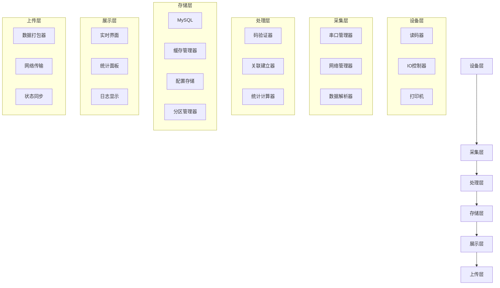

# 数据流设计和状态管理

## 概述

本文档详细定义了产线采集关联软件的数据流架构、状态管理机制、事件驱动模型和数据同步策略，确保系统的数据一致性和高性能运行。

## 整体数据流架构

### 数据流层次结构



## 🔄 状态管理系统

### 全局状态管理器

```csharp
// 全局状态管理器
public class GlobalStateManager : INotifyPropertyChanged
{
    private static readonly Lazy<GlobalStateManager> _instance = 
        new Lazy<GlobalStateManager>(() => new GlobalStateManager());
    
    public static GlobalStateManager Instance => _instance.Value;
    
    private readonly object _lockObject = new object();
    private readonly Dictionary<string, object> _states = new Dictionary<string, object>();
    private readonly Dictionary<string, List<Action<object>>> _subscribers = 
        new Dictionary<string, List<Action<object>>>();
    
    public event PropertyChangedEventHandler PropertyChanged;
    
    // 设置状态
    public void SetState<T>(string key, T value)
    {
        lock (_lockObject)
        {
            var oldValue = _states.ContainsKey(key) ? _states[key] : default(T);
            _states[key] = value;
            
            // 通知订阅者
            if (_subscribers.ContainsKey(key))
            {
                foreach (var callback in _subscribers[key])
                {
                    callback?.Invoke(value);
                }
            }
            
            // 触发属性变更通知
            OnPropertyChanged(key);
            
            // 记录状态变更日志
            LogStateChange(key, oldValue, value);
        }
    }
    
    // 获取状态
    public T GetState<T>(string key, T defaultValue = default(T))
    {
        lock (_lockObject)
        {
            return _states.ContainsKey(key) ? (T)_states[key] : defaultValue;
        }
    }
    
    // 订阅状态变更
    public void Subscribe(string key, Action<object> callback)
    {
        lock (_lockObject)
        {
            if (!_subscribers.ContainsKey(key))
            {
                _subscribers[key] = new List<Action<object>>();
            }
            _subscribers[key].Add(callback);
        }
    }
    
    // 取消订阅
    public void Unsubscribe(string key, Action<object> callback)
    {
        lock (_lockObject)
        {
            if (_subscribers.ContainsKey(key))
            {
                _subscribers[key].Remove(callback);
            }
        }
    }
    
    private void OnPropertyChanged([CallerMemberName] string propertyName = null)
    {
        PropertyChanged?.Invoke(this, new PropertyChangedEventArgs(propertyName));
    }
    
    private void LogStateChange(string key, object oldValue, object newValue)
    {
        var logger = LogManager.GetCurrentClassLogger();
        logger.Debug($"State changed: {key} from {oldValue} to {newValue}");
    }
}
```

### 状态定义和常量

```csharp
// 系统状态常量
public static class StateKeys
{
    // 系统状态
    public const string SystemStatus = "SystemStatus";
    public const string CurrentTask = "CurrentTask";
    public const string DeviceStatus = "DeviceStatus";
    
    // 生产状态
    public const string ProductionStatus = "ProductionStatus";
    public const string CurrentBoxCount = "CurrentBoxCount";
    public const string CurrentPalletCount = "CurrentPalletCount";
    public const string TotalProduced = "TotalProduced";
    public const string CompletionRate = "CompletionRate";
    
    // 设备状态
    public const string ReaderStatus = "ReaderStatus";
    public const string PrinterStatus = "PrinterStatus";
    public const string IOStatus = "IOStatus";
    
    // 上传状态
    public const string UploadStatus = "UploadStatus";
    public const string LastUploadTime = "LastUploadTime";
    public const string PendingUploadCount = "PendingUploadCount";
    
    // 界面状态
    public const string CurrentView = "CurrentView";
    public const string IsLoading = "IsLoading";
    public const string LastError = "LastError";
}

// 状态枚举定义
public enum SystemStatus
{
    Initializing,
    Ready,
    Running,
    Paused,
    Error,
    Maintenance
}

public enum ProductionStatus
{
    Stopped,
    Running,
    Paused,
    Completed,
    Error
}

public enum DeviceStatus
{
    Disconnected,
    Connected,
    Working,
    Error,
    Maintenance
}

public enum UploadStatus
{
    Idle,
    Uploading,
    Success,
    Failed,
    Retrying
}
```

## 📊 数据流管理器

### 实时数据流处理

```csharp
// 数据流管理器
public class DataFlowManager : IDisposable
{
    private readonly ILogger<DataFlowManager> _logger;
    private readonly IDeviceCommunication _deviceCommunication;
    private readonly ICodeValidationService _codeValidationService;
    private readonly IDataRepository _dataRepository;
    
    private readonly Channel<CodeData> _codeChannel;
    private readonly ChannelWriter<CodeData> _codeWriter;
    private readonly ChannelReader<CodeData> _codeReader;
    
    private readonly CancellationTokenSource _cancellationTokenSource;
    private readonly Task _processingTask;
    
    public DataFlowManager(
        ILogger<DataFlowManager> logger,
        IDeviceCommunication deviceCommunication,
        ICodeValidationService codeValidationService,
        IDataRepository dataRepository)
    {
        _logger = logger;
        _deviceCommunication = deviceCommunication;
        _codeValidationService = codeValidationService;
        _dataRepository = dataRepository;
        
        // 创建数据通道
        var options = new BoundedChannelOptions(1000)
        {
            FullMode = BoundedChannelFullMode.Wait,
            SingleReader = true,
            SingleWriter = false
        };
        
        var channel = Channel.CreateBounded<CodeData>(options);
        _codeChannel = channel;
        _codeWriter = channel.Writer;
        _codeReader = channel.Reader;
        
        _cancellationTokenSource = new CancellationTokenSource();
        
        // 启动数据处理任务
        _processingTask = Task.Run(ProcessDataAsync, _cancellationTokenSource.Token);
        
        // 订阅设备数据
        _deviceCommunication.DataReceived += OnDeviceDataReceived;
    }
    
    // 设备数据接收处理
    private async void OnDeviceDataReceived(object sender, DataReceivedEventArgs e)
    {
        try
        {
            var codeData = ParseCodeData(e.Data);
            if (codeData != null)
            {
                await _codeWriter.WriteAsync(codeData, _cancellationTokenSource.Token);
            }
        }
        catch (Exception ex)
        {
            _logger.LogError(ex, "处理设备数据时发生错误: {Data}", e.Data);
        }
    }
    
    // 数据处理主循环
    private async Task ProcessDataAsync()
    {
        await foreach (var codeData in _codeReader.ReadAllAsync(_cancellationTokenSource.Token))
        {
            try
            {
                await ProcessSingleCodeAsync(codeData);
            }
            catch (Exception ex)
            {
                _logger.LogError(ex, "处理码数据时发生错误: {CodeValue}", codeData.CodeValue);
                
                // 更新错误状态
                GlobalStateManager.Instance.SetState(StateKeys.LastError, ex.Message);
            }
        }
    }
    
    // 处理单个码数据
    private async Task ProcessSingleCodeAsync(CodeData codeData)
    {
        var stopwatch = Stopwatch.StartNew();
        
        try
        {
            // 1. 码验证
            var validationResult = await _codeValidationService.ValidateAsync(codeData);
            
            // 2. 更新实时统计
            UpdateRealTimeStatistics(codeData, validationResult);
            
            // 3. 建立关联关系
            if (validationResult.IsValid)
            {
                await EstablishCodeRelationAsync(codeData);
            }
            
            // 4. 存储数据
            await _dataRepository.SaveCodeDataAsync(codeData, validationResult);
            
            // 5. 更新界面状态
            UpdateUIState(codeData, validationResult);
            
            // 6. 发送设备控制指令
            await SendDeviceControlCommand(validationResult);
            
            _logger.LogDebug("码处理完成: {CodeValue}, 耗时: {ElapsedMs}ms", 
                codeData.CodeValue, stopwatch.ElapsedMilliseconds);
        }
        finally
        {
            stopwatch.Stop();
        }
    }
    
    // 更新实时统计
    private void UpdateRealTimeStatistics(CodeData codeData, ValidationResult validationResult)
    {
        var currentTask = GlobalStateManager.Instance.GetState<ProductionTask>(StateKeys.CurrentTask);
        if (currentTask == null) return;
        
        if (validationResult.IsValid)
        {
            // 更新箱数统计
            var currentBoxCount = GlobalStateManager.Instance.GetState<int>(StateKeys.CurrentBoxCount);
            var newBoxCount = currentBoxCount + 1;
            GlobalStateManager.Instance.SetState(StateKeys.CurrentBoxCount, newBoxCount);
            
            // 检查是否需要满垛
            var boxesPerPallet = currentTask.BoxesPerPallet;
            if (newBoxCount >= boxesPerPallet)
            {
                var currentPalletCount = GlobalStateManager.Instance.GetState<int>(StateKeys.CurrentPalletCount);
                GlobalStateManager.Instance.SetState(StateKeys.CurrentPalletCount, currentPalletCount + 1);
                GlobalStateManager.Instance.SetState(StateKeys.CurrentBoxCount, 0);
            }
            
            // 更新总产量
            var totalProduced = GlobalStateManager.Instance.GetState<int>(StateKeys.TotalProduced);
            GlobalStateManager.Instance.SetState(StateKeys.TotalProduced, totalProduced + 1);
            
            // 更新完成率
            var completionRate = (double)totalProduced / currentTask.PlannedQuantity * 100;
            GlobalStateManager.Instance.SetState(StateKeys.CompletionRate, completionRate);
        }
    }
    
    // 建立码关联关系
    private async Task EstablishCodeRelationAsync(CodeData codeData)
    {
        var currentTask = GlobalStateManager.Instance.GetState<ProductionTask>(StateKeys.CurrentTask);
        if (currentTask == null) return;
        
        var codeRelation = new CodeRelation
        {
            TaskId = currentTask.Id,
            Level1Code = codeData.CodeValue,
            Level1Time = codeData.Timestamp,
            CodeType = codeData.CodeType
        };
        
        // 根据包装层级建立关联
        switch (codeData.CodeType)
        {
            case CodeType.SingleCode:
                await HandleSingleCodeRelation(codeRelation);
                break;
            case CodeType.BoxCode:
                await HandleBoxCodeRelation(codeRelation);
                break;
            case CodeType.CaseCode:
                await HandleCaseCodeRelation(codeRelation);
                break;
            case CodeType.PalletCode:
                await HandlePalletCodeRelation(codeRelation);
                break;
        }
        
        await _dataRepository.SaveCodeRelationAsync(codeRelation);
    }
    
    // 更新界面状态
    private void UpdateUIState(CodeData codeData, ValidationResult validationResult)
    {
        // 添加到数据接收区
        var logEntry = new DataReceiveLogEntry
        {
            Timestamp = codeData.Timestamp,
            Content = $"读取#{codeData.CodeType}#成功&&&{codeData.CodeValue}",
            Status = validationResult.IsValid ? "合格" : validationResult.ErrorMessage,
            StatusColor = validationResult.IsValid ? "Green" : "Red"
        };
        
        // 通过事件总线发送界面更新事件
        EventBus.Instance.Publish(new UIUpdateEvent
        {
            Type = UIUpdateType.DataReceiveLog,
            Data = logEntry
        });
    }
    
    // 发送设备控制指令
    private async Task SendDeviceControlCommand(ValidationResult validationResult)
    {
        var command = validationResult.IsValid ? "PASS" : "REJECT";
        await _deviceCommunication.SendCommandAsync(command);
    }
    
    private CodeData ParseCodeData(string rawData)
    {
        // 解析设备原始数据
        // 这里需要根据具体的设备协议实现
        return new CodeData
        {
            CodeValue = rawData.Trim(),
            Timestamp = DateTime.Now,
            CodeType = DetermineCodeType(rawData)
        };
    }
    
    private CodeType DetermineCodeType(string codeValue)
    {
        // 根据码值格式判断码类型
        if (codeValue.StartsWith("L1_")) return CodeType.SingleCode;
        if (codeValue.StartsWith("L2_")) return CodeType.BoxCode;
        if (codeValue.StartsWith("L3_")) return CodeType.CaseCode;
        if (codeValue.StartsWith("L4_")) return CodeType.PalletCode;
        
        return CodeType.SingleCode; // 默认为单品码
    }
    
    public void Dispose()
    {
        _codeWriter?.Complete();
        _cancellationTokenSource?.Cancel();
        _processingTask?.Wait(TimeSpan.FromSeconds(5));
        _cancellationTokenSource?.Dispose();
        
        if (_deviceCommunication != null)
        {
            _deviceCommunication.DataReceived -= OnDeviceDataReceived;
        }
    }
}
```

## 🔔 事件驱动系统

### 事件总线实现

```csharp
// 事件总线
public class EventBus
{
    private static readonly Lazy<EventBus> _instance = new Lazy<EventBus>(() => new EventBus());
    public static EventBus Instance => _instance.Value;
    
    private readonly ConcurrentDictionary<Type, List<object>> _subscribers = 
        new ConcurrentDictionary<Type, List<object>>();
    
    private readonly ILogger<EventBus> _logger = LogManager.GetCurrentClassLogger();
    
    // 订阅事件
    public void Subscribe<T>(Action<T> handler) where T : IEvent
    {
        var eventType = typeof(T);
        _subscribers.AddOrUpdate(eventType, 
            new List<object> { handler },
            (key, list) => { list.Add(handler); return list; });
    }
    
    // 取消订阅
    public void Unsubscribe<T>(Action<T> handler) where T : IEvent
    {
        var eventType = typeof(T);
        if (_subscribers.TryGetValue(eventType, out var handlers))
        {
            handlers.Remove(handler);
        }
    }
    
    // 发布事件
    public async Task PublishAsync<T>(T eventData) where T : IEvent
    {
        var eventType = typeof(T);
        if (!_subscribers.TryGetValue(eventType, out var handlers))
            return;
        
        var tasks = new List<Task>();
        
        foreach (var handler in handlers.ToList())
        {
            if (handler is Action<T> action)
            {
                tasks.Add(Task.Run(() =>
                {
                    try
                    {
                        action(eventData);
                    }
                    catch (Exception ex)
                    {
                        _logger.LogError(ex, "处理事件时发生错误: {EventType}", eventType.Name);
                    }
                }));
            }
        }
        
        await Task.WhenAll(tasks);
    }
    
    // 同步发布事件
    public void Publish<T>(T eventData) where T : IEvent
    {
        var eventType = typeof(T);
        if (!_subscribers.TryGetValue(eventType, out var handlers))
            return;
        
        foreach (var handler in handlers.ToList())
        {
            if (handler is Action<T> action)
            {
                try
                {
                    action(eventData);
                }
                catch (Exception ex)
                {
                    _logger.LogError(ex, "处理事件时发生错误: {EventType}", eventType.Name);
                }
            }
        }
    }
}

// 事件接口
public interface IEvent
{
    DateTime Timestamp { get; }
}

// 基础事件类
public abstract class BaseEvent : IEvent
{
    public DateTime Timestamp { get; } = DateTime.Now;
}

// 具体事件定义
public class CodeCollectedEvent : BaseEvent
{
    public string CodeValue { get; set; }
    public CodeType CodeType { get; set; }
    public bool IsValid { get; set; }
    public string ValidationMessage { get; set; }
}

public class ProductionStatusChangedEvent : BaseEvent
{
    public ProductionStatus OldStatus { get; set; }
    public ProductionStatus NewStatus { get; set; }
    public string Reason { get; set; }
}

public class DeviceStatusChangedEvent : BaseEvent
{
    public string DeviceId { get; set; }
    public DeviceStatus OldStatus { get; set; }
    public DeviceStatus NewStatus { get; set; }
    public string Message { get; set; }
}

public class UIUpdateEvent : BaseEvent
{
    public UIUpdateType Type { get; set; }
    public object Data { get; set; }
}

public enum UIUpdateType
{
    DataReceiveLog,
    OperationLog,
    AlarmMessage,
    Statistics,
    Status
}
```

## 💾 数据缓存策略

### 多层缓存系统

```csharp
// 缓存管理器
public class CacheManager
{
    private static readonly Lazy<CacheManager> _instance = new Lazy<CacheManager>(() => new CacheManager());
    public static CacheManager Instance => _instance.Value;
    
    private readonly MemoryCache _memoryCache;
    private readonly ILogger<CacheManager> _logger;
    
    public CacheManager()
    {
        var options = new MemoryCacheOptions
        {
            SizeLimit = 1000,
            CompactionPercentage = 0.25
        };
        
        _memoryCache = new MemoryCache(options);
        _logger = LogManager.GetCurrentClassLogger();
    }
    
    // 设置缓存
    public void Set<T>(string key, T value, TimeSpan? expiration = null)
    {
        var options = new MemoryCacheEntryOptions
        {
            Size = 1,
            SlidingExpiration = expiration ?? TimeSpan.FromMinutes(30),
            Priority = CacheItemPriority.Normal
        };
        
        options.RegisterPostEvictionCallback((k, v, reason, state) =>
        {
            _logger.LogDebug("缓存项被移除: {Key}, 原因: {Reason}", k, reason);
        });
        
        _memoryCache.Set(key, value, options);
    }
    
    // 获取缓存
    public T Get<T>(string key, T defaultValue = default(T))
    {
        if (_memoryCache.TryGetValue(key, out var value) && value is T)
        {
            return (T)value;
        }
        
        return defaultValue;
    }
    
    // 获取或创建缓存
    public async Task<T> GetOrCreateAsync<T>(string key, Func<Task<T>> factory, TimeSpan? expiration = null)
    {
        if (_memoryCache.TryGetValue(key, out var value) && value is T)
        {
            return (T)value;
        }
        
        var newValue = await factory();
        Set(key, newValue, expiration);
        return newValue;
    }
    
    // 移除缓存
    public void Remove(string key)
    {
        _memoryCache.Remove(key);
    }
    
    // 清空缓存
    public void Clear()
    {
        if (_memoryCache is MemoryCache mc)
        {
            mc.Compact(1.0);
        }
    }
}

// 缓存键常量
public static class CacheKeys
{
    public const string CurrentTask = "current_task";
    public const string ProductList = "product_list";
    public const string TaskList = "task_list";
    public const string DeviceConfig = "device_config";
    public const string SystemConfig = "system_config";
    public const string RecentCodes = "recent_codes";
    public const string Statistics = "statistics";
    
    // 动态键生成
    public static string TaskStatistics(long taskId) => $"task_statistics_{taskId}";
    public static string ProductInfo(long productId) => $"product_info_{productId}";
    public static string CodeRelations(string codeValue) => $"code_relations_{codeValue}";
}
```

## 🔄 数据同步机制

### 数据同步服务

```csharp
// 数据同步服务
public class DataSyncService : IHostedService
{
    private readonly ILogger<DataSyncService> _logger;
    private readonly IDataRepository _dataRepository;
    private readonly IUploadService _uploadService;
    private readonly Timer _syncTimer;
    
    private readonly SemaphoreSlim _syncSemaphore = new SemaphoreSlim(1, 1);
    
    public DataSyncService(
        ILogger<DataSyncService> logger,
        IDataRepository dataRepository,
        IUploadService uploadService)
    {
        _logger = logger;
        _dataRepository = dataRepository;
        _uploadService = uploadService;
        
        // 每30秒执行一次同步
        _syncTimer = new Timer(SyncData, null, TimeSpan.Zero, TimeSpan.FromSeconds(30));
    }
    
    public Task StartAsync(CancellationToken cancellationToken)
    {
        _logger.LogInformation("数据同步服务已启动");
        return Task.CompletedTask;
    }
    
    public Task StopAsync(CancellationToken cancellationToken)
    {
        _syncTimer?.Change(Timeout.Infinite, 0);
        _logger.LogInformation("数据同步服务已停止");
        return Task.CompletedTask;
    }
    
    private async void SyncData(object state)
    {
        if (!await _syncSemaphore.WaitAsync(100))
            return;
        
        try
        {
            await PerformSyncAsync();
        }
        catch (Exception ex)
        {
            _logger.LogError(ex, "数据同步时发生错误");
        }
        finally
        {
            _syncSemaphore.Release();
        }
    }
    
    private async Task PerformSyncAsync()
    {
        // 1. 同步待上传数据
        await SyncPendingUploads();
        
        // 2. 同步系统配置
        await SyncSystemConfig();
        
        // 3. 同步设备状态
        await SyncDeviceStatus();
        
        // 4. 清理过期数据
        await CleanupExpiredData();
    }
    
    private async Task SyncPendingUploads()
    {
        var pendingData = await _dataRepository.GetPendingUploadDataAsync();
        if (pendingData.Any())
        {
            GlobalStateManager.Instance.SetState(StateKeys.PendingUploadCount, pendingData.Count);
            
            foreach (var data in pendingData)
            {
                try
                {
                    await _uploadService.UploadAsync(data);
                    await _dataRepository.MarkAsUploadedAsync(data.Id);
                }
                catch (Exception ex)
                {
                    _logger.LogWarning(ex, "上传数据失败: {DataId}", data.Id);
                }
            }
        }
    }
    
    private async Task SyncSystemConfig()
    {
        // 从远程服务器同步系统配置
        try
        {
            var remoteConfig = await _uploadService.GetSystemConfigAsync();
            if (remoteConfig != null)
            {
                await _dataRepository.UpdateSystemConfigAsync(remoteConfig);
                
                // 清除配置缓存
                CacheManager.Instance.Remove(CacheKeys.SystemConfig);
            }
        }
        catch (Exception ex)
        {
            _logger.LogWarning(ex, "同步系统配置失败");
        }
    }
    
    private async Task SyncDeviceStatus()
    {
        // 更新设备状态到全局状态管理器
        var deviceStatuses = await _dataRepository.GetDeviceStatusesAsync();
        
        foreach (var status in deviceStatuses)
        {
            GlobalStateManager.Instance.SetState($"device_status_{status.DeviceId}", status);
        }
    }
    
    private async Task CleanupExpiredData()
    {
        // 清理30天前的日志数据
        var cutoffDate = DateTime.Now.AddDays(-30);
        await _dataRepository.CleanupOldLogsAsync(cutoffDate);
        
        // 清理缓存中的过期数据
        CacheManager.Instance.Clear();
    }
    
    public void Dispose()
    {
        _syncTimer?.Dispose();
        _syncSemaphore?.Dispose();
    }
}
```

## 📈 性能监控和优化

### 性能监控器

```csharp
// 性能监控器
public class PerformanceMonitor
{
    private static readonly Lazy<PerformanceMonitor> _instance = 
        new Lazy<PerformanceMonitor>(() => new PerformanceMonitor());
    
    public static PerformanceMonitor Instance => _instance.Value;
    
    private readonly ConcurrentDictionary<string, PerformanceCounter> _counters = 
        new ConcurrentDictionary<string, PerformanceCounter>();
    
    private readonly Timer _reportTimer;
    private readonly ILogger<PerformanceMonitor> _logger;
    
    public PerformanceMonitor()
    {
        _logger = LogManager.GetCurrentClassLogger();
        
        // 每分钟报告一次性能数据
        _reportTimer = new Timer(ReportPerformance, null, 
            TimeSpan.FromMinutes(1), TimeSpan.FromMinutes(1));
        
        InitializeCounters();
    }
    
    private void InitializeCounters()
    {
        _counters["CodeProcessingRate"] = new PerformanceCounter();
        _counters["DatabaseOperationTime"] = new PerformanceCounter();
        _counters["UIUpdateTime"] = new PerformanceCounter();
        _counters["DeviceCommunicationTime"] = new PerformanceCounter();
        _counters["MemoryUsage"] = new PerformanceCounter();
    }
    
    public void RecordOperation(string operation, TimeSpan duration)
    {
        if (_counters.TryGetValue(operation, out var counter))
        {
            counter.Record(duration.TotalMilliseconds);
        }
    }
    
    public void IncrementCounter(string counterName)
    {
        if (_counters.TryGetValue(counterName, out var counter))
        {
            counter.Increment();
        }
    }
    
    private void ReportPerformance(object state)
    {
        try
        {
            var report = new PerformanceReport
            {
                Timestamp = DateTime.Now,
                Counters = _counters.ToDictionary(
                    kvp => kvp.Key, 
                    kvp => kvp.Value.GetStatistics())
            };
            
            _logger.LogInformation("性能报告: {Report}", JsonConvert.SerializeObject(report));
            
            // 检查性能阈值
            CheckPerformanceThresholds(report);
            
            // 重置计数器
            foreach (var counter in _counters.Values)
            {
                counter.Reset();
            }
        }
        catch (Exception ex)
        {
            _logger.LogError(ex, "生成性能报告时发生错误");
        }
    }
    
    private void CheckPerformanceThresholds(PerformanceReport report)
    {
        // 检查码处理速率
        if (report.Counters.ContainsKey("CodeProcessingRate"))
        {
            var rate = report.Counters["CodeProcessingRate"];
            if (rate.Average > 1000) // 超过1秒
            {
                _logger.LogWarning("码处理速率过慢: {AverageMs}ms", rate.Average);
                
                // 发送性能警告事件
                EventBus.Instance.Publish(new PerformanceWarningEvent
                {
                    Type = "CodeProcessingRate",
                    Value = rate.Average,
                    Threshold = 1000
                });
            }
        }
    }
}

// 性能计数器
public class PerformanceCounter
{
    private readonly List<double> _values = new List<double>();
    private long _count = 0;
    
    public void Record(double value)
    {
        lock (_values)
        {
            _values.Add(value);
            _count++;
        }
    }
    
    public void Increment()
    {
        Interlocked.Increment(ref _count);
    }
    
    public PerformanceStatistics GetStatistics()
    {
        lock (_values)
        {
            if (_values.Count == 0)
            {
                return new PerformanceStatistics
                {
                    Count = _count,
                    Average = 0,
                    Min = 0,
                    Max = 0
                };
            }
            
            return new PerformanceStatistics
            {
                Count = _count,
                Average = _values.Average(),
                Min = _values.Min(),
                Max = _values.Max()
            };
        }
    }
    
    public void Reset()
    {
        lock (_values)
        {
            _values.Clear();
            _count = 0;
        }
    }
}

public class PerformanceStatistics
{
    public long Count { get; set; }
    public double Average { get; set; }
    public double Min { get; set; }
    public double Max { get; set; }
}

public class PerformanceReport
{
    public DateTime Timestamp { get; set; }
    public Dictionary<string, PerformanceStatistics> Counters { get; set; }
}

public class PerformanceWarningEvent : BaseEvent
{
    public string Type { get; set; }
    public double Value { get; set; }
    public double Threshold { get; set; }
}
```

## 使用示例

### 在ViewModel中使用状态管理

```csharp
public class MainViewModel : ViewModelBase
{
    public MainViewModel()
    {
        // 订阅状态变更
        GlobalStateManager.Instance.Subscribe(StateKeys.CurrentBoxCount, OnBoxCountChanged);
        GlobalStateManager.Instance.Subscribe(StateKeys.ProductionStatus, OnProductionStatusChanged);
        
        // 订阅事件
        EventBus.Instance.Subscribe<CodeCollectedEvent>(OnCodeCollected);
        EventBus.Instance.Subscribe<UIUpdateEvent>(OnUIUpdate);
    }
    
    private void OnBoxCountChanged(object value)
    {
        if (value is int boxCount)
        {
            CurrentBoxCount = boxCount;
        }
    }
    
    private void OnProductionStatusChanged(object value)
    {
        if (value is ProductionStatus status)
        {
            ProductionStatus = status;
            UpdateUIBasedOnStatus(status);
        }
    }
    
    private void OnCodeCollected(CodeCollectedEvent eventData)
    {
        // 处理码采集事件
        Application.Current.Dispatcher.Invoke(() =>
        {
            // 更新界面显示
            AddDataReceiveLog(eventData);
        });
    }
    
    private void OnUIUpdate(UIUpdateEvent eventData)
    {
        Application.Current.Dispatcher.Invoke(() =>
        {
            switch (eventData.Type)
            {
                case UIUpdateType.DataReceiveLog:
                    if (eventData.Data is DataReceiveLogEntry logEntry)
                    {
                        DataReceiveLogs.Insert(0, logEntry);
                        
                        // 限制日志条数
                        while (DataReceiveLogs.Count > 1000)
                        {
                            DataReceiveLogs.RemoveAt(DataReceiveLogs.Count - 1);
                        }
                    }
                    break;
                    
                case UIUpdateType.Statistics:
                    UpdateStatistics(eventData.Data);
                    break;
            }
        });
    }
}
```

## 数据仓储接口定义

### IDataRepository接口

```csharp
/// <summary>
/// 数据仓储接口（适配MySQL）
/// </summary>
public interface IDataRepository
{
    /// <summary>
    /// 保存码数据（支持分区存储）
    /// </summary>
    /// <param name="codeData">码数据</param>
    /// <param name="validationResult">验证结果</param>
    /// <returns>操作结果</returns>
    Task<bool> SaveCodeDataAsync(CodeData codeData, ValidationResult validationResult);
    
    /// <summary>
    /// 批量保存码数据（优化大数据量插入）
    /// </summary>
    /// <param name="codeDataList">码数据列表</param>
    /// <returns>操作结果</returns>
    Task<bool> BulkSaveCodeDataAsync(IEnumerable<CodeData> codeDataList);
    
    /// <summary>
    /// 保存码关联关系
    /// </summary>
    /// <param name="codeRelation">码关联关系</param>
    /// <returns>操作结果</returns>
    Task<bool> SaveCodeRelationAsync(CodeRelation codeRelation);
    
    /// <summary>
    /// 获取待上传数据（分页查询）
    /// </summary>
    /// <param name="batchSize">批次大小</param>
    /// <returns>待上传数据列表</returns>
    Task<IEnumerable<UploadData>> GetPendingUploadDataAsync(int batchSize = 1000);
    
    /// <summary>
    /// 标记数据为已上传
    /// </summary>
    /// <param name="dataId">数据ID</param>
    /// <returns>操作结果</returns>
    Task<bool> MarkAsUploadedAsync(long dataId);
    
    /// <summary>
    /// 批量标记数据为已上传
    /// </summary>
    /// <param name="dataIds">数据ID列表</param>
    /// <returns>操作结果</returns>
    Task<bool> BatchMarkAsUploadedAsync(IEnumerable<long> dataIds);
    
    /// <summary>
    /// 更新系统配置
    /// </summary>
    /// <param name="config">配置对象</param>
    /// <returns>操作结果</returns>
    Task<bool> UpdateSystemConfigAsync(SystemConfig config);
    
    /// <summary>
    /// 获取设备状态列表
    /// </summary>
    /// <returns>设备状态列表</returns>
    Task<IEnumerable<DeviceStatus>> GetDeviceStatusesAsync();
    
    /// <summary>
    /// 清理历史日志（分区清理）
    /// </summary>
    /// <param name="cutoffDate">清理截止日期</param>
    /// <returns>清理的记录数</returns>
    Task<int> CleanupOldLogsAsync(DateTime cutoffDate);
    
    /// <summary>
    /// 获取任务统计信息（跨分区查询）
    /// </summary>
    /// <param name="taskId">任务ID</param>
    /// <param name="startDate">开始日期</param>
    /// <param name="endDate">结束日期</param>
    /// <returns>统计信息</returns>
    Task<TaskStatistics> GetTaskStatisticsAsync(long taskId, DateTime? startDate = null, DateTime? endDate = null);
    
    /// <summary>
    /// 执行分区维护操作
    /// </summary>
    /// <returns>操作结果</returns>
    Task<bool> ExecutePartitionMaintenanceAsync();
    
    /// <summary>
    /// 压缩历史数据
    /// </summary>
    /// <param name="beforeDate">压缩截止日期</param>
    /// <returns>操作结果</returns>
    Task<bool> CompressHistoricalDataAsync(DateTime beforeDate);
    
    /// <summary>
    /// 获取数据库性能统计
    /// </summary>
    /// <returns>性能统计信息</returns>
    Task<DatabasePerformanceStats> GetDatabasePerformanceStatsAsync();
}
```

### 数据传输对象

```csharp
/// <summary>
/// 数据库性能统计
/// </summary>
public class DatabasePerformanceStats
{
    /// <summary>
    /// 数据库大小（MB）
    /// </summary>
    public long DatabaseSizeMB { get; set; }
    
    /// <summary>
    /// 索引碎片化程度
    /// </summary>
    public double IndexFragmentationPercent { get; set; }
    
    /// <summary>
    /// 活跃连接数
    /// </summary>
    public int ActiveConnections { get; set; }
    
    /// <summary>
    /// 平均查询执行时间（毫秒）
    /// </summary>
    public double AverageQueryTimeMs { get; set; }
    
    /// <summary>
    /// 分区信息
    /// </summary>
    public List<PartitionInfo> Partitions { get; set; }
    
    /// <summary>
    /// 缓存命中率
    /// </summary>
    public double CacheHitRatio { get; set; }
}

/// <summary>
/// 分区信息
/// </summary>
public class PartitionInfo
{
    /// <summary>
    /// 分区名称
    /// </summary>
    public string PartitionName { get; set; }
    
    /// <summary>
    /// 分区范围
    /// </summary>
    public string PartitionRange { get; set; }
    
    /// <summary>
    /// 记录数
    /// </summary>
    public long RecordCount { get; set; }
    
    /// <summary>
    /// 分区大小（MB）
    /// </summary>
    public long SizeMB { get; set; }
    
    /// <summary>
    /// 压缩状态
    /// </summary>
    public bool IsCompressed { get; set; }
}
```

---

**注意**: 此数据流设计和状态管理系统确保了应用的高性能、数据一致性和实时响应能力，针对MySQL进行了优化，支持大数据量处理和分区管理。 