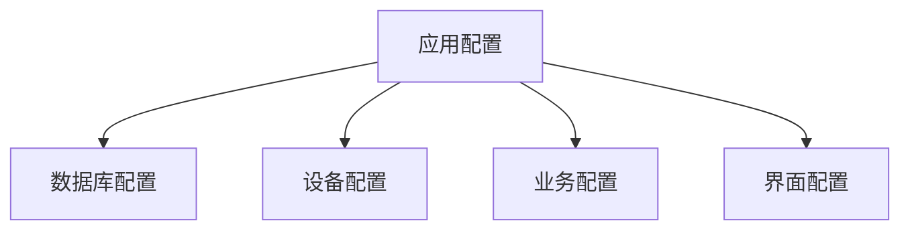

# 简化配置管理

## 概述

本文档定义了产线采集关联软件的简化配置管理方案，专注于实用性和易于维护，避免过度复杂的配置架构。

## 简化配置架构

### 基础配置结构



### 配置文件结构

```json
{
  "Application": {
    "Name": "产线采集关联软件",
    "Version": "1.0.0",
    "Environment": "Production"
  },
  "Database": {
    "ConnectionString": "Server=localhost\\SQLEXPRESS;Database=ProductionLineDB;Integrated Security=true;TrustServerCertificate=true",
    "CommandTimeout": 60,
    "MaxPoolSize": 50,
    "EnableRetryOnFailure": true
  },
  "Device": {
    "SerialPort": {
      "PortName": "COM1",
      "BaudRate": 9600,
      "DataBits": 8,
      "StopBits": "One",
      "Parity": "None",
      "ReadTimeout": 5000
    },
    "Scanner": {
      "Enabled": true,
      "AutoConnect": true,
      "RetryCount": 3
    }
  },
  "Business": {
    "DefaultTaskTimeout": 3600,
    "MaxCodeLength": 100,
    "EnableCodeValidation": true,
    "AutoUpload": false
  },
  "UI": {
    "Theme": "Light",
    "Language": "zh-CN",
    "AutoRefreshInterval": 5000,
    "ShowDebugInfo": false
  },
  "Logging": {
    "LogLevel": "Information",
    "LogPath": "Logs",
    "MaxLogFiles": 10,
    "MaxLogSizeMB": 50
  }
}
```

## 简化配置服务

### 基础配置服务

```java
public interface ConfigService {
    <T> T getValue(String key, T defaultValue);
    <T> void setValue(String key, T value);
    void saveChanges();
    void reloadConfig();
}

@Service
public class ConfigServiceImpl implements ConfigService {
    private static final Logger logger = LoggerFactory.getLogger(ConfigServiceImpl.class);
    
    private final String configPath;
    private Map<String, Object> config;
    private final Object lock = new Object();
    
    public ConfigServiceImpl() {
        this.configPath = System.getProperty("user.dir") + "/application.properties";
        loadConfig();
    }
    
    public T GetValue<T>(string key, T defaultValue = default)
    {
        lock (_lock)
        {
            try
            {
                if (TryGetNestedValue(key, out var value))
                {
                    if (value is JsonElement jsonElement)
                    {
                        return JsonSerializer.Deserialize<T>(jsonElement.GetRawText());
                    }
                    
                    return (T)Convert.ChangeType(value, typeof(T));
                }
                
                return defaultValue;
            }
            catch (Exception ex)
            {
                _logger.LogWarning(ex, $"获取配置失败: {key}, 使用默认值: {defaultValue}");
                return defaultValue;
            }
        }
    }
    
    public void SetValue<T>(string key, T value)
    {
        lock (_lock)
        {
            try
            {
                SetNestedValue(key, value);
                _logger.LogInformation($"配置已更新: {key} = {value}");
            }
            catch (Exception ex)
            {
                _logger.LogError(ex, $"设置配置失败: {key}");
                throw;
            }
        }
    }
    
    public void SaveChanges()
    {
        lock (_lock)
        {
            try
            {
                ObjectMapper mapper = new ObjectMapper();
                mapper.enable(SerializationFeature.INDENT_OUTPUT);
                String json = mapper.writeValueAsString(config);
                
                File.WriteAllText(_configPath, json, Encoding.UTF8);
                _logger.LogInformation("配置文件已保存");
            }
            catch (Exception ex)
            {
                _logger.LogError(ex, "保存配置文件失败");
                throw;
            }
        }
    }
    
    public void ReloadConfig()
    {
        lock (_lock)
        {
            LoadConfig();
            _logger.LogInformation("配置文件已重新加载");
        }
    }
    
    private void LoadConfig()
    {
        try
        {
            if (File.Exists(_configPath))
            {
                var json = File.ReadAllText(_configPath, Encoding.UTF8);
                _config = JsonSerializer.Deserialize<Dictionary<string, object>>(json) ?? new Dictionary<string, object>();
            }
            else
            {
                _config = CreateDefaultConfig();
                SaveChanges();
            }
        }
        catch (Exception ex)
        {
            _logger.LogError(ex, "加载配置文件失败，使用默认配置");
            _config = CreateDefaultConfig();
        }
    }
    
    private bool TryGetNestedValue(string key, out object value)
    {
        value = null;
        var keys = key.Split(':');
        var current = _config;
        
        for (int i = 0; i < keys.Length - 1; i++)
        {
            if (current.TryGetValue(keys[i], out var next) && next is JsonElement element)
            {
                current = JsonSerializer.Deserialize<Dictionary<string, object>>(element.GetRawText());
            }
            else
            {
                return false;
            }
        }
        
        return current.TryGetValue(keys[keys.Length - 1], out value);
    }
    
    private void SetNestedValue(string key, object value)
    {
        var keys = key.Split(':');
        var current = _config;
        
        for (int i = 0; i < keys.Length - 1; i++)
        {
            if (!current.ContainsKey(keys[i]))
            {
                current[keys[i]] = new Dictionary<string, object>();
            }
            
            if (current[keys[i]] is JsonElement element)
            {
                current[keys[i]] = JsonSerializer.Deserialize<Dictionary<string, object>>(element.GetRawText());
            }
            
            current = (Dictionary<string, object>)current[keys[i]];
        }
        
        current[keys[keys.Length - 1]] = value;
    }
    
    private Dictionary<string, object> CreateDefaultConfig()
    {
        return new Dictionary<string, object>
        {
            ["Application"] = new Dictionary<string, object>
            {
                ["Name"] = "产线采集关联软件",
                ["Version"] = "1.0.0",
                ["Environment"] = "Production"
            },
            ["Database"] = new Dictionary<string, object>
            {
                ["ConnectionString"] = "Server=localhost\\SQLEXPRESS;Database=ProductionLineDB;Integrated Security=true",
                ["CommandTimeout"] = 60,
                ["MaxPoolSize"] = 50,
                ["EnableRetryOnFailure"] = true
            },
            ["Device"] = new Dictionary<string, object>
            {
                ["SerialPort"] = new Dictionary<string, object>
                {
                    ["PortName"] = "COM1",
                    ["BaudRate"] = 9600,
                    ["DataBits"] = 8,
                    ["StopBits"] = "One",
                    ["Parity"] = "None",
                    ["ReadTimeout"] = 5000
                }
            },
            ["Business"] = new Dictionary<string, object>
            {
                ["DefaultTaskTimeout"] = 3600,
                ["MaxCodeLength"] = 100,
                ["EnableCodeValidation"] = true,
                ["AutoUpload"] = false
            },
            ["UI"] = new Dictionary<string, object>
            {
                ["Theme"] = "Light",
                ["Language"] = "zh-CN",
                ["AutoRefreshInterval"] = 5000,
                ["ShowDebugInfo"] = false
            },
            ["Logging"] = new Dictionary<string, object>
            {
                ["LogLevel"] = "Information",
                ["LogPath"] = "Logs",
                ["MaxLogFiles"] = 10,
                ["MaxLogSizeMB"] = 50
            }
        };
    }
}
```

## 配置类定义

### 强类型配置类

```csharp
// 应用配置
public class ApplicationConfig
{
    public string Name { get; set; } = "产线采集关联软件";
    public string Version { get; set; } = "1.0.0";
    public string Environment { get; set; } = "Production";
}

// 数据库配置
public class DatabaseConfig
{
    public string ConnectionString { get; set; }
    public int CommandTimeout { get; set; } = 60;
    public int MaxPoolSize { get; set; } = 50;
    public bool EnableRetryOnFailure { get; set; } = true;
}

// 设备配置
public class DeviceConfig
{
    public SerialPortConfig SerialPort { get; set; } = new();
    public ScannerConfig Scanner { get; set; } = new();
}

public class SerialPortConfig
{
    public string PortName { get; set; } = "COM1";
    public int BaudRate { get; set; } = 9600;
    public int DataBits { get; set; } = 8;
    public string StopBits { get; set; } = "One";
    public string Parity { get; set; } = "None";
    public int ReadTimeout { get; set; } = 5000;
}

public class ScannerConfig
{
    public bool Enabled { get; set; } = true;
    public bool AutoConnect { get; set; } = true;
    public int RetryCount { get; set; } = 3;
}

// 业务配置
public class BusinessConfig
{
    public int DefaultTaskTimeout { get; set; } = 3600;
    public int MaxCodeLength { get; set; } = 100;
    public bool EnableCodeValidation { get; set; } = true;
    public bool AutoUpload { get; set; } = false;
}

// 界面配置
public class UIConfig
{
    public string Theme { get; set; } = "Light";
    public string Language { get; set; } = "zh-CN";
    public int AutoRefreshInterval { get; set; } = 5000;
    public bool ShowDebugInfo { get; set; } = false;
}

// 日志配置
public class LoggingConfig
{
    public string LogLevel { get; set; } = "Information";
    public string LogPath { get; set; } = "Logs";
    public int MaxLogFiles { get; set; } = 10;
    public int MaxLogSizeMB { get; set; } = 50;
}
```

## 配置管理器

### 简化配置管理器

```csharp
public class ConfigManager
{
    private readonly IConfigService _configService;
    private readonly ILogger<ConfigManager> _logger;
    
    // 缓存的配置对象
    private ApplicationConfig _appConfig;
    private DatabaseConfig _dbConfig;
    private DeviceConfig _deviceConfig;
    private BusinessConfig _businessConfig;
    private UIConfig _uiConfig;
    private LoggingConfig _loggingConfig;
    
    public ConfigManager(IConfigService configService, ILogger<ConfigManager> logger)
    {
        _configService = configService;
        _logger = logger;
        LoadAllConfigs();
    }
    
    // 属性访问器
    public ApplicationConfig Application => _appConfig ??= LoadConfig<ApplicationConfig>("Application");
    public DatabaseConfig Database => _dbConfig ??= LoadConfig<DatabaseConfig>("Database");
    public DeviceConfig Device => _deviceConfig ??= LoadConfig<DeviceConfig>("Device");
    public BusinessConfig Business => _businessConfig ??= LoadConfig<BusinessConfig>("Business");
    public UIConfig UI => _uiConfig ??= LoadConfig<UIConfig>("UI");
    public LoggingConfig Logging => _loggingConfig ??= LoadConfig<LoggingConfig>("Logging");
    
    public void SaveConfig<T>(string section, T config)
    {
        try
        {
            var properties = typeof(T).GetProperties();
            foreach (var prop in properties)
            {
                var key = $"{section}:{prop.Name}";
                var value = prop.GetValue(config);
                _configService.SetValue(key, value);
            }
            
            _configService.SaveChanges();
            
            // 清除缓存，强制重新加载
            ClearCache(section);
            
            _logger.LogInformation($"配置已保存: {section}");
        }
        catch (Exception ex)
        {
            _logger.LogError(ex, $"保存配置失败: {section}");
            throw;
        }
    }
    
    public void ReloadAllConfigs()
    {
        _configService.ReloadConfig();
        LoadAllConfigs();
        _logger.LogInformation("所有配置已重新加载");
    }
    
    private T LoadConfig<T>(string section) where T : new()
    {
        try
        {
            var config = new T();
            var properties = typeof(T).GetProperties();
            
            foreach (var prop in properties)
            {
                var key = $"{section}:{prop.Name}";
                var defaultValue = prop.GetValue(config);
                var value = _configService.GetValue(key, defaultValue);
                prop.SetValue(config, value);
            }
            
            return config;
        }
        catch (Exception ex)
        {
            _logger.LogError(ex, $"加载配置失败: {section}，使用默认配置");
            return new T();
        }
    }
    
    private void LoadAllConfigs()
    {
        _appConfig = null;
        _dbConfig = null;
        _deviceConfig = null;
        _businessConfig = null;
        _uiConfig = null;
        _loggingConfig = null;
    }
    
    private void ClearCache(string section)
    {
        switch (section)
        {
            case "Application": _appConfig = null; break;
            case "Database": _dbConfig = null; break;
            case "Device": _deviceConfig = null; break;
            case "Business": _businessConfig = null; break;
            case "UI": _uiConfig = null; break;
            case "Logging": _loggingConfig = null; break;
        }
    }
}
```

## 配置界面支持

### 配置编辑服务

```csharp
public interface IConfigEditService
{
    Task<T> GetConfigAsync<T>(string section) where T : new();
    Task<bool> SaveConfigAsync<T>(string section, T config);
    Task<bool> ResetToDefaultAsync(string section);
    Task<Dictionary<string, object>> GetAllConfigsAsync();
}

public class ConfigEditService : IConfigEditService
{
    private readonly ConfigManager _configManager;
    private readonly ILogger<ConfigEditService> _logger;
    
    public ConfigEditService(ConfigManager configManager, ILogger<ConfigEditService> logger)
    {
        _configManager = configManager;
        _logger = logger;
    }
    
    public async Task<T> GetConfigAsync<T>(string section) where T : new()
    {
        return section switch
        {
            "Application" => (T)(object)_configManager.Application,
            "Database" => (T)(object)_configManager.Database,
            "Device" => (T)(object)_configManager.Device,
            "Business" => (T)(object)_configManager.Business,
            "UI" => (T)(object)_configManager.UI,
            "Logging" => (T)(object)_configManager.Logging,
            _ => new T()
        };
    }
    
    public async Task<bool> SaveConfigAsync<T>(string section, T config)
    {
        try
        {
            _configManager.SaveConfig(section, config);
            return true;
        }
        catch (Exception ex)
        {
            _logger.LogError(ex, $"保存配置失败: {section}");
            return false;
        }
    }
    
    public async Task<bool> ResetToDefaultAsync(string section)
    {
        try
        {
            var defaultConfig = section switch
            {
                "Application" => new ApplicationConfig(),
                "Database" => new DatabaseConfig(),
                "Device" => new DeviceConfig(),
                "Business" => new BusinessConfig(),
                "UI" => new UIConfig(),
                "Logging" => new LoggingConfig(),
                _ => null
            };
            
            if (defaultConfig != null)
            {
                _configManager.SaveConfig(section, defaultConfig);
                return true;
            }
            
            return false;
        }
        catch (Exception ex)
        {
            _logger.LogError(ex, $"重置配置失败: {section}");
            return false;
        }
    }
    
    public async Task<Dictionary<string, object>> GetAllConfigsAsync()
    {
        return new Dictionary<string, object>
        {
            ["Application"] = _configManager.Application,
            ["Database"] = _configManager.Database,
            ["Device"] = _configManager.Device,
            ["Business"] = _configManager.Business,
            ["UI"] = _configManager.UI,
            ["Logging"] = _configManager.Logging
        };
    }
}
```

## 🔄 配置验证

### 简单配置验证

```csharp
public class ConfigValidator
{
    private readonly ILogger<ConfigValidator> _logger;
    
    public ConfigValidator(ILogger<ConfigValidator> logger)
    {
        _logger = logger;
    }
    
    public ValidationResult ValidateDatabase(DatabaseConfig config)
    {
        var result = new ValidationResult();
        
        if (string.IsNullOrEmpty(config.ConnectionString))
        {
            result.AddError("数据库连接字符串不能为空");
        }
        
        if (config.CommandTimeout <= 0)
        {
            result.AddError("命令超时时间必须大于0");
        }
        
        if (config.MaxPoolSize <= 0 || config.MaxPoolSize > 200)
        {
            result.AddError("连接池大小必须在1-200之间");
        }
        
        return result;
    }
    
    public ValidationResult ValidateDevice(DeviceConfig config)
    {
        var result = new ValidationResult();
        
        if (string.IsNullOrEmpty(config.SerialPort.PortName))
        {
            result.AddError("串口名称不能为空");
        }
        
        if (config.SerialPort.BaudRate <= 0)
        {
            result.AddError("波特率必须大于0");
        }
        
        return result;
    }
    
    public ValidationResult ValidateBusiness(BusinessConfig config)
    {
        var result = new ValidationResult();
        
        if (config.DefaultTaskTimeout <= 0)
        {
            result.AddError("默认任务超时时间必须大于0");
        }
        
        if (config.MaxCodeLength <= 0 || config.MaxCodeLength > 500)
        {
            result.AddError("最大码长度必须在1-500之间");
        }
        
        return result;
    }
}

public class ValidationResult
{
    public bool IsValid => !Errors.Any();
    public List<string> Errors { get; } = new List<string>();
    
    public void AddError(string error)
    {
        Errors.Add(error);
    }
}
```

## 服务注册

### 依赖注入配置

```csharp
public void ConfigureServices(IServiceCollection services)
{
    // 配置服务
    services.AddSingleton<IConfigService, ConfigService>();
    services.AddSingleton<ConfigManager>();
    services.AddScoped<IConfigEditService, ConfigEditService>();
    services.AddSingleton<ConfigValidator>();
}
```

## 📝 使用示例

### 在业务代码中使用配置

```csharp
public class TaskService
{
    private readonly ConfigManager _config;
    private readonly ILogger<TaskService> _logger;
    
    public TaskService(ConfigManager config, ILogger<TaskService> logger)
    {
        _config = config;
        _logger = logger;
    }
    
    public async Task<bool> ProcessTaskAsync(long taskId)
    {
        // 使用业务配置
        var timeout = _config.Business.DefaultTaskTimeout;
        var maxCodeLength = _config.Business.MaxCodeLength;
        
        // 使用超时设置
        using var cts = new CancellationTokenSource(TimeSpan.FromSeconds(timeout));
        
        // 业务逻辑...
        return true;
    }
}

public class DatabaseService
{
    private readonly ConfigManager _config;
    
    public DatabaseService(ConfigManager config)
    {
        _config = config;
    }
    
    public Connection createConnection() throws SQLException {
        return dataSource.getConnection();
    }
}
```

## 📝 总结

简化后的配置管理专注于：

1. **单一配置文件** - 使用JSON格式的appsettings.json
2. **强类型配置** - 定义配置类，提供类型安全
3. **简单服务** - 基础的读取、保存、验证功能
4. **易于使用** - 直观的API和配置访问方式

**移除的复杂功能**：
- ❌ 多层配置架构
- ❌ 多种配置提供程序
- ❌ 复杂的配置变更监控
- ❌ 动态配置更新机制
- ❌ 配置加密和安全策略

这种简化设计更容易理解和维护，降低了配置管理的复杂度，提高了系统的可靠性。 