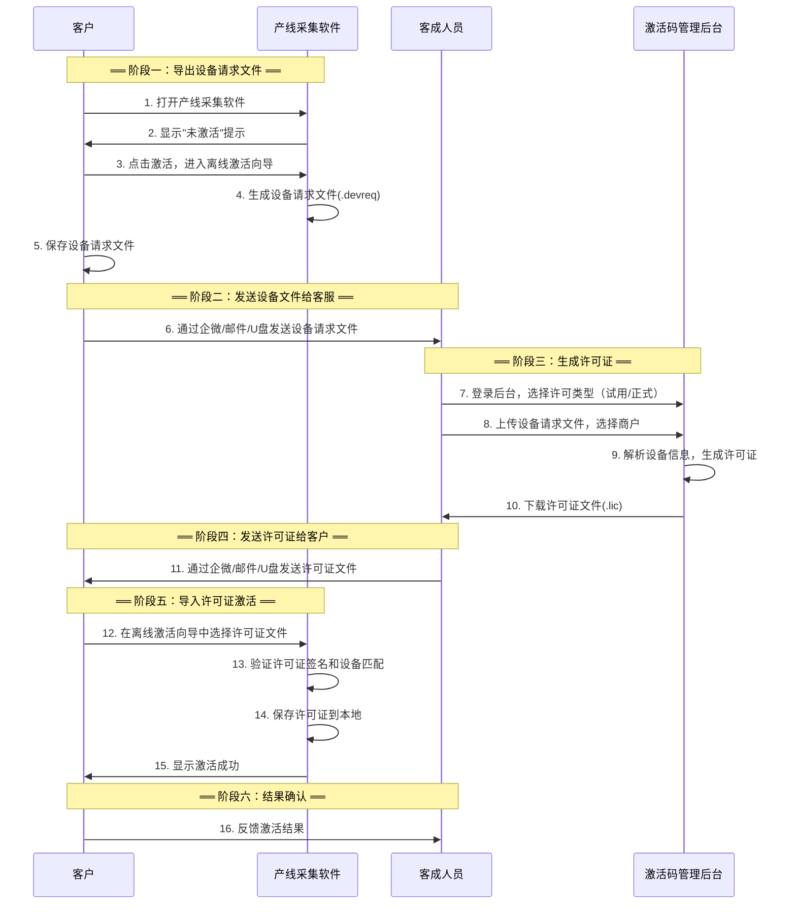
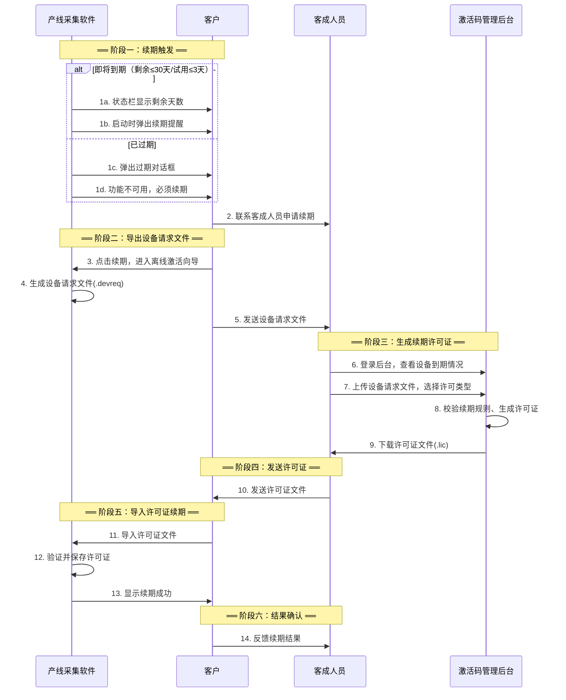
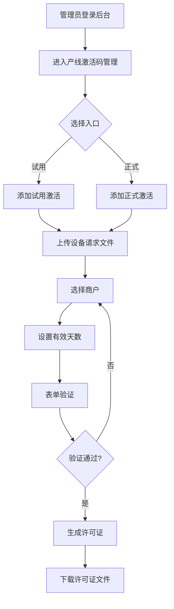
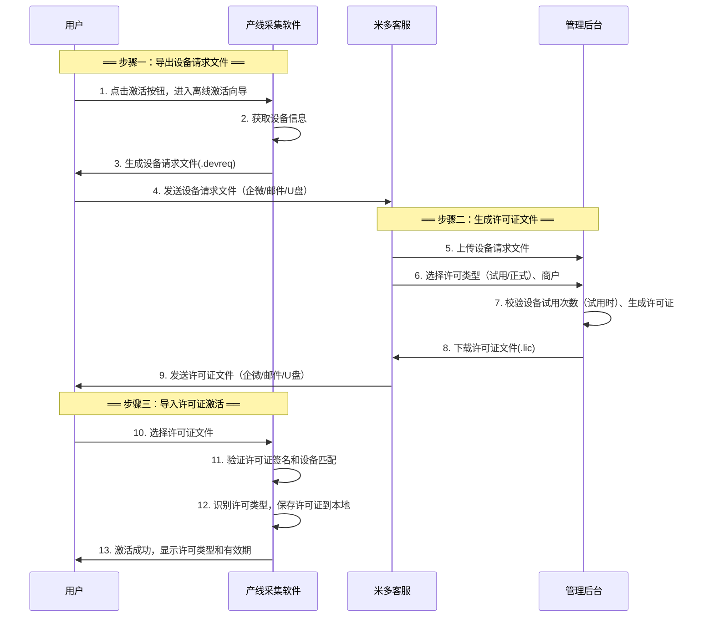

DEMO地址：

[https://image.qn.weixin12315.com.cn/prototypes/2025/12/PROTO_20251216_192546_FHJ/产线采集软件T1.1（新增激活码）/index.html](https://image.qn.weixin12315.com.cn/prototypes/2025/12/PROTO_20251216_192546_FHJ/产线采集软件T1.1（新增激活码）/index.html)

## 📋 文档信息
**文档头**

| 项目 | 内容 |
| --- | --- |
| **文档名称** | 产线采集软件激活码方案 - 产品需求文档（PRD） |
| **产品线/模块** | 产线采集软件 / 激活码管理 |
| **版本** | v1.1 |
| **迭代类型** | 新增 |
| **方案类型** | 激活码期限授权方案（离线激活） |
| **作者(PM)** | [伍林波] |
| **审批人(Owner)** | 产品负责人：[待填写]   技术负责人：[待填写]   相关决策者：[待填写] |
| **创建日期** | 2025-12-02 |
| **最后更新** | 2025-12-16 |
| **文档状态** | 待评审 |


## 📖 目录
+ [1. 产品概述](#一产品概述)
+ [2. 用户角色定义](#二用户角色定义)
+ [3. 授权体系说明](#三授权体系说明)
+ [4. 业务流程](#四业务流程)
+ [5. 核心功能模块](#五核心功能模块)
+ [6. API接口设计](#六api接口设计)
+ [7. 界面设计要求](#七界面设计要求)
+ [8. 数据库设计](#八数据库设计)
+ [9. 异常处理](#九异常处理)
+ [10. 安全性要求](#十安全性要求)
+ [文档修订记录](#文档修订记录)

---

## 一、产品概述
### 🎯 1.1 产品背景
为保证产线采集软件的合法使用，防止未授权工控机安装和使用产线采集应用，需要建立一套基于激活码的授权机制。该机制通过激活码验证，确保只有持有有效许可证的工控机才能正常使用软件。

**核心需求**：

+ 工控机环境下的软件授权管理
+ 基于硬件设备唯一码的设备绑定
+ 1年期限授权，支持延长有效期
+ 渐进式限制策略，人性化用户体验

> **💡**** 部署说明**：产线采集软件部署后与硬件联动运行，正常情况下不支持自动更新。如有新功能需求，需重新部署客户端。
>

### 🚀 1.2 产品目标
| 目标 | 描述 |
| --- | --- |
| 🔒 **安全性** | 防止软件被未授权使用和盗版，基于硬件设备唯一码绑定 |
| 🛠️ **可管理性** | 支持激活码的创建、分发、激活、查询 |
| 👥 **易用性** | 激活流程简单明了，状态显示清晰，用户体验友好 |
| 📊 **可追溯性** | 完整记录激活码的生命周期、使用情况、有效期变更记录 |
| ⏰ **有效期管理** | 1年授权期限，剩余30天提醒，到期后功能限制 |


### 📱 1.3 适用范围
+ **产线采集软件（Java桌面应用）**
+ **Windows工控机环境**
+ **独立的产线激活码管理后台**
+ **企业客户**

### 📋 1.4 方案概述
本方案提供完整的软件授权管理机制，包含以下核心要素：

**许可类型**：

| 类型 | 说明 |
| --- | --- |
| **试用许可** | 每次最多15天，同一设备最多激活2次（首次+续期1次），用于产线调试期 |
| **正式许可** | 激活后获得1年授权期限，到期前可续期延长 |


**激活方式**：

| 方式 | 适用场景 | 操作方式 |
| --- | --- | --- |
| **离线激活** | 所有工控机环境（含内网隔离） | 导出设备文件 → 获取许可证 → 导入激活 |


> 💡 **说明**：本期仅支持离线激活方式，在线激活后续迭代。
>

**渐进式限制策略**：

+ 试用期内/已激活：全功能可用
+ 试用过期/授权过期：功能不可用，必须激活/续期

> 💡 **阅读指引**：第三章详细说明授权体系和激活方式，第四章描述业务流程，第五章介绍功能实现细节。
>

---

## 二、用户角色定义
### 👨‍💼 2.1 系统管理员
| 类别 | 内容 |
| --- | --- |
| **🎯**** 职责** | • 手动添加和管理产线激活码   • 查看所有激活码使用情况   • 处理激活码相关问题   • 为设备变更用户重新生成许可证 |
| **🔑**** 权限** | • 创建激活码   • 查看所有激活记录   • 查看激活详情 |


### 📱 2.2 工控机使用者
| 类别 | 内容 |
| --- | --- |
| **🎯**** 职责** | • 输入激活码激活工控机软件   • 查看激活状态和剩余天数   • 使用激活码延长授权期限   • 正常使用产线采集功能 |
| **🔑**** 权限** | • 激活设备   • 查看本设备激活状态   • 激活（首次激活或续期） |


---

## 三、授权体系说明
本章节说明软件的授权机制，包括授权状态模型、试用模式、激活方式和限制策略。

### 📊 3.1 软件授权状态模型
软件共有5种授权状态，状态之间的转换关系明确：

| 状态 | 定义 | 说明 |
| --- | --- | --- |
| **未激活** | 首次安装，未导入任何许可证 | 功能不可用，需联系米多专员获取许可证 |
| **试用期内** | 已导入试用许可证，在有效期内 | 全功能可用，状态栏显示试用剩余天数 |
| **试用已过期** | 试用许可证超过有效期 | 功能不可用，可续试用（限1次）或激活正式版 |
| **已激活** | 正式授权有效期内 | 全功能可用，状态栏显示激活剩余天数 |
| **已过期** | 正式授权超过有效期 | 功能不可用，必须续期后才能使用 |


> **🔄**** 状态流转图**
>

```plain
┌─────────────────────────────────────────────────────────────────────┐
│                        软件授权状态流转                              │
├─────────────────────────────────────────────────────────────────────┤
│                                                                     │
│  ┌──────────┐  [导入试用许可证]   ┌──────────┐    15天到期          │
│  │  未激活   │ ─────────────────→ │ 试用期内  │ ───────────→        │
│  └────┬─────┘                     └────┬─────┘              │       │
│       │                                │                    ↓       │
│       │ [导入正式许可证]               │ [激活]      ┌──────────────┐│
│       │                                ↓             │  试用已过期   ││
│       │                          ┌──────────┐        └───────┬──────┘│
│       └─────────────────────────→│  已激活   │               │       │
│                                  └────┬─────┘  [激活/续试用] │       │
│                                       │        ←─────────────┘       │
│                                       │ 到期                         │
│                                       ↓                              │
│                                  ┌──────────┐                        │
│                                  │  已过期   │                        │
│                                  └────┬─────┘                        │
│                                       ↑   │                          │
│                                       └───┘ [续期]                   │
│                                                                     │
└─────────────────────────────────────────────────────────────────────┘
```

> **💡**** 状态判断优先级**
>

```plain
1. 检查正式许可证是否存在且有效
   → 有效：状态 = 已激活
   → 过期：状态 = 已过期
   → 不存在/无效：继续检查试用许可证

2. 检查试用许可证
   → 试用期内：状态 = 试用期内
   → 试用过期：状态 = 试用已过期
   → 不存在：状态 = 未激活
```

---

### 🎁 3.2 试用模式
试用模式为产线调试期提供临时授权，采用离线激活方式（与正式许可一致），便于客户在正式购买前进行产线调试和验证。

#### 3.2.1 试用规则
| 项目 | 规则 |
| --- | --- |
| **试用期限** | 每次最多15天 |
| **试用次数** | 同一设备最多2次（首次试用 + 续试用1次） |
| **功能限制** | 试用期内无限制，所有功能可正常使用 |
| **数据上传** | ✅ 试用期内允许上传 |
| **到期行为** | 试用到期后**功能不可用**，可续试用（限1次）或激活正式版 |
| **激活方式** | 离线激活（与正式许可一致） |
| **试用起始** | 导入试用许可证后开始计时 |


#### 3.2.2 试用激活流程
试用激活采用离线激活方式，流程与正式激活一致：

1. **客户导出设备请求文件**：在软件中导出 `.devreq` 文件
2. **客服生成试用许可证**：在后台上传设备文件，选择"试用激活"入口生成许可证
3. **客户导入许可证**：在软件中导入 `.lic` 文件完成激活

> **💡**** 说明**：首次启动软件时显示"未激活"状态，引导用户联系米多专员获取试用许可证。
>

#### 3.2.3 试用续期规则
| 场景 | 处理方式 |
| --- | --- |
| **首次试用到期** | 可申请续试用1次，每次最多15天 |
| **续试用到期** | 不可再续试用，必须购买正式许可 |
| **设备试用次数超限** | 后台拒绝生成试用许可证，提示"该设备已达试用上限" |


**服务器端校验逻辑**：

+ 后台记录每个设备的试用次数（基于设备ID）
+ 生成试用许可证时校验设备试用次数
+ 超过2次试用拒绝生成，返回错误提示

#### 3.2.4 试用期提醒策略
| 时机 | 提醒方式 | 可关闭 |
| --- | --- | --- |
| 首次启动（未激活） | 显示"未激活"提示，引导联系米多专员获取许可证 | ✅ 是 |
| 剩余 > 3天 | 不弹窗，仅状态栏显示 | - |
| 剩余 ≤ 3天 | 启动时弹出试用到期提醒，提示可续试用 | ✅ 是 |
| 试用已过期 | 弹出试用过期提示（可续试用/激活正式版/退出） | ❌ 否 |


---

### 🔀 3.3 激活方式说明
本方案采用**离线激活**方式，适用于所有工控机环境（包括内网隔离场景）。

> 💡 **说明**：在线激活功能将在后续版本迭代中支持。
>

#### 3.3.1 离线激活流程
**适用场景**：所有工控机环境（含内网隔离、无法联网的环境）

**操作流程**：

1. 客户在软件中导出设备请求文件（.devreq）
2. 客户将设备请求文件发送给米多客服（企微/邮件/U盘）
3. 客服在后台上传设备请求文件，选择许可类型（试用/正式），生成许可证
4. 客服将许可证文件（.lic）发送给客户
5. 客户在软件中导入许可证文件完成激活

**特点**：

+ 全程无需联网，适合内网隔离环境
+ 需要通过文件交换完成激活
+ 许可证生成时即为"已激活"状态
+ 试用和正式许可证激活流程一致，仅许可类型不同

> **🕐**** 有效期计算原理**
>
> 许可证有效期从**后台生成许可证时**开始计算，而非客户端导入时。
>
> **控制原理**：许可证文件中的 `expireDate` 字段在生成时已固化并签名，客户端每次启动时读取并验证签名，确保到期日期不可被篡改。
>

| 计算规则 | 说明 |
| --- | --- |
| **计时起点** | 后台管理员上传设备请求文件、点击生成许可证的时刻 |
| **到期日期固化** | 到期日期在服务端生成时写入许可证文件，并经RSA签名保护 |
| **客户端验证** | 客户端仅读取许可证中的到期日期，无法篡改 |
| **离线可用** | 日常使用完全离线，无需联网验证 |


#### 3.3.2 许可类型说明
| 许可类型 | 有效期 | 续期规则 | 适用场景 |
| --- | --- | --- | --- |
| **试用许可** | 每次最多15天 | 同一设备最多续期1次（共2次试用） | 产线调试期 |
| **正式许可** | 默认365天（可配置1-1095天） | 不限次数 | 正式生产使用 |


#### 3.3.3 激活界面行为
+ 点击"激活"或"续期"按钮直接进入离线激活向导
+ 无需选择激活方式
+ 导入许可证后自动识别许可类型（试用/正式）

---

### ⏰ 3.4 渐进式限制策略
根据授权状态采用渐进式的功能限制策略，在保护软件授权的同时提供友好的用户体验。

#### 阶段0：未激活（首次安装，无许可证）
| 特征 | 说明 |
| --- | --- |
| **启动行为** | 软件启动后弹出未激活提示 |
| **弹窗提示** | 显示"软件未激活"提示，引导联系米多专员获取许可证（可关闭） |
| **状态栏显示** | "未激活"（灰色） |
| **功能限制** | 所有功能不可用，必须激活后才能使用 |


#### 阶段1：试用期内（已导入试用许可证，有效期内）
| 特征 | 说明 |
| --- | --- |
| **启动行为** | 软件正常启动 |
| **弹窗提示** | 剩余≤3天时启动弹出提醒（可关闭） |
| **状态栏显示** | "试用剩余: XX天"（蓝色） |
| **功能限制** | 无限制，所有功能可正常使用 |


#### 阶段2：试用已过期（试用许可证超过有效期）
| 特征 | 说明 |
| --- | --- |
| **启动行为** | 软件启动后弹出过期对话框 |
| **弹窗提示** | 弹出"试用已过期"对话框（**不可关闭**），提示可续试用（限1次）或激活正式版 |
| **功能限制** | 所有功能不可用，必须续试用或激活正式版后才能使用 |


#### 阶段3：已激活（正式许可有效期内）
| 剩余天数 | 状态栏显示 | 颜色 | 提醒策略 |
| --- | --- | --- | --- |
| > 30天 | "激活剩余: XX天" | 绿色 | 不提醒 |
| 30-7天 | "激活剩余: XX天" | 橙色 | 启动时弹出续期提醒（可关闭） |
| < 7天 | "激活剩余: XX天" | 红色 | 每次启动强制提醒（可关闭） |


**功能状态**：所有功能正常使用

#### 阶段4：已过期（正式授权超过有效期）
| 特征 | 说明 |
| --- | --- |
| **启动行为** | 软件启动后弹出过期对话框 |
| **弹窗提示** | 弹出"激活已过期"对话框（**不可关闭**，必须续期或退出） |
| **功能限制** | 所有功能不可用，必须续期后才能使用 |


---

## 四、业务流程
本章节描述产线采集软件激活码的完整业务流程，明确各角色在业务中的职责和协作方式。

### 🔄 4.1 首次激活业务流程
#### 4.1.1 业务场景
首次激活适用于以下场景：

+ 新客户购买产线采集软件授权
+ 客户新增工控机设备部署
+ 设备更换后重新申请许可证激活

#### 4.1.2 参与角色
| 角色 | 职责 |
| --- | --- |
| **客成人员** | 对接客户需求、在后台生成许可证、将许可证文件发送给客户、跟进激活结果 |
| **系统管理员** | 在后台生成许可证、处理异常问题、管理激活码状态 |
| **客户（工控机使用者）** | 在工控机软件中导出设备请求文件、导入许可证文件完成激活 |


#### 4.1.3 完整业务流程（离线激活）
> **🔄**** 首次激活业务流程图**
>



#### 4.1.4 关键业务节点说明
| 节点 | 操作人 | 操作内容 | 系统入口 |
| --- | --- | --- | --- |
| 导出设备文件 | 客户 | 在软件中导出设备请求文件 | 产线采集软件 → 离线激活向导 → 导出 |
| 生成许可证 | 客成人员/管理员 | 上传设备文件，选择许可类型和商户 | 后台 → 添加试用激活 / 添加正式激活 |
| 发送许可证 | 客成人员 | 将许可证文件发送给客户 | 企微、邮件、U盘等 |
| 导入激活 | 客户 | 在软件中导入许可证文件 | 产线采集软件 → 离线激活向导 → 导入 |
| 状态确认 | 客成人员 | 确认客户激活成功 | 后台 → 产线激活码管理 → 激活码列表 |


---

### 🔁 4.2 续期业务流程
#### 4.2.1 业务触发场景
续期业务在以下场景触发：

| 触发场景 | 许可类型 | 触发方式 | 说明 |
| --- | --- | --- | --- |
| **试用即将到期** | 试用 | 软件提醒 | 试用剩余≤3天时弹出提醒，可续试用（限1次）或激活正式版 |
| **试用已过期** | 试用 | 客户主动联系 | 试用过期后可续试用1次或激活正式版 |
| **正式即将到期** | 正式 | 系统自动 + 客成主动 | 设备剩余30天内，软件状态栏显示提醒 |
| **正式已过期** | 正式 | 客户主动联系 | 设备过期后功能不可用，客户联系客成人员续期 |
| **提前续期** | 正式 | 客户主动申请 | 客户主动提出续期需求，有效期从原到期日叠加 |


#### 4.2.2 试用续期规则
| 规则项 | 说明 |
| --- | --- |
| **续期次数** | 同一设备最多续试用1次（即最多2次试用激活） |
| **续期时长** | 每次最多15天 |
| **校验逻辑** | 服务器端记录设备试用次数，超限拒绝生成 |
| **超限处理** | 后台提示"该设备已达试用上限"，引导客户购买正式许可 |


#### 4.2.3 参与角色
| 角色 | 在续期流程中的职责 |
| --- | --- |
| **客成人员** | 定期检查即将到期设备、主动联系客户确认续期需求、生成续期许可证、发送给客户、跟进续期结果 |
| **系统管理员** | 处理续期异常问题、查看续期历史记录 |
| **客户（工控机使用者）** | 收到续期提醒后联系客成人员、在软件中导入续期许可证完成续期 |


#### 4.2.4 完整续期业务流程（离线激活）
> **🔄**** 续期业务流程图**
>



#### 4.2.5 续期到期日计算规则
| 许可类型 | 设备状态 | 计算规则 | 示例 |
| --- | --- | --- | --- |
| **试用** | 未过期续试用 | 新到期日 = 原到期日 + 有效天数（最多15天） | 原到期12-15，续15天 → 新到期12-30 |
| **试用** | 已过期续试用 | 新到期日 = 续期当天 + 有效天数（最多15天） | 已过期，今天续15天 → 新到期+15天 |
| **正式** | 未过期续期 | 新到期日 = 原到期日 + 有效天数 | 原到期2026-06-01，续期365天 → 新到期2027-06-01 |
| **正式** | 已过期续期 | 新到期日 = 续期当天 + 有效天数 | 已过期，今天2026-07-01续期365天 → 新到期2027-07-01 |


> 💡 **提前续期不损失天数**：用户提前续期时，新有效期从原到期日开始叠加，剩余天数不会被清零。
>

#### 4.2.6 关键业务节点说明
| 节点 | 操作人 | 操作内容 | 系统入口 |
| --- | --- | --- | --- |
| 到期检查 | 客成人员 | 定期查看即将到期/已过期设备 | 后台 → 激活码列表 → 筛选"剩余天数" |
| 联系客户 | 客成人员 | 主动联系客户确认续期需求 | 企微、电话等 |
| 导出设备文件 | 客户 | 在软件中导出设备请求文件 | 软件 → 离线激活向导 |
| 生成许可证 | 客成人员 | 上传设备文件，生成续期许可证 | 后台 → 添加试用激活/添加正式激活 |
| 发送许可证 | 客成人员 | 将许可证文件发送给客户 | 企微、邮件、U盘等 |
| 执行续期 | 客户 | 在软件中导入许可证文件 | 软件 → 离线激活向导 |
| 确认结果 | 客成人员 | 确认客户续期成功、新到期时间 | 后台 → 激活码详情 |


---

### 👥 4.3 各角色职责与协作
#### 4.3.1 客成人员职责
客成人员是激活业务的核心对接人，负责连接米多平台与客户：

| 职责类别 | 具体内容 |
| --- | --- |
| **首次激活** | • 了解客户购买/部署需求   • 接收客户设备请求文件，在后台生成许可证   • 将许可证文件发送给客户并说明操作方式   • 跟进确认激活结果 |
| **试用管理** | • 为产线调试期客户生成试用许可证   • 跟踪设备试用次数，提醒客户购买正式版 |
| **续期管理** | • 定期查看即将到期设备（建议每周）   • 提前联系客户确认续期需求   • 生成续期许可证并发送给客户   • 跟进确认续期结果 |
| **问题处理** | • 接收客户激活/续期问题反馈   • 协调管理员处理异常情况   • 反馈处理结果给客户 |


#### 4.3.2 系统管理员职责
| 职责类别 | 具体内容 |
| --- | --- |
| **激活码管理** | • 管理激活码生成规则   • 处理激活码异常（如误用、作废等）   • 为设备变更用户重新生成许可证 |
| **数据查看** | • 查看所有激活码使用情况   • 查看激活历史和续期记录   • 导出激活数据报表 |
| **系统维护** | • 监控激活服务运行状态   • 处理系统异常告警 |


#### 4.3.3 客户（工控机使用者）职责
| 职责类别 | 具体内容 |
| --- | --- |
| **激活操作** | • 收到激活码后在软件中输入激活   • 确认激活成功并反馈给客成人员 |
| **续期操作** | • 关注软件中的到期提醒   • 到期前联系客成人员获取续期码   • 在软件中完成续期操作 |
| **问题反馈** | • 激活/续期失败时及时反馈   • 提供错误信息协助排查 |


---

### 📊 4.4 管理后台续期管理功能
#### 4.4.1 即将到期设备查询
客成人员和管理员可通过后台快速筛选即将到期或已过期的设备：

**筛选条件**：

| 筛选项 | 说明 |
| --- | --- |
| 剩余天数范围 | 如：0-7天、7-30天、已过期 |
| 商户 | 按商户筛选其设备 |
| 状态 | 已激活、已过期 |


**快捷筛选按钮**：

+ 「7天内到期」- 快速查看紧急需续期设备
+ 「30天内到期」- 查看近期需跟进设备
+ 「已过期」- 查看已过期待续期设备

#### 4.4.2 续期历史查看
在激活码详情页面，可查看该设备的完整续期历史：

```plain
有效期变更记录：
┌──────────────┬─────────────┬─────────────┬──────────┬─────────────┐
│ 激活码       │ 原到期时间   │ 新到期时间   │ 延长天数  │ 操作时间     │
├──────────────┼─────────────┼─────────────┼──────────┼─────────────┤
│ T3B7-9KLM-F4H2 │ -          │ 2026-12-02  │ 365      │ 2025-12-02  │ (首次激活)
│ K8M2-P5JN-Q7R3 │ 2026-12-02 │ 2027-12-02  │ 365      │ 2026-11-15  │ (续期)
└──────────────┴─────────────┴─────────────┴──────────┴─────────────┘
```

---

## 五、核心功能模块
### 🎫 5.1 激活码管理模块
#### 🔢 5.1.1 激活码说明
激活码作为许可证的唯一标识符，由系统自动生成。

| 项目 | 说明 |
| --- | --- |
| **生成方式** | 系统自动生成，格式：`XXXX-XXXX-XXXX` |
| **用途** | 后台管理中用于许可证标识和查询，便于客服与客户沟通 |
| **使用规则** | 一码一设备，支持首次激活和续期（系统自动判断） |
| **客户端显示** | 本期客户端界面不显示激活码，暂不支持激活码输入激活 |


> **💡**** 说明**：激活码主要用于后台管理和客服沟通场景，客户通过导入许可证文件(.lic)完成激活，无需手动输入激活码。
>

#### ➕ 5.1.2 添加许可证（离线激活）
> **📖**** 功能描述**
>

系统管理员在后台上传设备请求文件，生成许可证。根据许可类型分为两个独立入口：

+ **添加试用激活**：生成试用许可证（有效期固定15天）
+ **添加正式激活**：生成正式许可证（有效期可配置）

> **🔄**** 操作流程**
>



> **📝**** 添加试用激活表单**
>

| 字段 | 类型 | 说明 |
| --- | --- | --- |
| 📁 **设备请求文件** | 文件上传 | 必填，支持 .devreq 格式 |
| 🏢 **商户** | 下拉选择 | 必填，从已有商户列表中选择 |
| ⏰ **有效天数** | 数字输入 | 固定15天，不可修改 |
| 📝 **备注信息** | 文本输入 | 可选 |


**试用激活校验规则**：

+ 校验设备试用次数，超过2次（首次+续期1次）拒绝生成
+ 超限时提示"该设备已达试用上限，请购买正式许可"

> **📝**** 添加正式激活表单**
>

| 字段 | 类型 | 说明 |
| --- | --- | --- |
| 📁 **设备请求文件** | 文件上传 | 必填，支持 .devreq 格式 |
| 🏢 **商户** | 下拉选择 | 必填，从已有商户列表中选择 |
| ⏰ **有效天数** | 数字输入 | 必填，默认365天（范围1-1095天） |
| 📝 **备注信息** | 文本输入 | 可选，如批次说明、用途等 |


> **💡**** 许可证生成规则**
>

+ 激活码作为许可证唯一标识，由系统自动生成（格式：XXXX-XXXX-XXXX）
+ 自动校验唯一性，确保不重复
+ 生成后自动关联到选定商户和设备
+ 许可证生成时即为"已激活"状态
+ **有效期从生成时开始计时**（非客户端导入时），到期日期写入许可证文件并签名保护
+ 到期日期计算规则：
    - 首次激活：到期日 = 生成当天 + 有效天数
    - 续期（设备未过期）：新到期日 = 原到期日 + 有效天数
    - 续期（设备已过期）：新到期日 = 生成当天 + 有效天数

> **🔄**** 许可证生成方式**
>

| 阶段 | 生成方式 | 说明 |
| --- | --- | --- |
| **当前阶段（MVP）** | 管理员手动添加 | 管理员上传设备文件，选择许可类型，系统生成许可证 |
| **后续迭代** | 订单驱动自动生成 | 客成人员下单 → 财务审核 → 审核通过 → 系统自动生成许可证 |


> ⚠️ **重要说明**：正式许可证不能随意生成，后续需要与订单系统对接，由财务人员审核通过后自动规范生成。
>

### 🔐 5.2 激活验证模块
#### 🚀 5.2.1 离线激活流程
> **🔄**** 离线激活流程图**
>

本方案统一采用离线激活方式，适用于所有工控机环境（包括内网隔离场景）：



> **📋**** 离线激活详细步骤**
>

| 步骤 | 操作人 | 操作 | 说明 |
| --- | --- | --- | --- |
| 1️⃣ | 用户 | 点击激活按钮 | 在许可证信息页面点击"激活"，直接进入离线激活向导 |
| 2️⃣ | 软件 | 获取设备信息 | 自动采集设备ID等信息 |
| 3️⃣ | 软件 | 生成设备请求文件 | 生成.devreq文件并保存到本地 |
| 4️⃣ | 用户 | 发送请求文件 | 通过企微/邮件/U盘发送给米多客服 |
| 5️⃣ | 客服 | 上传请求文件 | 在管理后台上传设备请求文件 |
| 6️⃣ | 客服 | 选择许可类型 | 选择"添加试用激活"或"添加正式激活"入口 |
| 7️⃣ | 后台 | 生成许可证 | 系统校验设备试用次数（试用时），生成许可证文件 |
| 8️⃣ | 客服 | 下载许可证 | 下载.lic文件 |
| 9️⃣ | 客服 | 发送许可证 | 通过企微/邮件/U盘发送给用户 |
| 🔟 | 用户 | 导入许可证 | 在软件中选择许可证文件 |
| 1️⃣1️⃣ | 软件 | 验证许可证 | 验证签名、设备匹配、有效期、许可类型 |
| 1️⃣2️⃣ | 软件 | 保存许可证 | 保存到本地应用目录 |
| 1️⃣3️⃣ | 软件 | 激活成功 | 显示许可类型（试用/正式）和有效期信息 |


> **📁**** 设备请求文件格式（.devreq）**
>

**文件命名**：`设备激活请求_设备ID前8位_日期.devreq`

**示例**：`设备激活请求_a3b2c1d4_20251205.devreq`

**文件内容**（Base64编码的JSON）：

```json
{
  "fileType": "DEVICE_ACTIVATION_REQUEST",
  "version": "1.0",
  "createTime": "2025-12-05 14:30:00",
  "deviceInfo": {
    "deviceId": "a3b2c1d4e5f6g7h8i9j0k1l2m3n4o5p6",
    "baseboardSerial": "L1HF65X00156",
    "cpuId": "BFEBFBFF000906E9",
    "manufacturer": "HP",
    "deviceModel": "HP EliteDesk 800 G5",
    "osVersion": "Windows 10 Pro",
    "appVersion": "2.0.0"
  },
  "requestType": "activation",
  "checksum": "MD5_HASH"
}
```

> **💡**** 设备请求文件(.devreq)原理说明**
>
> **首次激活与续期的.devreq文件有区别吗？**
>
> 无论首次激活还是续期，导出的 `.devreq` 文件内容结构**完全相同**，均包含设备硬件指纹信息。续期时重新导出是为了：
>
> + **设备身份验证**：确保续期请求来自真实的授权设备，而非伪造请求
> + **设备信息同步**：若设备某些信息有变更（如OS版本、应用版本），可同步到后台
> + **安全校验**：后台通过 `deviceId` 查询历史记录，自动判断是首次激活还是续期
>
> **后台判断逻辑**：
>

```plain
收到.devreq文件
    ↓
解析deviceId
    ↓
查询licenses表是否存在该deviceId的有效记录
    ↓
├─ 不存在 → activation_type = 'first'（首次激活）
│            到期日 = 生成当天 + 有效天数
│
└─ 存在 → activation_type = 'renewal'（续期）
           └─ 原记录未过期：新到期日 = 原到期日 + 有效天数
           └─ 原记录已过期：新到期日 = 生成当天 + 有效天数
```

#### 5.2.2 续期计算规则
> **📋**** 续期到期日计算规则**
>

| 设备当前状态 | 计算规则 | 示例说明 |
| --- | --- | --- |
| **首次激活** | 到期日 = 激活当天 + 有效天数 | 今天2025-12-02激活，有效365天 → 到期2026-12-02 |
| **续期（未过期）** | 新到期日 = 原到期日 + 有效天数 | 原到期2026-06-01，续期365天 → 新到期2027-06-01 |
| **续期（已过期）** | 新到期日 = 续期当天 + 有效天数 | 已过期，今天2026-07-01续期365天 → 新到期2027-07-01 |


> **💡**** 规则说明**
>

+ **未过期续期**：用户提前续期不会损失剩余天数，新有效期从原到期日开始叠加
+ **已过期续期**：过期后续期从当天开始计算，过期期间不计入有效期
+ **激活码消耗**：无论首次激活还是续期，每次操作都消耗一个新的激活码
+ **记录策略**：每次激活/续期都会在 `device_activations` 表插入新记录，便于追溯历史

### 5.3 许可证验证模块
#### 5.3.1 应用启动验证
**验证策略说明**：

+ **本地文件验证**：验证本地存储的许可证文件完整性和有效性
+ **验证频率**：应用启动时 + 启用任务前强制检查
+ **网络要求**：离线激活和日常使用完全离线

**验证时机**：

| 验证时机 | 验证类型 | 网络要求 | 说明 |
| --- | --- | --- | --- |
| 应用每次启动时 | 本地验证 | 离线 | 验证本地许可证文件完整性、签名、设备匹配、有效期 |
| 启用任务前 | 本地验证 | 离线 | 强制验证许可证是否在有效期内，确保授权有效 |
| 激活（离线模式） | 本地验证 | 离线 | 验证导入的许可证文件签名和有效性 |


**内网部署说明**：

+ 产线工控机通常部署在隔离内网，日常运行无法联网
+ 所有验证均离线执行，不依赖网络连接
+ 采用离线激活模式，整个软件生命周期无需联网
+ 操作流程：导出设备请求文件 → 发送给米多客服 → 获取许可证文件 → 导入激活

> **📡**** 部署说明**
>
> 激活成功后，许可证文件保存在本地，日常使用无需联网。
>

**本地验证流程**（离线，应用启动时/启用任务前执行）：

1. **读取本地许可证文件**
    - 检查许可证文件是否存在（`%APPDATA%\miduo\license\production_line.lic`）
    - 验证文件完整性（MD5校验）
    - 解密许可证内容（AES256）
2. **许可证内容验证**
    - 验证许可证签名（RSA2048签名验证）
    - 验证设备ID是否匹配
    - 验证是否在有效期内（检查expireDate）
    - 计算剩余天数
3. **验证结果处理**
    - **试用期内**：正常启动，状态栏显示试用剩余天数
    - **试用已过期**：弹出试用过期提示（不可关闭，必须激活或退出）
    - **已激活且有效**：正常启动应用，状态栏显示剩余天数
    - **已激活但过期**：弹出过期对话框（不可关闭，必须续期或退出）
    - **许可证损坏**：提示重新激活

**验证优先级**：

```plain
应用启动 → 本地许可证验证 → 渐进式限制策略 → 应用正常使用/功能受限
```

**本地许可证验证原理说明**：

+ 首次激活时，服务器生成包含设备信息和权限的加密许可证文件
+ 许可证文件使用RSA私钥签名，确保无法被篡改
+ 应用启动时验证许可证文件的签名和设备匹配性
+ 验证到期时间，计算剩余天数
+ 无需联网即可完成验证，实现真正的离线使用
+ 如果许可证文件损坏或验证失败，需要重新联网激活

#### 5.3.2 许可证文件设计
> **📁**** 许可证文件关系**
>

| 文件 | 用途 | 生成时机 | 优先级 |
| --- | --- | --- | --- |
| `trial.lic` | 试用许可证 | 首次启动时自动生成 | 低 |
| `production_line.lic` | 正式许可证 | 激活成功后服务器下发 | 高 |


**存储路径**：`%APPDATA%\miduo\license\`

> **📁**** 试用许可证文件结构**
>

```json
{
  "header": {
    "version": "1.0",
    "type": "TRIAL",
    "keyVersion": "2025",
    "algorithm": "AES256+RSA2048"
  },
  "payload": {
    "deviceId": "a3b2c1d4e5f6g7h8i9j0k1l2m3n4o5p6",
    "trialStartDate": "2025-12-02",
    "trialExpireDate": "2025-12-17",
    "trialDays": 15,
    "checksum": "MD5_HASH"
  },
  "signature": "RSA_SIGNATURE_BASE64"
}
```

> **🗂️**** 注册表存储（备份校验）**
>

**路径**：`HKEY_CURRENT_USER\Software\Miduo\ProductionLine`

| 键名 | 值 | 说明 |
| --- | --- | --- |
| `InstallId` | 加密字符串 | 首次启动时间 + 设备ID 的加密值 |
| `CheckValue` | 校验码 | 用于检测篡改 |


> **💡**** 说明**：
>
> + 软件授权状态模型详见 **3.1 软件授权状态模型**
> + 试用模式规则详见 **3.2 试用模式**
> + 渐进式限制策略详见 **3.4 渐进式限制策略**
>

### 🖥️ 5.4 产线激活码管理后台
#### 5.4.1 激活码列表
**功能描述**：查看和管理所有产线激活码

**列表字段**：

+ 激活码（支持点击复制）
+ 状态（已激活、已续期、已过期）
+ 激活类型（首次激活/续期）
+ 商户信息（商户编号/商户名称）
+ 绑定设备（设备型号/设备ID）
+ 有效天数
+ 激活时间
+ 到期时间
+ 剩余天数
+ 添加人
+ 创建时间
+ 操作（查看详情）

**激活类型显示规则**：

| 激活类型 | 显示样式 | 说明 |
| --- | --- | --- |
| 首次激活 | 蓝色徽章 | 该激活码用于设备的首次激活 |
| 续期 | 绿色徽章 | 该激活码用于设备的续期操作 |
| - | 灰色文字 | 激活码尚未使用 |


**筛选条件**：

+ 激活码
+ 状态（已激活/已续期/已过期）
+ 激活类型（全部/首次激活/续期）
+ 许可类型（全部/试用/正式）
+ 商户编号
+ 设备ID（绑定设备）
+ 到期时间范围
+ 搜索按钮、重置按钮

> 💡 **说明**：离线模式下，生成许可证即完成激活，不存在"未激活"状态；不支持解绑功能，不存在"已撤销"状态。
>

**列表特性**：

+ 支持分页（10/20/50/100条每页）
+ 激活码右侧有复制图标，点击可复制激活码
+ 过期码自动标红
+ 激活类型徽章区分首次激活和续期
+ 许可类型徽章：试用（蓝色）、正式（绿色）
+ 操作列显示"详情"链接

#### 5.4.2 激活码详情
**详细信息**：

```plain
基本信息：
- 激活码（完整显示，如：T3B7-9KLM-F4H2）
- 状态（已激活/已续期/已过期）
- 激活类型（首次激活/续期）
- 有效天数
- 创建时间
- 添加人

关联信息：
- 商户编号
- 商户名称
- 备注信息

激活信息：
- 激活时间
- 到期时间
- 剩余天数（实时计算，已续期/已过期状态显示"-"）

设备信息：
- 绑定设备（设备唯一码）
- 设备型号
- 主板序列号
- CPU ID
- 制造商
- 操作系统版本
- 应用版本

有效期变更记录（同一设备的所有激活历史）：
- 激活码
- 激活类型（首次激活/续期）
- 原到期时间
- 新到期时间
- 延长天数
- 激活时间

许可类型：
- 试用/正式
- 试用许可证显示试用次数：当前第X次/最多2次

> 💡 **说明**：详情页完整展示激活码信息。离线模式下设备变更时需为用户重新生成新许可证。
```

**状态显示规则**：

| 状态 | 徽章颜色 | 说明 |
| --- | --- | --- |
| 已激活 | 绿色 | 当前有效的许可证 |
| 已续期 | 蓝色 | 该设备已生成新的续期许可证，此记录为历史记录 |
| 已过期 | 红色 | 许可证到期且未续期 |


---

## 六、API接口设计
本章节定义激活模块的所有API接口，包括客户端接口和后台管理接口。

> 💡 **说明**：本期仅支持离线激活，无在线激活接口。
>

### 🔌 6.1 客户端接口
> **离线激活验证**（客户端本地）
>

离线激活无需调用服务端接口，客户端导入许可证文件后执行本地验证：

1. 验证文件格式和完整性（MD5校验）
2. 验证RSA签名
3. 验证设备ID是否匹配
4. 解密payload获取许可信息
5. 识别许可类型（试用/正式）
6. 验证有效期
7. 保存许可证文件到本地存储

### 🔌 6.2 后台管理接口
> **激活码列表**
>

| 项目 | 内容 |
| --- | --- |
| **接口地址** | `GET /api/admin/licenses` |
| **请求方式** | GET |
| **权限要求** | 管理员登录 |


**请求参数**：

| 参数 | 类型 | 必填 | 说明 |
| --- | --- | --- | --- |
| licenseKey | String | 否 | 激活码（模糊搜索） |
| status | String | 否 | 状态筛选：active/superseded/expired |
| activationType | String | 否 | 激活类型筛选：first（首次激活）/renewal（续期） |
| licenseType | String | 否 | 许可类型筛选：trial（试用）/official（正式） |
| merchantId | String | 否 | 商户编号 |
| deviceId | String | 否 | 设备ID（模糊搜索，用于筛选同一设备的所有激活记录） |
| expireDateStart | Date | 否 | 到期时间范围开始 |
| expireDateEnd | Date | 否 | 到期时间范围结束 |
| page | Integer | 是 | 页码（从1开始） |
| pageSize | Integer | 是 | 每页条数（10/20/50/100） |


**响应示例**：

```json
{
  "success": true,
  "data": {
    "total": 25,
    "list": [
      {
        "id": 1,
        "licenseKey": "T3B7-9KLM-F4H2",
        "status": "active",
        "activationType": "first",
        "licenseType": "official",
        "merchantId": "M001",
        "merchantName": "测试商户",
        "validDays": 365,
        "bindDevice": {
          "deviceModel": "PTP-AN10",
          "deviceId": "a3b2c1d4e5f6g7h8"
        },
        "activationDate": "2025-12-02",
        "expireDate": "2026-12-02",
        "remainingDays": 180,
        "createBy": "admin",
        "createTime": "2025-12-01 10:00:00"
      }
    ]
  }
}
```

**activationType字段说明**：

| 值 | 说明 |
| --- | --- |
| `first` | 首次激活 - 该激活码用于设备的首次激活 |
| `renewal` | 续期 - 该激活码用于设备的续期操作 |


**status字段说明**：

| 值 | 说明 |
| --- | --- |
| `active` | 当前有效 - 该许可证是设备当前使用的有效许可 |
| `superseded` | 已被续期取代 - 该设备已生成新的续期许可证，此记录为历史记录 |
| `expired` | 已过期 - 许可证到期且未续期 |


**licenseType字段说明**：

| 值 | 说明 |
| --- | --- |
| `trial` | 试用许可 - 用于产线调试期，每次最多15天，同一设备最多2次 |
| `official` | 正式许可 - 用于正式生产，有效期可配置（1-1095天） |


> **添加试用许可证**
>

| 项目 | 内容 |
| --- | --- |
| **接口地址** | `POST /api/admin/licenses/trial` |
| **请求方式** | POST |
| **权限要求** | 管理员登录 |


**请求参数**：

```json
{
  "deviceRequestFile": "BASE64_ENCODED_DEVREQ_CONTENT",
  "merchantId": "M001",
  "remarks": "产线调试"
}
```

**说明**：

+ 有效天数固定为15天，不可配置
+ 系统自动校验设备试用次数，超过2次拒绝生成

**响应示例**：

```json
{
  "success": true,
  "message": "试用许可证生成成功",
  "data": {
    "licenseKey": "T3B7-9KLM-F4H2",
    "licenseType": "trial",
    "validDays": 15,
    "deviceTrialCount": 1,
    "licenseFile": "BASE64_ENCODED_LICENSE_DATA"
  }
}
```

**试用次数超限错误响应**：

```json
{
  "success": false,
  "code": 2001,
  "message": "该设备已达试用上限（2次），请购买正式许可"
}
```

> **添加正式许可证**
>

| 项目 | 内容 |
| --- | --- |
| **接口地址** | `POST /api/admin/licenses/official` |
| **请求方式** | POST |
| **权限要求** | 管理员登录 |


**请求参数**：

```json
{
  "deviceRequestFile": "BASE64_ENCODED_DEVREQ_CONTENT",
  "merchantId": "M001",
  "validDays": 365,
  "remarks": "正式购买"
}
```

**响应示例**：

```json
{
  "success": true,
  "message": "正式许可证生成成功",
  "data": {
    "licenseKey": "T3B7-9KLM-F4H2",
    "licenseType": "official",
    "validDays": 365,
    "licenseFile": "BASE64_ENCODED_LICENSE_DATA"
  }
}
```

> **激活码详情**
>

| 项目 | 内容 |
| --- | --- |
| **接口地址** | `GET /api/admin/licenses/{id}` |
| **请求方式** | GET |
| **权限要求** | 管理员登录 |


> **设备试用记录查询**
>

| 项目 | 内容 |
| --- | --- |
| **接口地址** | `GET /api/admin/devices/{deviceId}/trial-records` |
| **请求方式** | GET |
| **权限要求** | 管理员登录 |


**响应示例**：

```json
{
  "success": true,
  "data": {
    "deviceId": "a3b2c1d4e5f6g7h8",
    "trialCount": 1,
    "maxTrialCount": 2,
    "canTrial": true,
    "records": [
      {
        "licenseKey": "T3B7-9KLM-F4H2",
        "activationDate": "2025-12-01",
        "expireDate": "2025-12-16",
        "status": "active"
      }
    ]
  }
}
```

**错误码定义**：

| 错误码 | 错误类型 | 用户提示信息 |
| --- | --- | --- |
| 2001 | 试用次数超限 | 该设备已达试用上限（2次），请购买正式许可 |
| 3001 | 文件格式错误 | 设备请求文件格式不正确 |
| 3002 | 文件解析失败 | 无法解析设备请求文件 |
| 3003 | 文件校验失败 | 设备请求文件校验失败，可能已损坏 |


> **许可证文件下载**
>

| 项目 | 内容 |
| --- | --- |
| **接口地址** | `GET /api/admin/licenses/{id}/download` |
| **请求方式** | GET |
| **权限要求** | 管理员登录 |


**响应**：直接返回 .lic 文件

+ Content-Type: application/octet-stream
+ Content-Disposition: attachment; filename="production_line_a3b2c1d4_20251205.lic"

---

## 七、界面设计要求
### 7.1 JavaFX客户端界面（工控机软件）
> **📋**** 界面使用流程说明**
>
> 根据用户使用场景，界面出现顺序如下：
>
> **注**：本期仅支持离线激活方式。
>

| 阶段 | 界面 | 触发时机 |
| --- | --- | --- |
| **首次启动** | 未激活提示弹窗（7.1.6） | 软件首次运行，无许可证 |
| **日常使用** | 主界面状态栏（7.1.2） | 常态显示授权状态 |
| **查看/管理** | 许可证信息页面（7.1.3） | 点击状态栏或设置菜单 |
| **离线激活** | 离线激活向导（7.1.4） | 点击激活/续期按钮 |
| **激活完成** | 激活成功界面（7.1.1） | 激活/续期成功后 |
| **到期提醒** | 试用到期提醒（7.1.7） | 试用剩余≤3天 |
| **过期处理** | 过期提示对话框（7.1.5） | 试用/授权过期 |


#### 7.1.1 激活成功界面
**页面布局**（首次激活成功）：

```plain
┌──────────────────────────────────────────────┐
│            激活成功                          │
├──────────────────────────────────────────────┤
│                                              │
│            [成功图标 ✓]                      │
│                                              │
│             激活成功！                        │
│                                              │
│  ┌──────────────────────────────┐            │
│  │ 许可类型  试用/正式          │            │
│  │ ─────────────────────────────│            │
│  │ 激活时间  2025-12-02         │            │
│  │ ─────────────────────────────│            │
│  │ 到期时间  2025-12-17         │            │
│  │ ─────────────────────────────│            │
│  │ 有效期    15天               │            │
│  └──────────────────────────────┘            │
│                                              │
│  +────────────────────────────────+          │
│  |        [开始使用]              |          │
│  +────────────────────────────────+          │
│                                              │
└──────────────────────────────────────────────┘
```

**页面布局**（续期成功）：

```plain
┌──────────────────────────────────────────────┐
│            续期成功                          │
├──────────────────────────────────────────────┤
│                                              │
│            [成功图标 ✓]                      │
│                                              │
│             续期成功！                        │
│                                              │
│  ┌──────────────────────────────┐            │
│  │ 许可类型  试用/正式          │            │
│  │ ─────────────────────────────│            │
│  │ 原到期时间  2025-12-02       │            │
│  │ ─────────────────────────────│            │
│  │ 新到期时间  2025-12-17       │            │
│  │ ─────────────────────────────│            │
│  │ 延长天数    15天             │            │
│  └──────────────────────────────┘            │
│                                              │
│  +────────────────────────────────+          │
│  |        [确定]                  |          │
│  +────────────────────────────────+          │
│                                              │
└──────────────────────────────────────────────┘
```

#### 7.1.2 主界面状态栏集成
**位置**：主界面底部状态栏右侧，紧邻版本号

**显示格式**：

> **已激活（正式授权）状态**
>

| 状态 | 显示内容 | 颜色 | 图标 |
| --- | --- | --- | --- |
| 正常（>30天） | `激活剩余: XX天` | 绿色 (#2e7d32) | ✓ |
| 警告（30-7天） | `激活剩余: XX天` | 橙色 (#f57c00) | ⚠️ |
| 紧急（7-1天） | `激活剩余: XX天` | 红色 (#d32f2f) | ⚠️ |
| 即将过期（<1天） | `激活剩余: X小时` | 红色 (#d32f2f) | ⚠️ |
| 已过期 | `已过期` | 红色 (#d32f2f) | ❌ |


> **试用模式状态**（试用许可证）
>

| 状态 | 显示内容 | 颜色 | 图标 |
| --- | --- | --- | --- |
| 试用期内（>7天） | `试用剩余: XX天` | 蓝色 (#1976d2) | 🔵 |
| 试用期内（7-3天） | `试用剩余: XX天` | 橙色 (#f57c00) | ⚠️ |
| 试用期内（≤3天） | `试用剩余: XX天` | 红色 (#d32f2f) | ⚠️ |
| 试用已过期 | `试用已过期` | 红色 (#d32f2f) | ❌ |


> **未激活状态**（无许可证）
>

| 状态 | 显示内容 | 颜色 | 图标 |
| --- | --- | --- | --- |
| 未激活 | `未激活` | 灰色 (#757575) | ○ |


> **🔄**** 状态显示优先级**
>
> 1. 若存在有效的正式许可证 → 显示**已激活状态**
> 2. 若正式许可证已过期 → 显示**已过期**
> 3. 若存在有效的试用许可证 → 显示**试用模式状态**
> 4. 若试用许可证已过期 → 显示**试用已过期**
> 5. 若无任何许可证 → 显示**未激活**
>

**交互行为**：

+ 可点击：点击状态文字跳转到"激活信息"页面
+ 悬停提示：显示详细信息（激活码、到期时间）
+ 每分钟更新：剩余天数/小时实时更新

**示例布局**：

```plain
┌─────────────────────────────────────────────────────────────┐
│ 当前功能: 主界面 | 设备状态: 3个在线 | 工作状态: 生产中      │
│              [激活剩余: 180天 ✓]  v2.0.0  2025-12-02 14:30  │
└─────────────────────────────────────────────────────────────┘
```

#### 7.1.3 许可证信息页面
**菜单路径**：设置 → 许可证信息

**页面职责**：展示当前授权状态 + 提供激活/续期操作入口

> **💡**** 设计说明**
>
> 许可证信息页面是软件的常态入口，用户可随时访问查看当前授权状态。  
页面根据不同授权状态展示不同内容，但保持统一的页面结构。  
点击激活/续期按钮直接进入离线激活向导。
>

**页面布局**（未激活状态）：

```plain
┌──────────────────────────────────────────────────────────────┐
│  [返回]  许可证信息                                          │
├──────────────────────────────────────────────────────────────┤
│                                                              │
│  ┌────────────────────────────────────┐                      │
│  │ 当前状态                            │                      │
│  │ ───────────────────────────────────│                      │
│  │ [○未激活]  请联系米多专员获取许可证    │                      │
│  └────────────────────────────────────┘                      │
│                                                              │
│  ┌────────────────────────────────────┐                      │
│  │ 设备信息                            │                      │
│  │ ───────────────────────────────────│                      │
│  │ 设备ID: a3b2****o5p6                │                      │
│  │ 设备型号: HP EliteDesk 800 G5       │                      │
│  └────────────────────────────────────┘                      │
│                                                              │
│  +──────────────────+                                        │
│  |    [激活]         |                                        │
│  +──────────────────+                                        │
│                                                              │
│  💡 请联系米多专员或拔打400-XXX-XXXX                           │
│                                                              │
└──────────────────────────────────────────────────────────────┘
```

**页面布局**（试用期内 / 试用已过期状态）：

```plain
┌──────────────────────────────────────────────────────────────┐
│  [返回]  许可证信息                                          │
├──────────────────────────────────────────────────────────────┤
│                                                              │
│  ┌────────────────────────────────────┐                      │
│  │ 当前状态                            │                      │
│  │ ───────────────────────────────────│                      │
│  │ [●试用中]  试用剩余: 12天           │                      │
│  │ 许可类型: 试用（第1次/最多2次）      │                      │
│  └────────────────────────────────────┘                      │
│                                                              │
│  ┌────────────────────────────────────┐                      │
│  │ 设备信息                            │                      │
│  │ ───────────────────────────────────│                      │
│  │ 设备ID      a3b2****o5p6          │                      │
│  │ 设备型号    HP EliteDesk 800 G5    │                      │
│  │ 制造商      HP                     │                      │
│  │ 操作系统    Windows 10 Pro         │                      │
│  └────────────────────────────────────┘                      │
│                                                              │
│  请联系米多专员或拔打400-XXX-XXXX                            │
│                                                              │
│          [激活]          [关闭]                              │
│                                                              │
└──────────────────────────────────────────────────────────────┘
```

**页面布局**（已激活 / 已过期状态）：

```plain
┌──────────────────────────────────────────────────────────────┐
│  [返回]  许可证信息                                          │
├──────────────────────────────────────────────────────────────┤
│                                                              │
│  ┌────────────────────────────────────┐                      │
│  │ 当前状态                            │                      │
│  │ ───────────────────────────────────│                      │
│  │ [●已激活]  剩余180天                │                      │
│  └────────────────────────────────────┘                      │
│                                                              │
│  ┌────────────────────────────────────┐                      │
│  │ 授权信息                            │                      │
│  │ ───────────────────────────────────│                      │
│  │ 激活时间    2025-12-02 10:30       │                      │
│  │ 到期时间    2026-12-02 10:30       │                      │
│  │ 有效期      365天                  │                      │
│  └────────────────────────────────────┘                      │
│                                                              │
│  ┌────────────────────────────────────┐                      │
│  │ 设备信息                            │                      │
│  │ ───────────────────────────────────│                      │
│  │ 设备ID      a3b2****o5p6          │                      │
│  │ 设备型号    HP EliteDesk 800 G5    │                      │
│  │ 制造商      HP                     │                      │
│  │ 操作系统    Windows 10 Pro         │                      │
│  └────────────────────────────────────┘                      │
│                                                              │
│  请联系米多专员或拔打400-XXX-XXXX                            │
│                                                              │
│          [续期]          [关闭]                              │
│                                                              │
└──────────────────────────────────────────────────────────────┘
```

**状态显示规则**：

| 当前状态 | 状态标签 | 状态颜色 | 操作按钮 |
| --- | --- | --- | --- |
| 未激活 | `[○未激活]` | 灰色 | [激活] |
| 试用期内 | `[●试用中] 试用剩余: XX天（第X次/最多2次）` | 蓝色 | [激活正式版] |
| 试用已过期 | `[●试用已过期]` | 红色 | [续试用]/[激活正式版] |
| 已激活（>30天） | `[●已激活] 剩余XXX天` | 绿色 | [续期] |
| 已激活（30-7天） | `[●已激活] 剩余XX天` | 橙色 | [续期] |
| 已激活（<7天） | `[●已激活] 剩余X天` | 红色 | [续期] |
| 已过期 | `[●已过期]` | 红色 | [续期] |


**试用过期时的特殊处理**：

+ 若设备试用次数<2：显示 [续试用] 和 [激活正式版] 两个按钮
+ 若设备试用次数=2：仅显示 [激活正式版] 按钮，提示"试用已达上限"

**按钮行为**：

+ **激活**/**续期**/**续试用**/**激活正式版**：直接进入离线激活向导（见7.1.4）
+ **关闭**：关闭当前页面，返回主界面

> **💡**** 说明**：本期仅支持离线激活方式，点击按钮后直接进入离线激活向导。
>

#### 7.1.4 离线激活向导界面
**步骤一：导出设备请求文件**

```plain
┌──────────────────────────────────────────────────────────────┐
│  [×]  离线激活 - 步骤 1/2                                    │
├──────────────────────────────────────────────────────────────┤
│                                                              │
│            [📄 文件图标]                                     │
│                                                              │
│             导出设备请求文件                                  │
│         将生成的文件发送给米多客服                            │
│                                                              │
│              设备ID: a3b2****o5p6                            │
│                                                              │
│  +──────────────────────────────────────+                    │
│  |      📥 导出设备请求文件              |                    │
│  +──────────────────────────────────────+                    │
│                                                              │
│  文件将保存至：桌面/设备激活请求_a3b2c1d4_20251205.devreq    │
│                                                              │
│      [取消]                    [下一步 →]                    │
│                                                              │
└──────────────────────────────────────────────────────────────┘
```

**步骤二：导入许可证文件**

```plain
┌──────────────────────────────────────────────────────────────┐
│  [×]  离线激活 - 步骤 2/2                                    │
├──────────────────────────────────────────────────────────────┤
│                                                              │
│            [📄 文件图标]                                     │
│                                                              │
│              导入许可证文件                                   │
│          导入从客服处获取的许可证文件                         │
│                                                              │
│  ┌────────────────────────────────────┐                      │
│  │                                    │                      │
│  │      点击选择或拖拽文件到此处       │                      │
│  │                                    │                      │
│  │         支持 .lic 格式文件         │                      │
│  │                                    │                      │
│  └────────────────────────────────────┘                      │
│                                                              │
│  +──────────────────────────────────────+                    │
│  |        📂 选择许可证文件             |                    │
│  +──────────────────────────────────────+                    │
│                                                              │
│  已选择：production_line_a3b2c1d4.lic  ✓                     │
│                                                              │
│      [← 上一步]                  [确认激活]                  │
│                                                              │
└──────────────────────────────────────────────────────────────┘
```

**离线激活成功界面**：显示许可类型（试用/正式）、激活时间、到期时间、有效期等信息。

#### 7.1.5 过期提示对话框
**页面布局**（正式授权过期）：

```plain
┌──────────────────────────────────────────────┐
│           激活已过期                          │
├──────────────────────────────────────────────┤
│                                              │
│            [警告图标 ⚠]                      │
│                                              │
│         您的软件授权已过期                    │
│                                              │
│  过期时间：2026-12-02                        │
│                                              │
│  ━━━━━━━━━━━━━━━━━━━━━━━━━━━                │
│                                              │
│  如需续期请联系米多专员或拔打400-XXX-XXXX    │
│                                              │
│           [续期]        [退出软件]           │
│                                              │
└──────────────────────────────────────────────┘
```

**页面布局**（试用已过期 - 可续试用）：

```plain
┌──────────────────────────────────────────────┐
│           试用已过期                          │
├──────────────────────────────────────────────┤
│                                              │
│            [信息图标 ℹ]                      │
│                                              │
│         试用期已结束                          │
│         （当前第1次/最多2次）                 │
│                                              │
│  ━━━━━━━━━━━━━━━━━━━━━━━━━━━                │
│                                              │
│  您可以：                                    │
│  • 续试用（剩余1次机会）                      │
│  • 购买正式许可                              │
│                                              │
│  请联系米多专员或拔打400-XXX-XXXX            │
│                                              │
│    [续试用]    [激活正式版]   [退出软件]      │
│                                              │
└──────────────────────────────────────────────┘
```

**页面布局**（试用已过期 - 已达上限）：

```plain
┌──────────────────────────────────────────────┐
│           试用已过期                          │
├──────────────────────────────────────────────┤
│                                              │
│            [信息图标 ℹ]                      │
│                                              │
│         试用期已结束                          │
│         （已使用2次试用机会）                 │
│                                              │
│  ━━━━━━━━━━━━━━━━━━━━━━━━━━━                │
│                                              │
│  试用已达上限，如需继续使用                   │
│  请联系米多专员或拔打400-XXX-XXXX            │
│                                              │
│      [激活正式版]        [退出软件]           │
│                                              │
└──────────────────────────────────────────────┘
```

**交互说明**：

+ 对话框**不可关闭**（无×按钮）
+ **续期/续试用/激活正式版**：进入离线激活向导
+ **退出软件**：关闭应用程序

#### 7.1.6 未激活提示弹窗
**显示时机**：首次启动软件时（无任何许可证）

**页面布局**：

```plain
┌──────────────────────────────────────────────┐
│  [×]       产线采集软件                       │
├──────────────────────────────────────────────┤
│                                              │
│            [软件图标/Logo]                   │
│                                              │
│           软件未激活                          │
│                                              │
│  ━━━━━━━━━━━━━━━━━━━━━━━━━━━                │
│                                              │
│  请联系米多专员获取许可证：                   │
│  • 试用许可：用于产线调试（每次15天）         │
│  • 正式许可：用于正式生产                    │
│                                              │
│  请联系米多专员或拔打400-XXX-XXXX            │
│                                              │
│  ━━━━━━━━━━━━━━━━━━━━━━━━━━━                │
│                                              │
│      [激活]              [退出]              │
│                                              │
└──────────────────────────────────────────────┘
```

**交互说明**：

+ **激活**：进入离线激活向导
+ **退出**：关闭弹窗（功能不可用，但可查看许可证信息页面）
+ 点击×关闭，等同"退出"

#### 7.1.7 试用到期提醒弹窗
**显示时机**：试用剩余≤3天时，每次启动显示

**页面布局**：

```plain
┌──────────────────────────────────────────────┐
│  [×]       试用即将到期                      │
├──────────────────────────────────────────────┤
│                                              │
│            [提醒图标 ⏰]                      │
│                                              │
│         试用期即将到期                        │
│         （当前第X次/最多2次）                 │
│                                              │
│         剩余 X 天                            │
│                                              │
│  ━━━━━━━━━━━━━━━━━━━━━━━━━━━                │
│                                              │
│  试用到期后功能将不可用                       │
│  您可以续试用或购买正式许可                   │
│  请联系米多专员或拔打400-XXX-XXXX            │
│                                              │
│  [续试用/激活正式版]      [稍后提醒]          │
│                                              │
└──────────────────────────────────────────────┘
```

**交互说明**：

+ **续试用/激活正式版**：进入离线激活向导
+ **稍后提醒**：关闭弹窗，下次启动再提醒
+ 点击×关闭，等同"稍后提醒"

### 7.2 Web后台管理端界面
#### 7.2.1 产线激活码管理菜单
**菜单结构**：

```plain
系统管理
├─ 用户管理
├─ 角色管理
├─ 权限管理
└─ 产线激活码管理
```

#### 7.2.2 激活码列表页面
**页面结构**：

```plain
顶部导航栏
├─ Logo（米多星球）
└─ 产线激活码管理

操作区（拆分为两个按钮）
├─ [+ 添加试用激活]
└─ [+ 添加正式激活]

筛选区
├─ 激活码：[搜索框]
├─ 状态：[全部 ▼]（已激活/已续期/已过期）
├─ 许可类型：[全部 ▼]（试用/正式）
├─ 激活类型：[全部 ▼]（首次激活/续期）
├─ 商户编号：[搜索框]
├─ 设备ID：[搜索框]（用于筛选同一设备的所有激活记录）
├─ 到期时间：[日期范围选择]
├─ [搜索] 按钮
└─ [重置] 按钮

列表区（表格）
┌──────────────┬─────┬────────┬────────┬─────────────┬─────────────────┬──────┬──────┬──────┬──────┬─────┬──────┬────┐
│激活码    [📋]│状态 │许可类型│激活类型│商户信息     │绑定设备         │有效  │激活  │到期  │剩余  │添加 │创建  │操作│
│              │     │        │        │             │                 │天数  │时间  │时间  │天数  │人   │时间  │    │
├──────────────┼─────┼────────┼────────┼─────────────┼─────────────────┼──────┼──────┼──────┼──────┼─────┼──────┼────┤
│T3B7-9KLM-F4H2│已激 │正式    │首次激活│M001         │PTP-AN10         │365天 │2025- │2026- │180天 │张三 │2025- │    │
│ [📋]         │活   │        │        │测试商户A    │a3b2c1d4...      │      │12-02 │12-02 │      │     │12-01 │详情│
├──────────────┼─────┼────────┼────────┼─────────────┼─────────────────┼──────┼──────┼──────┼──────┼─────┼──────┼────┤
│P8Q3-7WXY-M5N6│已激 │试用    │首次激活│M002         │HP EliteDesk     │15天  │2025- │2025- │10天  │李四 │2025- │    │
│ [📋]         │活   │        │        │测试商户B    │b4c5d6e7...      │      │12-05 │12-20 │      │     │12-05 │详情│
├──────────────┼─────┼────────┼────────┼─────────────┼─────────────────┼──────┼──────┼──────┼──────┼─────┼──────┼────┤
│K8M2-P5JN-Q7R3│已激 │正式    │续期    │M001         │PTP-AN10         │365天 │2026- │2027- │365天 │王五 │2026- │    │
│ [📋]         │活   │        │        │测试商户A    │a3b2c1d4...      │      │11-15 │12-02 │      │     │11-10 │详情│
└──────────────┴─────┴────────┴────────┴─────────────┴─────────────────┴──────┴──────┴──────┴──────┴─────┴──────┴────┘

说明：
- 激活码列显示完整激活码（等宽字体加粗），右侧有复制图标[📋]，点击可复制激活码
- 状态列显示徽章样式（已激活：绿色，已续期：蓝色，已过期：红色）
- 许可类型列显示徽章样式（试用：蓝色，正式：绿色）
- 激活类型列显示徽章样式（首次激活：蓝色，续期：绿色）
- 商户信息列显示：商户编号（主行）+ 商户名称（灰色小字，次行）
- 绑定设备列显示：设备型号（主行）+ 设备ID（灰色小字，次行）
- 剩余天数：根据天数显示颜色（>30天：绿色，30-7天：橙色，<7天：红色）
- 操作列：详情 | 导出许可证（已过期状态隐藏导出功能）
- 同一设备的首次激活码和续期码可能同时存在于列表中（绑定设备相同）

**操作列显示规则**：
| 状态 | 可用操作 |
|------|---------|
| 已激活 | 详情 \| 导出许可证 |
| 已续期 | 详情 \| 导出许可证 |
| 已过期 | 详情（隐藏导出功能） |

分页区
└─ 共25条 | 每页显示 [20▼] | [<] [1] [2] [>] | 前往[1]页
```

#### 7.2.3 添加试用激活对话框
点击「添加试用激活」按钮打开此对话框：

```plain
┌─────────────────────────────────────────────┐
│  添加试用激活                           [X] │
├─────────────────────────────────────────────┤
│                                             │
│  【试用激活】用于产线调试期，每次最多15天   │
│  ─────────────────────────────────          │
│                                             │
│  设备请求文件：                             │
│  +─────────────────────────────────+        │
│  |  📂 点击上传或拖拽文件到此处     |        │
│  |     支持 .devreq 格式            |        │
│  +─────────────────────────────────+        │
│  已选择: 设备激活请求_a3b2c1d4.devreq  ✓    │
│                                             │
│  设备信息预览：                             │
│  ┌─────────────────────────────────┐        │
│  │ 设备ID    a3b2c1d4e5f6g7h8...   │        │
│  │ 设备型号  HP EliteDesk 800 G5   │        │
│  │ 操作系统  Windows 10 Pro        │        │
│  │ 生成时间  2025-12-05 14:30      │        │
│  │ 试用次数  第1次/最多2次   ✓     │        │
│  └─────────────────────────────────┘        │
│                                             │
│  商户：                                     │
│  [请选择商户 ▼]                     *       │
│                                             │
│  有效天数：                                 │
│  [15] 天（固定）                            │
│                                             │
│  备注信息：                                 │
│  [_________________________________]        │
│                                             │
│         [取消]      [生成试用许可证]        │
│                                             │
└─────────────────────────────────────────────┘
```

**试用次数超限提示**（设备已试用2次时）：

```plain
┌─────────────────────────────────────────────┐
│  无法生成试用许可证                     [X] │
├─────────────────────────────────────────────┤
│                                             │
│            [警告图标 ⚠]                     │
│                                             │
│       该设备已达试用上限（2次）              │
│                                             │
│  设备ID: a3b2c1d4e5f6g7h8...                │
│  已试用: 2次 / 最多2次                      │
│                                             │
│  请引导客户购买正式许可证                   │
│                                             │
│              [确定]                         │
│                                             │
└─────────────────────────────────────────────┘
```

#### 7.2.4 添加正式激活对话框
点击「添加正式激活」按钮打开此对话框：

```plain
┌─────────────────────────────────────────────┐
│  添加正式激活                           [X] │
├─────────────────────────────────────────────┤
│                                             │
│  【正式激活】用于正式生产，有效期可配置     │
│  ─────────────────────────────────          │
│                                             │
│  设备请求文件：                             │
│  +─────────────────────────────────+        │
│  |  📂 点击上传或拖拽文件到此处     |        │
│  |     支持 .devreq 格式            |        │
│  +─────────────────────────────────+        │
│  已选择: 设备激活请求_a3b2c1d4.devreq  ✓    │
│                                             │
│  设备信息预览：                             │
│  ┌─────────────────────────────────┐        │
│  │ 设备ID    a3b2c1d4e5f6g7h8...   │        │
│  │ 设备型号  HP EliteDesk 800 G5   │        │
│  │ 操作系统  Windows 10 Pro        │        │
│  │ 生成时间  2025-12-05 14:30      │        │
│  └─────────────────────────────────┘        │
│                                             │
│  商户：                                     │
│  [请选择商户 ▼]                     *       │
│                                             │
│  有效天数：                                 │
│  [365] 天                           *       │
│  (范围：1-1095天，默认365)                  │
│                                             │
│  备注信息：                                 │
│  [_________________________________]        │
│                                             │
│         [取消]      [生成正式许可证]        │
│                                             │
└─────────────────────────────────────────────┘
```

#### 7.2.5 许可证生成成功弹窗
```plain
┌─────────────────────────────────────────────┐
│  许可证生成成功                         [X] │
├─────────────────────────────────────────────┤
│                                             │
│            [成功图标 ✓]                     │
│                                             │
│       许可证已生成，请下载并发送给客户       │
│                                             │
│  ┌─────────────────────────────────┐        │
│  │ 许可类型  试用/正式              │        │
│  │ 激活码    T3B7-9KLM-F4H2        │        │
│  │ 商户      测试商户A (M001)       │        │
│  │ 设备ID    a3b2****o5p6          │        │
│  │ 有效天数  15天/365天             │        │
│  │ 到期时间  2025-12-20            │        │
│  └─────────────────────────────────┘        │
│                                             │
│  +─────────────────────────────────+        │
│  |     📥 下载许可证文件 (.lic)    |        │
│  +─────────────────────────────────+        │
│                                             │
│  提示：请立即下载并发送给客户               │
│                                             │
│                    [完成]                   │
│                                             │
└─────────────────────────────────────────────┘
```

> **💡**** 下载许可证使用场景说明（后期扩展）**
>
> 本期仅支持生成时立即下载。后续迭代将在列表/详情页补充下载功能，适用于以下场景：
>
> **注**：重新导入许可证文件不会改变授权状态和到期时间，仅恢复本地验证能力。
>

| 场景 | 说明 |
| --- | --- |
| **客户丢失许可证文件** | 客户误删除或丢失了本地的 .lic 文件，需要重新获取 |
| **客户重装系统** | 工控机重装操作系统后，需要重新导入许可证文件激活 |
| **许可证文件损坏** | 本地许可证文件损坏无法验证，需要重新导入 |
| **多次发送失败** | 首次发送的许可证文件客户未收到，需要重新下载发送 |


---

## 八、数据库设计
### 8.1 激活码表（licenses）
```sql
CREATE TABLE licenses (
    id BIGINT PRIMARY KEY AUTO_INCREMENT COMMENT '主键ID',
    license_key VARCHAR(14) UNIQUE NOT NULL COMMENT '激活码（XXXX-XXXX-XXXX格式）',
    status VARCHAR(20) DEFAULT 'active' COMMENT '状态：active-已激活/superseded-已续期/expired-已过期',
    license_type VARCHAR(10) DEFAULT 'official' COMMENT '许可类型：trial-试用/official-正式',
    activation_type VARCHAR(10) COMMENT '激活类型：first-首次激活/renewal-续期',
    merchant_id VARCHAR(50) NOT NULL COMMENT '商户编号',
    merchant_name VARCHAR(100) COMMENT '商户名称',
    valid_days INT NOT NULL DEFAULT 365 COMMENT '有效天数（试用固定15天，正式可配置）',
    activation_date DATE NOT NULL COMMENT '激活日期（生成时即激活）',
    expire_date DATE NOT NULL COMMENT '到期日期',
    device_id VARCHAR(50) NOT NULL COMMENT '绑定的设备ID',
    remarks TEXT COMMENT '备注信息',
    license_file_content TEXT COMMENT '许可证文件内容（用于后续下载）',
    -- 订单关联字段（预留，用于后续订单驱动自动生成）
    order_id VARCHAR(50) COMMENT '关联订单ID（预留）',
    order_status VARCHAR(20) COMMENT '订单状态（预留）',
    create_time DATETIME NOT NULL COMMENT '创建时间',
    create_by VARCHAR(50) COMMENT '创建人',
    INDEX idx_license_key (license_key),
    INDEX idx_status (status),
    INDEX idx_license_type (license_type),
    INDEX idx_merchant (merchant_id),
    INDEX idx_expire_date (expire_date),
    INDEX idx_device_id (device_id),
    INDEX idx_order_id (order_id)
) COMMENT='激活码表';
```

> **📝**** 字段说明**
>

| 字段 | 说明 |
| --- | --- |
| `status` | 激活码状态（见下表）。本期仅离线激活，生成即激活，无unactivated状态；不支持解绑，无revoked状态 |
| `license_type` | 许可类型：trial（试用）、official（正式） |
| `activation_type` | 激活类型：first（首次激活）、renewal（续期）。该字段表示记录是如何产生的，**永不改变** |
| `license_file_content` | 许可证文件内容，用于后续下载许可证文件 |
| `order_id` | 预留字段，用于后续订单驱动自动生成激活码时关联订单 |
| `order_status` | 预留字段，用于后续订单审核状态同步 |


> **📊**** status状态值说明**
>

| 状态值 | 含义 | 触发条件 |
| --- | --- | --- |
| `active` | 当前有效 | 生成许可证时 |
| `superseded` | 已被续期取代 | 该设备生成新许可证时，原记录变更为此状态 |
| `expired` | 已过期（未续期） | 定时任务检测到期且status仍为active |


> **🔄**** 续期时licenses表数据处理流程**
>

```plain
1. 查询该设备 status='active' 的记录
2. 将该记录 status 更新为 'superseded'
3. 生成新记录：status='active', activation_type='renewal'
4. 计算新到期日：
   - 原记录未过期：新到期日 = 原到期日 + 有效天数
   - 原记录已过期：新到期日 = 生成当天 + 有效天数
```


> **💡**** activation_type与status双字段设计原理**
>
> **解决的核心问题**：如何在支持多次续期的场景下，既能区分每条记录的产生方式，又能快速识别当前有效记录？
>
> **设计思路**：采用两个独立字段分别记录不同维度的信息
>
> **多次续期场景示例**：
>
> 假设设备A进行3次激活操作：首次激活 → 第1次续期 → 第2次续期
>
> **设计优势**：
>
> **查询示例**：
>

| 字段 | 职责 | 是否可变 | 说明 |
| --- | --- | --- | --- |
| `activation_type` | 记录**产生方式** | ❌ 永不改变 | 首次激活记录永远是`first`，续期记录永远是`renewal` |
| `status` | 记录**当前状态** | ✅ 会变化 | 从`active`变为`superseded`或`expired` |


```plain
操作完成后的licenses表数据：
┌──────────────────┬─────────────────┬─────────────┬─────────────┐
│ 激活码           │ activation_type │ status      │ 说明        │
├──────────────────┼─────────────────┼─────────────┼─────────────┤
│ T3B7-9KLM-F4H2   │ first           │ superseded  │ 首次激活记录│
│ K8M2-P5JN-Q7R3   │ renewal         │ superseded  │ 第1次续期   │
│ M9N4-X2YZ-P7Q8   │ renewal         │ active      │ 第2次续期   │
└──────────────────┴─────────────────┴─────────────┴─────────────┘

关键观察点：
- activation_type='first' 的记录只有1条（永远标识首次激活）
- activation_type='renewal' 的记录可以有多条（每次续期1条）
- status='active' 的记录只有1条（当前有效记录）
- status='superseded' 的记录标识已被新记录取代的历史记录
```

| 优势 | 说明 |
| --- | --- |
| **历史可追溯** | 通过`activation_type`可清晰区分哪条是首次激活、哪条是续期 |
| **快速定位** | 通过`status='active'`可快速找到设备当前有效的许可证 |
| **统计分析** | 可统计首次激活数、续期数，分析客户续费情况 |
| **状态清晰** | 三种状态（active/superseded/expired）覆盖完整生命周期 |


```sql
-- 查询设备当前有效的许可证
SELECT * FROM licenses WHERE device_id = ? AND status = 'active';

-- 查询设备的完整激活历史（按时间排序）
SELECT * FROM licenses WHERE device_id = ? ORDER BY activation_date ASC;

-- 统计首次激活与续期的数量
SELECT activation_type, COUNT(*) FROM licenses GROUP BY activation_type;
```

### 8.2 设备激活表（device_activations）
> **📋**** 设计说明**
>
> 每次激活（首次激活或续期）都会**插入新记录**，便于追溯设备的完整激活历史。  
通过 `status` 字段区分当前有效记录和历史记录。
>

```sql
CREATE TABLE device_activations (
    id BIGINT PRIMARY KEY AUTO_INCREMENT COMMENT '主键ID',
    license_id BIGINT NOT NULL COMMENT '激活码ID',
    license_key VARCHAR(14) NOT NULL COMMENT '激活码',
    device_id VARCHAR(50) NOT NULL COMMENT '设备唯一码（MD5）',
    baseboard_serial VARCHAR(50) COMMENT '主板序列号',
    cpu_id VARCHAR(50) COMMENT 'CPU标识符',
    device_model VARCHAR(50) COMMENT '设备型号',
    manufacturer VARCHAR(50) COMMENT '制造商',
    os_version VARCHAR(50) COMMENT '系统版本',
    app_version VARCHAR(20) COMMENT '应用版本',
    license_type VARCHAR(10) NOT NULL COMMENT '许可类型：trial-试用/official-正式',
    activation_type VARCHAR(10) NOT NULL COMMENT '激活类型：first-首次激活/renewal-续期',
    activation_time DATETIME NOT NULL COMMENT '激活时间',
    expire_date DATE NOT NULL COMMENT '到期日期',
    last_check_time DATETIME COMMENT '最后验证时间',
    check_count INT DEFAULT 0 COMMENT '验证次数',
    is_expired TINYINT DEFAULT 0 COMMENT '是否已过期：0-未过期，1-已过期',
    status VARCHAR(20) DEFAULT 'active' COMMENT '状态：active-当前有效/renewed-已续期（历史）/expired-已过期',
    FOREIGN KEY (license_id) REFERENCES licenses(id),
    INDEX idx_license_key (license_key),
    INDEX idx_device_id (device_id),
    INDEX idx_expire_date (expire_date),
    INDEX idx_status (status),
    INDEX idx_activation_type (activation_type)
) COMMENT='设备激活表';
```

> **📝**** 状态流转说明**
>

| 状态 | 说明 | 触发条件 |
| --- | --- | --- |
| `active` | 当前有效记录 | 新激活/续期时，新记录状态为active |
| `renewed` | 已续期（历史记录） | 续期时，原active记录变更为renewed |
| `expired` | 已过期 | 定时任务检测到期日期已过 |


> **🔄**** 续期时数据处理流程**
>

1. 将设备当前 `status=active` 的记录更新为 `status=renewed`
2. 插入新的激活记录，`status=active`，`activation_type=renewal`
3. 新记录的 `expire_date` 根据续期规则计算

> **📋**** licenses表与device_activations表expire_date同步策略**
>

| 表 | expire_date含义 | 更新时机 |
| --- | --- | --- |
| **licenses** | 该激活码绑定设备的**当前最新**到期日期 | 每次激活/续期时更新为最新到期日 |
| **device_activations** | 该次激活记录对应的到期日期 | 插入时写入，后续不更新 |


**同步规则说明**：

+ `licenses.expire_date` 始终保存该激活码的**最新到期日期**
+ `device_activations.expire_date` 保存**每次激活时**计算的到期日期
+ 续期时：
    1. `licenses.expire_date` 更新为新计算的到期日期
    2. `device_activations` 插入新记录，`expire_date` 为新到期日期
    3. 原 `device_activations` 记录保留（状态更新为renewed），其 `expire_date` 不变

**示例**：

```plain
设备A首次激活（2025-12-01）：
- licenses.expire_date = 2026-12-01
- device_activations 记录1: expire_date = 2026-12-01, status = active

设备A续期（2026-06-01，原到期2026-12-01，续365天）：
- licenses.expire_date = 2027-12-01（更新为新值）
- device_activations 记录1: expire_date = 2026-12-01, status = renewed（不变）
- device_activations 记录2: expire_date = 2027-12-01, status = active（新增）
```

### 8.3 设备试用记录表（device_trial_records）
> **📋**** 设计说明**
>
> 记录每个设备的试用次数，用于校验设备试用上限（最多2次）。
>

```sql
CREATE TABLE device_trial_records (
    id BIGINT PRIMARY KEY AUTO_INCREMENT COMMENT '主键ID',
    device_id VARCHAR(50) NOT NULL UNIQUE COMMENT '设备唯一码',
    trial_count INT DEFAULT 0 COMMENT '试用次数（最多2次）',
    first_trial_time DATETIME COMMENT '首次试用时间',
    first_trial_expire_date DATE COMMENT '首次试用到期时间',
    last_trial_time DATETIME COMMENT '最后一次试用时间',
    last_trial_expire_date DATE COMMENT '最后一次试用到期时间',
    create_time DATETIME NOT NULL COMMENT '创建时间',
    update_time DATETIME COMMENT '更新时间',
    INDEX idx_device_id (device_id)
) COMMENT='设备试用记录表';
```

> **📝**** 字段说明**
>

| 字段 | 说明 |
| --- | --- |
| `device_id` | 设备唯一码，与licenses表和device_activations表关联 |
| `trial_count` | 该设备已使用的试用次数，最多2次（首次+续试用1次） |
| `first_trial_time` | 首次试用激活时间 |
| `last_trial_time` | 最后一次试用激活时间（续试用时更新） |


> **🔄**** 试用次数校验逻辑**
>

生成试用许可证时：

1. 查询 `device_trial_records` 表，获取设备的 `trial_count`
2. 若 `trial_count >= 2`，拒绝生成，返回错误"该设备已达试用上限"
3. 若 `trial_count < 2`，允许生成，生成后更新 `trial_count = trial_count + 1`

### 8.4 有效期变更记录表（license_history）
```sql
CREATE TABLE license_history (
    id BIGINT PRIMARY KEY AUTO_INCREMENT COMMENT '主键ID',
    device_id VARCHAR(50) NOT NULL COMMENT '设备唯一码',
    license_id BIGINT NOT NULL COMMENT '使用的激活码ID',
    license_key VARCHAR(14) NOT NULL COMMENT '使用的激活码',
    old_expire_date DATE COMMENT '原到期日期（首次激活为NULL）',
    new_expire_date DATE NOT NULL COMMENT '新到期日期',
    added_days INT NOT NULL COMMENT '延长天数',
    is_first_activation TINYINT DEFAULT 0 COMMENT '是否首次激活：0-续期，1-首次',
    activation_time DATETIME NOT NULL COMMENT '激活时间',
    create_time DATETIME NOT NULL COMMENT '创建时间',
    FOREIGN KEY (license_id) REFERENCES licenses(id),
    INDEX idx_device_id (device_id),
    INDEX idx_license_key (license_key),
    INDEX idx_activation_time (activation_time)
) COMMENT='有效期变更记录表（记录设备的每次激活/续期历史）';
```

### 8.5 操作日志表（operation_logs）
```sql
CREATE TABLE operation_logs (
    id BIGINT PRIMARY KEY AUTO_INCREMENT COMMENT '主键ID',
    license_key VARCHAR(14) COMMENT '激活码',
    operation_type VARCHAR(50) NOT NULL COMMENT '操作类型：create/activate/verify',
    operation_desc VARCHAR(200) NOT NULL COMMENT '操作描述',
    operator VARCHAR(50) COMMENT '操作人',
    operation_time DATETIME NOT NULL COMMENT '操作时间',
    client_ip VARCHAR(50) COMMENT '客户端IP',
    extra_data TEXT COMMENT '额外数据（JSON）',
    INDEX idx_license_key (license_key),
    INDEX idx_operation_type (operation_type),
    INDEX idx_operation_time (operation_time)
) COMMENT='操作日志表';
```

### 8.6 设备唯一码生成规则
**工控机设备唯一码生成（Java实现）**：

```java
// 使用OSHI库获取硬件信息
// Maven依赖：com.github.oshi:oshi-core:6.4.0

public static String getDeviceUniqueId() {
    SystemInfo si = new SystemInfo();
    HardwareAbstractionLayer hal = si.getHardware();
    
    // 主板序列号
    String baseboard = hal.getComputerSystem().getBaseboard().getSerialNumber();
    
    // CPU标识
    String cpuId = hal.getProcessor().getProcessorIdentifier().getProcessorID();
    
    // 制造商
    String manufacturer = hal.getComputerSystem().getManufacturer();
    
    // 组合生成MD5
    String combined = baseboard + cpuId + manufacturer;
    return DigestUtils.md5Hex(combined);
}
```

### 8.7 定时任务设计
服务器端需要配置定时任务来自动更新许可证和激活记录的状态。

#### 8.7.1 许可证过期状态更新任务
**任务名称**：LicenseExpireCheckTask

**执行频率**：每日凌晨 00:05 执行

**任务逻辑**：

```sql
-- 将已过期的激活码状态更新为expired
-- 注意：只处理status='active'的记录，superseded状态的记录已被取代，不需要处理
UPDATE licenses 
SET status = 'expired'
WHERE status = 'active' 
  AND expire_date < CURDATE();
```

**处理流程**：

1. 扫描 `licenses` 表中 `status='active'` 且 `expire_date < 今天` 的记录
2. 将这些记录的 `status` 更新为 `'expired'`
3. 记录操作日志

> **💡**** 说明**：`status='superseded'` 的记录表示已被新续期记录取代，为历史记录，不需要定时任务处理。
>

#### 8.7.2 设备激活记录过期更新任务
**任务名称**：DeviceActivationExpireCheckTask

**执行频率**：每日凌晨 00:10 执行

**任务逻辑**：

```sql
-- 将已过期的设备激活记录状态更新为expired，同时更新is_expired字段
UPDATE device_activations 
SET status = 'expired', is_expired = 1
WHERE status = 'active' 
  AND expire_date < CURDATE();
```

**处理流程**：

1. 扫描 `device_activations` 表中 `status='active'` 且 `expire_date < 今天` 的记录
2. 将这些记录的 `status` 更新为 `'expired'`，`is_expired` 更新为 `1`
3. 记录操作日志

#### 8.7.3 定时任务配置
| 任务 | Cron表达式 | 说明 |
| --- | --- | --- |
| LicenseExpireCheckTask | `0 5 0 * * ?` | 每日00:05执行 |
| DeviceActivationExpireCheckTask | `0 10 0 * * ?` | 每日00:10执行 |


> **💡**** 任务执行说明**
>
> + 两个任务错开5分钟执行，避免资源竞争
> + 任务执行后记录日志，包括处理记录数和执行时间
> + 任务失败时发送告警通知
>

---

## 九、异常处理
### 9.1 激活异常处理
| 异常场景 | 错误码 | 错误提示 | 处理方式 |
| --- | --- | --- | --- |
| 激活码格式错误 | 1001 | 激活码格式不正确，请检查后重新输入 | 重新输入 |
| 激活码不存在 | 1002 | 激活码无效，请检查后重新输入 | 重新输入 |
| 激活码已使用 | 1003 | 该激活码已被其他设备使用 | 联系米多专员 |
| 设备信息异常 | 1004 | 无法获取设备信息，请检查系统环境 | 检查硬件 |
| 网络连接失败 | 1005 | 网络连接失败，请检查网络后重试 | 检查网络 |
| 服务器错误 | 1006 | 服务器繁忙，请稍后重试 | 稍后重试 |
| 激活码已过期 | 1007 | 激活码已过期，请使用新激活码 | 换新激活码 |


### 9.2 验证异常处理
| 异常场景 | 处理策略 |
| --- | --- |
| 许可证文件不存在 | 提示未激活，弹出激活对话框 |
| 许可证文件损坏 | 提示许可证文件损坏，需重新激活 |
| 许可证签名无效 | 提示许可证被篡改，需重新激活 |
| 设备标识不匹配 | 提示设备不匹配，联系米多专员处理 |
| 许可证已过期 | 弹出过期对话框，阻止启用任务功能 |


### 9.3 离线激活异常处理
| 异常场景 | 错误提示 | 处理方式 |
| --- | --- | --- |
| 设备请求文件生成失败 | 无法生成设备请求文件，请检查系统权限 | 检查磁盘空间和写入权限 |
| 许可证文件格式错误 | 许可证文件格式不正确，请确认文件来源 | 重新获取许可证文件 |
| 许可证文件与设备不匹配 | 许可证与当前设备不匹配，请联系米多专员 | 联系米多专员重新生成许可证 |
| 许可证文件已被使用 | 许可证文件已导入，无需重复激活 | 检查激活状态 |


### 9.4 设备变更处理方案
#### 9.4.1 问题说明
设备唯一码在以下情况下会发生变化：

+ 更换主板
+ 更换CPU
+ 重装系统后硬件ID变化

这会导致设备标识验证失败，用户无法正常使用应用。

#### 9.4.2 处理方案
**用户端处理流程**：

1. **检测到设备标识不匹配**
    - 应用显示提示页面："检测到设备信息变更，无法验证许可证"
    - 显示设备信息：
        * 当前设备ID
        * 设备型号
2. **联系米多专员处理**
    - 用户联系米多专员说明情况
    - 提供新设备的设备请求文件
    - 客服为用户重新生成新许可证

**客服处理流程**：

1. 接收用户提供的新设备请求文件
2. 在后台为该商户生成新许可证
3. 将新许可证文件发送给用户
4. 用户在新设备上导入新许可证完成激活

> **💡**** 说明**：离线模式下不支持解绑功能，设备变更时需为用户重新生成新许可证。原许可证在原设备上仍然有效（若设备仍可用），新许可证在新设备上生效。
>

**设备不匹配提示页面**：

```plain
┌──────────────────────────────────────────────┐
│           设备验证失败                        │
├──────────────────────────────────────────────┤
│                                              │
│            [警告图标 ⚠]                      │
│                                              │
│       检测到设备信息已变更                    │
│           无法验证许可证                      │
│                                              │
│  可能原因：                                  │
│  • 更换了主板或CPU                           │
│  • 重装系统后硬件ID变化                      │
│                                              │
│  ━━━━━━━━━━━━━━━━━━━━━━━━━━━                │
│                                              │
│  当前设备信息：                              │
│  设备ID: a3b2****o5p6                        │
│  设备型号: HP EliteDesk 800 G5               │
│                                              │
│  ━━━━━━━━━━━━━━━━━━━━━━━━━━━                │
│                                              │
│  解决方法：                                  │
│  请联系米多专员或拨打 400-XXX-XXXX           │
│  重新申请许可证                              │
│                                              │
│              [退出软件]                      │
│                                              │
└──────────────────────────────────────────────┘
```

---

## 十、安全性要求
### 10.1 防止破解
1. **代码混淆**
    - 使用ProGuard混淆代码
    - 混淆关键类名和方法名
    - 移除调试信息
2. **防调试**
    - 检测调试器附加
    - 检测虚拟机环境
    - 检测逆向工具
3. **防篡改**
    - JAR签名校验
    - 代码完整性校验
    - 许可证文件签名验证
4. **防重打包**
    - 签名验证
    - 包名验证
    - 关键资源校验
5. **时间防篡改**
    - 记录上次验证时间，检测系统时间回拨
    - 时间回拨超过阈值时，提示用户校准系统时间
    - 许可证文件中记录激活时的服务器时间戳
    - 以较早的记录时间为准，防止通过修改时间延长有效期

> **🕐**** 时间防篡改机制详细设计**
>

**检测策略**：

| 检测项 | 检测方式 | 触发条件 | 处理方式 |
| --- | --- | --- | --- |
| 时间回拨 | 比较当前时间与上次记录时间 | 当前时间 < 上次记录时间 | 记录异常，以较早时间为准 |
| 大幅时间跳跃 | 两次启动时间差异过大 | 时间差 > 30天 | 警告提示，建议校准系统时间 |


**本地时间记录**：

+ 每次应用启动时，将当前系统时间加密存储到本地
+ 存储位置：许可证文件 + 注册表（双重校验）
+ 下次启动时比较，检测时间回拨

**时间异常处理流程**：

```plain
检测到时间异常
    ↓
判断许可证状态
    ↓
┌────────────────────────────────────────┐
│ 正式许可证：                            │
│   → 显示警告"检测到系统时间异常"         │
│   → 建议校准系统时间                    │
│   → 功能正常使用                        │
├────────────────────────────────────────┤
│ 试用许可证：                            │
│   → 显示警告"检测到系统时间异常"         │
│   → 以较早的记录时间为准计算试用期       │
│   → 防止通过修改时间延长试用期          │
└────────────────────────────────────────┘
```

### 10.2 敏感信息保护
1. **设备信息脱敏**
    - 日志中脱敏设备ID
    - 传输时加密设备信息
    - 界面展示时部分隐藏
2. **激活码保护**
    - 显示时部分隐藏
    - 禁止截屏（可选）
    - 内存加密存储

> **📝**** 统一脱敏格式规范**
>

| 信息类型 | 脱敏格式 | 示例 |
| --- | --- | --- |
| 激活码 | 中间段4位脱敏 | `T3B7-****-F4H2` |
| 设备ID | 中间段脱敏，保留前后4位 | `a3b2****o5p6` |


3. **许可证文件保护**
    - AES256加密存储
    - RSA2048签名验证
    - 文件完整性校验（MD5）
    - 隐藏存储目录

### 10.3 服务器安全
1. **接口安全**
    - 接口限流（防止暴力破解）
    - 请求签名验证
    - Token认证
    - HTTPS加密传输
2. **数据安全**
    - 数据库加密存储
    - 定期备份
    - 访问日志记录
3. **权限控制**
    - 角色权限管理
    - 操作审计
    - 敏感操作二次验证

### 10.4 许可证文件设计
**文件结构**：

```json
{
  "header": {
    "version": "1.0",
    "algorithm": "AES256+RSA2048"
  },
  "payload": {
    "licenseKey": "T3B7-9KLM-F4H2",
    "licenseType": "STD",
    "deviceId": "a3b2c1d4e5f6g7h8i9j0k1l2m3n4o5p6",
    "activationDate": "2025-12-02",
    "expireDate": "2026-12-02",
    "validDays": 365,
    "features": ["all"]
  },
  "signature": "RSA_SIGNATURE_BASE64"
}
```

**安全机制**：

1. 整个payload使用AES256加密
2. 使用RSA私钥对加密后的数据签名
3. 客户端使用RSA公钥验证签名
4. 验证通过后使用AES密钥解密payload
5. 验证设备ID和到期时间

### 10.5 密钥管理方案
#### 10.5.1 密钥体系
| 密钥类型 | 用途 | 存储位置 | 安全级别 |
| --- | --- | --- | --- |
| **RSA私钥** | 服务器端签名许可证（正式+试用） | 服务器密钥库（HSM或加密存储） | 最高 |
| **RSA公钥** | 客户端验证许可证签名（正式+试用） | 嵌入客户端JAR资源文件 | 中 |
| **AES密钥** | 加解密许可证payload | 客户端硬编码（混淆保护） | 中 |


#### 10.5.2 RSA密钥对管理
**密钥规格**：

+ 算法：RSA
+ 密钥长度：2048位
+ 签名算法：SHA256withRSA

**私钥管理**（服务器端）：

+ 存储于服务器安全密钥库
+ 建议使用HSM（硬件安全模块）存储
+ 访问权限严格控制，仅激活服务可访问
+ 定期备份，异地灾备

**公钥分发**（客户端）：

+ 公钥以资源文件形式嵌入客户端JAR包
+ 路径：`/resources/keys/license_public.key`
+ 使用Base64编码存储
+ 客户端启动时加载到内存

#### 10.5.3 AES密钥管理
**密钥规格**：

+ 算法：AES
+ 密钥长度：256位
+ 工作模式：GCM（带认证加密）

**客户端密钥获取方式**：

```plain
方案A（推荐）：密钥派生
1. 客户端内置种子密钥（混淆存储）
2. 结合设备ID派生实际AES密钥
3. 每个设备的AES密钥唯一

方案B：固定密钥
1. AES密钥硬编码在客户端
2. 使用ProGuard混淆保护
3. 分散存储在多个类中
```

#### 10.5.4 密钥轮换机制
| 场景 | 处理方式 |
| --- | --- |
| 定期轮换 | 建议每年更换一次RSA密钥对 |
| 密钥泄露 | 立即更换密钥，重新部署客户端 |
| 版本兼容 | 许可证header中包含密钥版本号，支持多版本密钥并存 |


**许可证密钥版本示例**：

```json
{
  "header": {
    "version": "1.0",
    "keyVersion": "2025",
    "algorithm": "AES256+RSA2048"
  }
}
```

#### 10.5.5 密钥安全存储
**服务器端**：

```plain
推荐方案：
1. 使用Java KeyStore（JKS/PKCS12）存储私钥
2. KeyStore密码从环境变量读取
3. 私钥别名和密码分开管理
4. 定期审计密钥访问日志
```

**客户端**：

```plain
推荐方案：
1. 公钥以资源文件嵌入JAR
2. AES密钥使用字符串混淆技术
3. 敏感密钥分散存储在多个类中
4. 启用ProGuard代码混淆
5. 使用Native方法存储核心密钥（可选增强）
```

---

