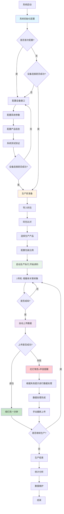
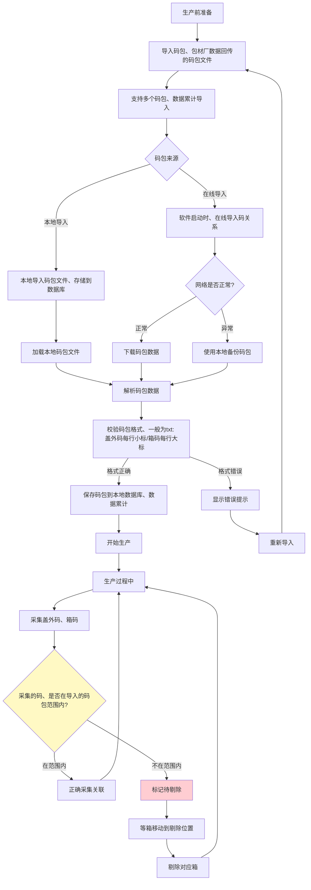
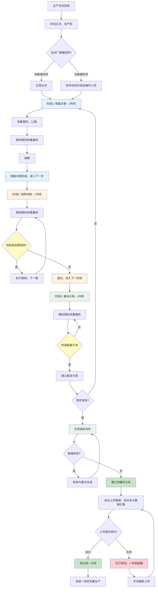

# 整体业务流程

**流程说明：** 系统启动后完成初始化配置，首次使用需配置设备接口、系统参数及产品信息并做测试验证；非首次则检查设备连接。配置完成后进入生产前准备，导入码包并比对，选择产品、配置包装比例后启动生产。生产完成瓶箱垛关联采集，成垛后自动上传数据，上传成功则绿灯亮一分钟，失败则红灯常亮并声音提醒，需根据提示处理数据后手动重新上传。生产结束后可进行统计分析及数据维护。

---

# 码包对比流程

**流程说明：** 生产前导入码包（包材厂回传的码包文件），支持多码包累计导入。码包可在线导入（启动时下载）或本地导入；在线导入时若网络异常则使用本地备份。解析后校验格式（盖外码每行小标、箱码每行大标），格式正确则保存到本地数据库，错误则提示并重新导入。生产过程中采集的盖外码、箱码需与码包比对，在范围内则正常关联，不在范围内则标记待剔除，等箱到剔除位置后执行剔除。

---

# 瓶箱垛关联流程

**流程说明：** 生产任务启用后先进行码包比对（有包材厂回传则正常比对，无则软件校验并告知操作人员）。

- **阶段1 瓶箱关联：** 采集 12 瓶瓶码，箱码相机采集箱码，装箱后进入下一步。
- **阶段2 剔除判断：** 剔除相机采集箱码，判断是否要剔除；需剔除则执行剔除并处理下一箱，不剔除则进入箱垛关联。
- **阶段3 箱垛关联：** 箱码相机采集箱码，检查箱属于垛后建立箱垛关联；未成垛则继续下一箱（回到阶段1），成垛则生成虚拟垛标、建立完整码关系并自动上传至米多大数据引擎。上传成功则绿灯亮一分钟，失败则红灯常亮并声音提醒，需手动重新上传。