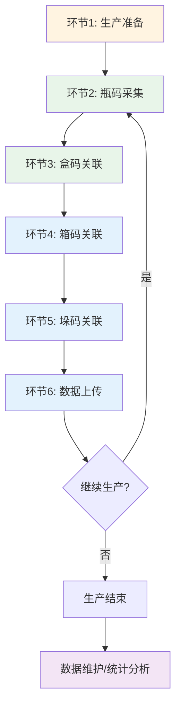
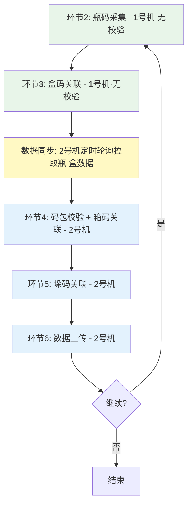
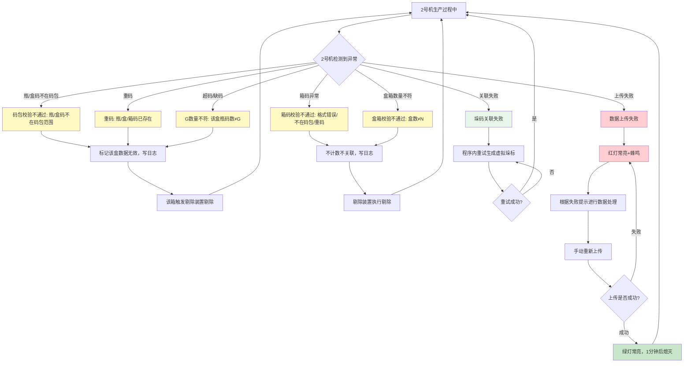

> demo链接：https://miduo1031.yuque.com/rsaesz/dugniz/bkuvai8u8i5wgr9c?singleDoc# 《UI设计与原型设计》

## 通用规范引用

本迭代遵循**赋码采集关联系统产品线通用规则**，以下内容直接引用基线文档，本文档仅描述**石湾产线差异与补充**：

| 通用规则文档 | 引用内容 | 本迭代差异说明 |
| ------------ | -------- | -------------- |
| 通用规则文档「01-项目概述与用户分析」 | 项目目标、用户群体、用户需求 | 四、用户范围：补充「系统管理员」角色及石湾产线诉求 |
| 通用规则文档「02-用户界面设计」 | 设计原则、布局、交互、视觉、组件规范、**状态栏** | 十二：石湾特有补充（按钮"？"帮助等） |
| 通用规则文档「03-业务流程分析」 | 通用采集模式定义 | 九、业务流程：模式43 的具体落地，含石湾门禁与产出 |
| 通用规则文档「04-非功能性需求与技术架构」 | 性能、可靠性、安全性、可维护性、兼容性、技术架构 | 十一：石湾差异（码包比对、相机数等） |
| 通用规则文档「05-非功能性验收标准」 | 验收检查项 | 遵循通用标准 |
| 通用规则文档「06-附录」 | 术语表 | 遵循通用定义 |

## 一、文档头


| 项目     | 内容                       |
| ------ | ------------------------ |
| 文档名称   | 赋码采集关联系统T1.2.0（石湾版）- AI文档 |
| 产品线/模块 | 赋码采集关联系统 / 石湾产线          |
| 版本     | T1.2.0                   |
| 迭代类型   | 新增                   |
| 作者     | 魏喜胜                      |
| 审批人    | 伍林波                      |
| 创建日期   | 2026-02-04               |
| 更新时间   | 2026-03-18               |


## 二、项目目的

### 2.1 项目目标


| 目标     | 说明                                                              |
| ------ | --------------------------------------------------------------- |
| 技术自主可控 | 将石湾赋码采集关联系统从第三方替代为自研系统，摆脱对第三方供应商的技术依赖，降低维护成本和响应延迟  |
| 业务功能完善 | 在保持旧版软件核心功能的基础上，新增码包管理、码关系比对、自动上传等关键功能，优化用户体验和操作流程，提升生产效率和数据准确性 |
| 品牌价值提升 | 通过及时响应需求变更、快速修复问题、提供稳定可靠的产品，改善客户使用体验，维护和提升公司品牌形象                |


### 2.2 项目价值


| 价值    | 说明                                                  |
| ----- | --------------------------------------------------- |
| 稳定性提升 | 解决旧版软件问题频发、维护不及时的问题，提供稳定可靠的软件系统，减少因软件故障导致的生产中断和数据错误 |
| 功能增强  | 新增码包导入、码关系比对、自动上传等功能，提升数据管理能力和追溯准确性，减少人工操作和错误风险     |
| 操作优化  | 通过按钮帮助提示、密码保护等设计优化，降低误操作风险，提升操作人员的使用体验和工作效率         |


## 三、现状背景与问题陈述

### 3.1 现状背景

**业务现状**：


| 项目   | 内容                                      |
| ---- | --------------------------------------- |
| 硬件配置 | 工控机2台、采集相机5台、箱剔除装置、三色声光报警灯2盏              |
| 1号机  | 2台瓶码采集相机交叉去重采集瓶数据，1台盒码采集相机采集盒数据，三色声光报警灯1盏    |
| 2号机  | 接收1号机数据，1台盒码采集相机+1台箱码采集相机采集盒箱数据，进行盒箱垛关联，剔除装置，三色声光报警灯1盏 |
| 硬件布局 | **龙门架**（2号机位置）：放置盒箱关联2台相机（盒码相机+箱码相机）；**剔除装置**（2号机位置）：在龙门架之后，产线经龙门架完成盒箱关联后到达剔除装置，按箱剔除 |
| 现状问题 | 软件使用过程中几乎每天都会出现问题，有大有小，大问题需要手动操作数据库修正数据 |


### 3.2 问题陈述


| 问题类型   | 具体表现                                                              |
| ------ | ----------------------------------------------------------------- |
| 技术依赖问题 | 第三方开发的软件维护工作不及时，出现问题时掣肘较大；有需求变更时不能及时响应，对公司品牌造成一定影响                |
| 功能缺失问题 | 缺少码包导入和管理功能、码关系比对功能、操作帮助提示                                        |
| 数据质量问题 | 软件使用过程几乎每天都会出现问题，影响入库和出货；大问题需手动改库修正，效率低易出错；缺少码包比对机制，米多作为兜底方需校验并告知 |
| 操作安全问题 | 产线重要参数及设置页面缺少密码保护，工人可能误操作改配置导致产线无法生产                              |


### 3.3 需求来源

石湾产线日常使用中的问题反馈和功能需求；产线操作人员的实际使用体验反馈。

## 四、用户范围

> **引用**：用户群体与需求基础见 通用规则文档「01-项目概述与用户分析」。下表为石湾产线**差异化补充**，在通用三角色基础上新增「系统管理员」，并细化各角色诉求。

### 4.1 核心用户角色


| 角色     | 重要度 | 职责                       | 诉求                                              |
| ------ | --- | ------------------------ | ----------------------------------------------- |
| 生产线操作员 | 主要  | 日常生产操作，使用软件进行生产任务执行和数据采集 | 简单易用界面、清晰状态提示和报警信息、操作帮助提示、最小化人工干预支持无人值守         |
| 生产管理员  | 重要  | 生产计划制定、任务分配、数据查询分析、数据维护  | 实时生产进度监控、码包导入和管理、数据查询和维护、异常情况及时预警               |
| 系统管理员  | 次要  | 系统配置、设备管理、参数设置           | 系统参数配置、设备连接和状态监控、密码保护机制、系统日志和异常信息查看             |
| 质量管理员  | 次要  | 产品质量追溯、问题排查、数据统计         | 完整产品追溯链路（四级关联：瓶-盒-箱-垛）、快速问题定位、码关系查询和维护、详细质量统计报表 |


### 4.2 用户使用场景


| 场景     | 主要动作                                                                           |
| ------ | ------------------------------------------------------------------------------ |
| 日常生产场景 | 操作员启动软件、选择生产产品、开始数据采集；系统自动采集瓶码盒码箱码建立四级关联；达到预设数量后自动生成垛码；系统自动上传数据，回传信息控制指示灯和声音提醒 |
| 数据维护场景 | 管理员导入码包数据、进行码关系比对；发现包材损坏等进行码替换；查询码关系排查质量问题；处理异常数据、取消关联操作                       |
| 系统配置场景 | 系统管理员配置读码器、扫码枪等设备参数；设置包装比例、超时时间等业务参数；配置报警灯、剔除装置等硬件设备                           |


## 五、实现思路

### 5.1 产品定位

自研 Java11+JavaFX17 **系统级桌面应用**，替代第三方旧版软件，定位为**石湾产线四级关联采集关联系统**。

**本迭代部署方案**：**1号机维持旧版软件运行**，作为瓶盒数据来源；**2号机部署新版盒箱垛关联软件**，承担主生产任务。通过**数据同步机制**（历史数据全量迁移 + 新版部署后定时差量同步）确保业务连续性，并在2号机完成数据完整性校验。本迭代新版开发范围为 **2号机盒箱垛关联软件**（内含定时轮询同步机制），1号机旧版软件不纳入本次开发。

### 5.2 结构归母

属于**赋码采集关联系统产品线**，与致美斋产线同产品线不同场景适配，针对石湾四级关联和硬件配置专门实现。


| 软件/组件          | 部署       | 职责                                               |
| -------------- | -------- | ------------------------------------------------ |
| 瓶盒关联（1号机旧版）   | 工控机1号机   | 沿用旧版软件，继续执行瓶盒关联数据采集，数据写入1号机自有数据库              |
| 盒箱垛关联软件（2号机）  | 工控机2号机   | **本迭代新版开发**，盒箱垛关联数据采集、数据管理、数据上传；**内置定时轮询**从1号机拉取瓶-盒数据，完成完整性校验  |


### 5.3 设计理念


| 理念    | 要点                           |
| ----- | ---------------------------- |
| 功能完整性 | 保持旧版所有核心功能，新增码包管理、码关系比对、自动上传 |
| 操作友好性 | 按钮帮助提示（"？"）、密码保护、清晰状态提示      |
| 技术先进性 | Java11+JavaFX17，可维护、可扩展、稳定   |
| 数据准确性 | 码包比对、重码检测、数据校验               |


### 5.4 设计思路

**部署架构**：本迭代仅开发 **2号机盒箱垛关联软件**（新版），1号机保留旧版软件不修改；新增**数据同步机制**部署于2号机，负责历史数据迁移和定时差量同步。若后续迭代需替换1号机软件，届时再按双软件方案推进。详见**八、页面清单与关系**。


| 设计要点   | 说明                                         |
| ------ | ------------------------------------------ |
| 包装比例   | 必须通过配置参数设置（G/N/M 可配置），不能写死在代码中             |
| 码位数配置  | 系统设置中配置大标、中标、小标位数；采集时校验，不符则告警关联失败；-1 表示不校验 |
| 码包在线拉取 | 统一 URL + type 参数；URL 和 type 由代码或配置文件提供     |
| 新增功能   | 码包导入与比对、自动上传与指示灯控制                         |
| 设计优化   | 操作帮助（按钮旁"？"）、重要参数密码保护（详见十一）                |


### 5.5 产品化与版本管理

**产品基础与参考**：本方案在已有**赋码采集关联系统（致美斋产线）** 基础上设计。致美斋为二级关联版本，石湾为四级关联版本，属同一产品线不同业务场景。开发时，**类似功能可参考致美斋实现**（如查询码、码替换等），按石湾业务差异做适配。

**产品化目的**：采用产品化方案设计，便于后续**维护和迭代**。每次产线方案可能是一套新的需求文档，但技术实现应遵循统一架构和规范，保证可复用、可扩展。

**版本与代码管理**（供技术实施参考）：

| 维度 | 建议 |
| -- | -- |
| 代码组织 | 按产线划分代码模块或文件夹（如 `zhimeizhai/`、`shiwan/`），共用部分抽离为公共模块 |
| 方案文档 | 每产线独立方案文档，版本号与迭代对应；文档变更可追溯 |
| 共用与差异 | 底层框架、UI 组件、业务工具类共用；产线特有逻辑（关联层级、包装比例、硬件配置）独立实现 |


## 六、版本迭代规划

### 6.1 迭代阶段划分

**T1.2.0版本（当前迭代）**：

| 维度       | 内容                                                                                               |
| -------- | ------------------------------------------------------------------------------------------------ |
| 目标       | 完成石湾产线2号机软件自研替代，实现旧版功能同步和新增功能开发；通过数据同步确保历史数据连续性                                              |
| 1号机      | **维持旧版软件运行，不纳入本次开发**；作为瓶盒数据来源，数据通过同步导入2号机                                                   |
| 2号机功能   | 数据采集、手工采集、码包管理、数据查询、数据替换、取消关联、生产统计、数据上传、系统设置                                       |
| 新增功能    | 码包导入、码包下载和比对、自动上传和指示灯控制                                                                        |
| 数据同步  | **本迭代新增**（内置于2号机软件）：① 历史数据全量迁移（部署前一次性执行）；② 软件内置定时轮询从1号机拉取差量数据；③ 在2号机完成数据完整性校验            |
| 设计优化    | 操作帮助提示、密码保护机制、取消关联功能合并优化                                                                       |
| 激活码集成   | 软件需激活才能使用；该功能已在 T1.1.0 版本迭代中完成，需集成接入本系统                                                       |
| 交付物     | 盒箱垛关联软件安装程序（2号机，含内置同步功能）、技术文档、用户手册                                                              |

---

## 七、需求变更

### 7.1 变更记录

| 变更日期 | 变更类型 | 涉及模块 | 变更说明 |
| -------- | -------- | -------- | -------- |
| 2026-03-18 | 架构调整 | 部署方案·全局 | **1号机维持旧版软件运行**，不纳入本次开发，继续作为瓶盒数据来源；**2号机部署新版盒箱垛关联软件**承担主生产任务；新增**数据同步机制**（内置于2号机软件定时轮询）：部署前一次性全量迁移1号机历史数据，部署后软件内定时拉取差量数据，在2号机完成数据完整性校验；本迭代交付物调整为2号机安装程序（含内置同步），移除1号机新版安装程序 |
| 2026-03-10 | 规则明确 | 硬件配置 | 报警灯明确为「三色声光报警灯（声光一体型）」，可独立控制灯光颜色和蜂鸣；统一替换文档中「声光报警器、蜂鸣器」等混用表述 |
| 2026-03-10 | 规则明确 | 硬件配置 | 明确1号机和2号机各配备三色声光报警灯1盏；剔除装置位于2号机龙门架之后；硬件布局标注所属机位 |
| 2026-03-10 | 规则新增 | 1号机·报警规则 | 明确「连续重码3次」定义：在软件本次启动生命周期内累计，退出软件后重置；1号机判断范围为瓶码/盒码 |
| 2026-03-10 | 规则新增 | 2号机·报警规则 | 明确「连续重码3次」定义：在软件本次启动生命周期内累计，退出软件后重置；2号机判断范围为盒码/箱码（2号机不采集瓶码） |
| 2026-03-10 | 规则删除 | 1号机·报警规则 | 删除「设备连接状态未连接触发长报警」，1号机不检测设备连接状态触发长报警 |
| 2026-03-10 | 描述修正 | 数据替换 | 修正功能描述歧义：用户只需操作外码，系统在已上传且码类型有内码（盖码、箱码）时自动同步替换云端内码；原「不替换内码」表述改为「用户无需单独操作内码」 |

---

## 八、页面清单与关系

### 8.1 软件架构说明

```
┌─────────────────────────────────────────────────────────────────────────────┐
│  石湾赋码采集关联系统（差量同步双机架构）                                    │
├─────────────────────────────────────────────────────────────────────────────┤
│                                                                             │
│  ┌──────────────────────┐         ┌──────────────────────────────────────┐  │
│  │ 瓶盒关联（1号机）     │         │ 盒箱垛关联（2号机）· 新版软件         │  │
│  │ 工控机1号机 · 旧版软件 │         ├──────────────────────────────────────┤  │
│  ├──────────────────────┤         │ P02-01 数据采集                       │  │
│  │ 瓶盒采集（旧版逻辑）  │  定时    │ P02-02 手工采集                       │  │
│  │                      │ 轮询拉取→│ P02-03 码包管理                       │  │
│  │ 数据库：本机自有DB   │         │ P02-04~08 数据管理                    │ ──→ 米多大数据 │
│  │ （旧版软件写入，      │         │ P03-02 系统设置(入口)                 │  │
│  │  不修改）            │         ├──────────────────────────────────────┤  │
│  │                      │         │ [内置] 定时轮询：定时读取1号机DB       │  │
│  │                      │         │ · 历史迁移（一次性全量）               │  │
│  │                      │         │ · 差量拉取（运行期定时）               │  │
│  │                      │         │ · 完整性校验                          │  │
│  └──────────────────────┘         └──────────────────────────────────────┘  │
│                                                                             │
│  ┌─────────────────────────────────────────────────────────────────────┐   │
│  │ 底层：Java11+JavaFX17、DB访问、设备驱动、工具类                        │   │
│  │ 共用弹窗：P03-01 操作帮助、P03-02 系统设置                              │   │
│  │ 业务：码包、查询、替换、取消关联（仅2号机）                             │   │
│  └─────────────────────────────────────────────────────────────────────┘   │
└─────────────────────────────────────────────────────────────────────────────┘
```


| 软件/组件     | 部署  | 页面数 | 数据库                                             |
| ----------- | --- | --- | ----------------------------------------------- |
| 瓶盒关联（旧版）  | 1号机 | -   | 本机自有DB（旧版软件写入，本次不修改）                                |
| 盒箱垛关联（新版） | 2号机 | 8   | 本机部署；**内置定时轮询**读取1号机DB拉取差量数据，完整性校验后写入本机DB |


### 8.2 页面清单

#### 8.2.1 瓶盒关联（1号机旧版）页面说明

> 1号机沿用旧版软件，**不在本迭代开发范围内**，页面不纳入新版交付清单。以下仅作参考。

| 页面编号   | 页面名称     | 页面类型 | 功能描述           | 所属软件         |
| ------ | -------- | ---- | -------------- | ------------ |
| P01-01 | 主界面-瓶盒关联 | 功能页面 | 1号机瓶盒关联数据采集主界面 | 旧版软件（非本次开发） |


#### 8.2.2 盒箱垛关联软件（2号机）页面清单


| 页面编号   | 页面名称      | 页面类型 | 功能描述                                                            | 所属软件    |
| ------ | --------- | ---- | --------------------------------------------------------------- | ------- |
| P02-01 | 主界面-盒箱垛关联 | 功能页面 | 2号机盒箱垛关联数据采集主界面                                                 | 盒箱垛关联软件 |
| P02-02 | 手工采集      | 功能页面 | 相机损坏时瓶盒关联备用方案，仅支持瓶盒关联                                           | 盒箱垛关联软件 |
| P02-03 | 码包管理      | 功能页面 | 码包导入与管理（Tab 内容区）；比对逻辑在采集时使用                                     | 盒箱垛关联软件 |
| P02-04 | 数据查询      | 功能页面 | 单一查询，输入码后查出该码所属垛的全部数据（垛-箱-盒-瓶）；左侧分层表格，右侧详情；输入码对应单元格红色字体，选中行展示详情 | 盒箱垛关联软件 |
| P02-05 | 数据替换      | 功能页面 | 码替换功能（已有功能：码替换，供参考）                                             | 盒箱垛关联软件 |
| P02-06 | 取消关联      | 功能页面 | 单个取消关联和批量取消关联（合并为一个功能模块）                                        | 盒箱垛关联软件 |
| P02-07 | 生产统计      | 功能页面 | 生产数据统计（垛数、剔除数可点击查看和筛选）和上传状态查询 | 盒箱垛关联软件 |
| P02-08 | 数据上传      | 功能页面 | 手动上传、上传信息展示区（接收自动上传日志）、垛码状态查询与管理                                | 盒箱垛关联软件 |


#### 8.2.3 共用弹窗页面清单


| 页面编号   | 页面名称 | 页面类型 | 功能描述                                                                      | 所属软件   |
| ------ | ---- | ---- | ------------------------------------------------------------------------- | ------ |
| P03-01 | 操作帮助 | 弹窗页面 | 系统操作指南、功能说明、常见问题及异常处理；通过菜单「帮助(H)」→「操作帮助」触发                                   | 盒箱垛关联软件（2号机） |
| P03-02 | 系统设置 | 弹窗页面 | 设备配置、参数设置；一级 Tab（常用优先）：业务、页面配置、设备、连接；**页面配置**可控制主界面各 Tab 显示/隐藏（Switch 开关）；虚拟垛标和上传配置仅2号机使用；通过菜单「配置」→「系统设置」触发 | 盒箱垛关联软件（2号机） |


### 8.3 页面关系

#### 8.3.1 瓶盒关联（1号机旧版）页面关系

- **1号机旧版软件**：维持现状运行，不修改，无新增页面
- **数据流向**：1号机旧版软件 → 写入1号机自有DB → **2号机内置定时轮询**拉取差量数据 → 写入2号机DB → P02-01（盒箱垛关联）读取

#### 8.3.2 盒箱垛关联软件（2号机）页面关系

- **Tab形式**：P02-01~08 共8个Tab，点击切换；各 Tab 显示/隐藏由系统设置→页面配置控制
- **弹窗形式**：P03-02（系统设置）通过菜单「配置」以模态对话框打开；P03-01（操作帮助）通过菜单「帮助(H)」→「操作帮助」以模态对话框打开
- **数据流向**：1号机旧版DB（经2号机内置定时轮询拉取）→ P02-01 读取 → 数据上传 → 米多大数据引擎
- **功能依赖**：P02-01 采集时使用 P02-03 提供的码包数据；P02-08 依赖 P02-01 的成垛数据

#### 8.3.3 共用弹窗页面关系

- P03-01（操作帮助）：仅2号机新版软件使用，通过菜单「帮助(H)」→「操作帮助」触发
- P03-02（系统设置）：仅2号机新版软件使用；一级 Tab 顺序：业务、页面配置、设备、连接；**页面配置**可控制主界面各 Tab 显示/隐藏；**虚拟垛标规则、上传配置仅2号机使用**；1号机旧版软件维持原有系统设置，不纳入本次开发范围

## 九、整体业务流程

> **引用**：通用四级关联采集模式定义见 通用规则文档「03-业务流程分析」之**模式43**（1:M:N:G）。本章为石湾产线的**具体落地**，含环节门禁、产出物及异常处理。

### 9.1 业务流程主干（总分结构）

**设计说明**：主干仅描述业务环节及顺序，不含技术实现（相机、龙门架、数据库等）；各环节的入口条件、门禁、通过/不通过动作见 **9.2 环节详情**。

#### 9.1.1 主干流程图




#### 9.1.2 主干阶段说明


| 环节           | 业务含义                                        | 产出物              | 详情章节    |
| ------------ | ------------------------------------------- | ---------------- | ------- |
| 环节1 生产准备     | 【2号机】码包导入、产品选择、包装比例（N/M）配置；【1号机】采集规格（G）确认  | 两机均可开始采集         | 9.2.1   |
| 环节2 瓶码采集     | 1号机按规格正常采集瓶码，不校验，写入1号机数据库                   | 瓶码记录（无校验）        | 9.2.2   |
| 环节3 盒码关联     | 1号机每G瓶→采集盒码并建立瓶-盒关联，不校验，写入1号机数据库             | 瓶-盒关联数据（待同步）     | 9.2.3   |
| **数据同步**     | **2号机内置定时轮询从1号机拉取瓶-盒关联数据**                   | 2号机获得完整瓶-盒关联数据   | -       |
| 环节4 码包校验+箱码关联 | 2号机对同步数据执行码包校验、重码检测；通过后采集箱码建立盒-箱关联            | 盒-箱关联数据          | 9.2.4   |
| 环节5 垛码关联     | 每M箱→生成虚拟垛标并关联                               | 垛-箱关联、完整四级关联     | 9.2.5   |
| 环节6 数据上传     | 成垛数据上传米多、声光反馈                               | 上传状态             | 9.2.6   |
| 数据维护/统计分析    | 码替换、取消关联、生产统计、上传状态查询                        | 修正数据、统计报告        | 十、全局规则库 |


**说明**：系统初始化（设备配置、参数设置）为使用前一次性或按需配置，不纳入日常生产主干；环节2-3在1号机执行；2号机软件内置定时轮询完成差量数据拉取；环节4-6在2号机执行，**所有码包校验和剔除控制统一在2号机完成**。

### 9.2 环节详情（条件与门禁）

**模式43**：商品包装比例 1:M:N:G（石湾产线），1垛:M箱:N盒:G瓶，G/N/M 可配置。

#### 9.2.1 环节1：生产准备


| 项目       | 内容                                                         |
| -------- | ---------------------------------------------------------- |
| **入口条件** | 【2号机】用户已选择产品并填写生产单号；【1号机】采集规格（G，每盒瓶数）已在旧版软件中确认          |
| **门禁1**  | 【仅2号机】码包是否已导入？（小标/中标/大标均通过2号机 P02-03 管理；1号机不涉及码包）        |
| 门禁1-通过   | 进入环节2                                                       |
| 门禁1-不通过  | 提示导入码包；盖外码小标可在线拉取或本地导入；盒外码中标、箱外码大标仅能本地导入                  |
| **门禁2**  | 【仅2号机】码包格式是否正确？txt，小标=每行瓶码、中标=每行盒码、大标=每行箱码                |
| 门禁2-不通过  | 显示错误提示，需重新导入                                               |
| **产出**   | 【2号机】码包入库、产品已选择、包装比例N/M已配置；【1号机】G已配置；两机均可开始各自采集流程         |


**码包管理**：三类码包统一在2号机 P02-03 管理；1号机不涉及码包；码包校验集中在2号机环节4执行。

**开始采集二次确认**（2号机盒箱垛关联）：点击「开始采集」且门禁通过后，弹出二次确认弹窗，展示生产信息（产品、生产单号）和包装比例（1垛X箱、1箱X盒）；用户确认后继续采集流程。

---

#### 9.2.2 环节2：瓶码采集（1号机旧版软件）


| 项目       | 内容                                                 |
| -------- | -------------------------------------------------- |
| **入口条件** | 采集规格G已在旧版软件中确认；已开始采集                               |
| **采集动作** | 相机持续采集瓶码，记录瓶码数据；**不校验码包、不检测重码**，原样记录              |
| **计数规则** | 每采集到1个瓶码，瓶码计数+1；达到G个后触发环节3（盒码关联）                   |
| **无门禁**  | 1号机旧版软件不执行任何码有效性校验，校验由2号机在环节4统一执行                  |
| **产出**   | 瓶码记录，写入1号机数据库；由2号机内置定时轮询拉取至2号机                     |

---

#### 9.2.3 环节3：盒码关联（1号机旧版软件）


| 项目       | 内容                                                      |
| -------- | ------------------------------------------------------- |
| **入口条件** | 瓶码计数达到G（如6瓶）                                            |
| **采集动作** | 采集1个盒码，建立G瓶码与1盒码的关联记录                                   |
| **无门禁**  | **不校验码包、不检测重码、不校验G数量**；原样记录所有采集到的瓶-盒关联数据               |
| **产出**   | 瓶-盒关联数据，写入1号机数据库；由2号机内置定时轮询拉取，供环节4校验和箱码关联使用              |

---

#### 9.2.4 环节4：码包校验 + 箱码关联（2号机）


| 项目            | 内容                                                                      |
| ------------- | ----------------------------------------------------------------------- |
| **入口条件**      | 2号机内置定时轮询已拉取1号机瓶-盒关联数据；2号机相机采集到箱码                                       |
| **门禁1**       | **瓶码/盒码码包校验**：同步过来的每组瓶-盒数据中，瓶码是否∈小标码包、盒码是否∈中标码包？                      |
| 门禁1-不通过       | 该盒关联数据标记无效，写日志；待该盒所在箱采集完成后，触发剔除装置剔除该箱                                   |
| **门禁2**       | **重码检测**：瓶码、盒码是否已在系统中存在（与已入库关联数据比对）？                                    |
| 门禁2-不通过       | 同门禁1-不通过处理                                                              |
| **门禁3**       | **G数量校验**：每个盒码对应的瓶码数是否等于G？                                              |
| 门禁3-不通过       | 超码（>G）或缺码（<G）→ 该盒关联数据标记无效，写日志，触发剔除                                      |
| **门禁4**       | **箱码有效性**：采集到的箱码是否格式正确、∈大标码包、非重码？                                        |
| 门禁4-不通过       | 不计数，不建立关联，写日志，执行剔除，不装垛                                                  |
| **门禁5**       | **盒箱数量校验**：当前箱内有效盒数是否等于N？                                               |
| 门禁5-不通过       | 不计数，不建立关联，写日志，执行剔除，不装垛                                                  |
| **全部门禁通过**    | 箱码有效计数+1，建立盒-箱关联，瓶/盒码落冷，工人装垛                                            |
| **产出**        | 盒-箱关联数据，箱码计数用于环节5判断是否满垛                                                  |

---

#### 9.2.5 环节5：垛码关联（2号机）


| 项目       | 内容                                 |
| -------- | ---------------------------------- |
| **入口条件** | 箱码有效计数达到M（如70箱）                    |
| **触发动作** | 自动生成虚拟垛标（格式：前缀+年月日+序号+产线号+随机数），建立M箱与垛码关联；无需人工干预 |
| **失败处理** | 程序内自动重试，一般不会失败                      |
| **产出**   | 垛-箱关联，完整四级关联（瓶-盒-箱-垛），触发环节6        |

---

#### 9.2.6 环节6：数据上传（2号机）


| 项目       | 内容                         |
| -------- | -------------------------- |
| **配置依赖** | 根据系统设置→基础设置→**上传配置**中「自动上传开关」执行；开关开启时成垛后自动上传，关闭时需手动上传（P02-08） |
| **入口条件** | 成垛完成                       |
| **门禁**   | 成垛数据是否完整？                  |
| 门禁-不通过   | 记录错误，不执行上传                 |
| **通过动作** | 开关开启时自动上传至米多大数据引擎；开关关闭时不自动上传，需手动上传（P02-08） |
| **上传成功** | 绿灯常亮，无蜂鸣/提示音；一分钟后自动熄灭         |
| **上传失败** | 红灯常亮+蜂鸣；根据失败提示数据处理后手动重传     |
| **产出**   | 上传状态（成功/失败/待上传）            |

---

### 9.3 流程示意（供参考）

以下为环节2~6的串行关系示意，包含数据同步节点；技术实现细节见各页面子文档。




### 9.4 异常处理流程

#### 9.4.1 异常处理流程图



## 十、全局规则库

### 10.1 业务规则

#### 10.1.1 码包管理规则

**页面职责**：码包导入（在线/本地/更新）、列表展示、查看/删除；**不展示比对结果**，比对逻辑在采集流程内执行。

**支持的码包类型**：盖外码小标、盒外码中标、箱外码大标。

**码包与码数据走向（标准设计）**：

| 阶段 | 说明 |
| ---- | ---- |
| **导入** | 码包导入 → 入库码包导入记录 + 码数据写入**热表**（未使用） |
| **采集校验** | 采集/关联时只查**热表**（未使用码）；关联成功 → 写关联表 + 码**落冷**（热表→冷表） |
| **成垛** | 箱码有效计数达到M时生成虚拟垛标并关联 |
| **数据替换** | 新码只查**热表**（天然未使用） |
| **取消关联** | 取消关联后，码是否**回迁**（冷表→热表）取决于该码是否完全脱离关联链（无父级且无子级）；回迁后方可参与码替换。详见 P02-06 |
| **删除边界** | 该码包内无已关联码时可删；需查冷表或关联表判断 |

**冷热分离术语**：热→冷称**落冷**（关联成功时迁入冷表）；冷→热称**回迁**（取消关联时迁回热表）；冷数据仍可被查询。

| 规则类型      | 具体规则                                                     |
| ------------- | ------------------------------------------------------------ |
| **导入-来源** | 包材厂回传文件。**盖外码小标**：支持在线拉取（统一 URL + type 参数，含软件启动时自动更新）或本地导入；**盒外码中标、箱外码大标**：仅支持本地导入，不参与在线拉取 |
| **导入-本地** | 用户先选择码包类型（小标/中标/大标）→ 再选择本地 TXT 文件 → 需输入密码 → 确认解析入库；格式相同无法自动识别 |
| **导入-累计** | 多码包可累加导入，按名称搜索；不存内码                       |
| **导入-增量** | 在线拉取按**各类型分别**记录最近成功拉取时间；某类型失败时不更新该类型时间戳，不覆盖本地数据 |
| **部分失败** | 盖外码小标、箱外码大标拉取时，某类型失败则保持原状、提示用户；成功类型正常入库；兜底：本地导入、保留已有数据、手动重试。盒外码中标不参与在线拉取 |
| **格式**      | txt；小标=每行一个瓶码；中标=每行一个盒码；大标=每行一个箱码 |
| **比对**      | 采集码 ∈ 对应类型码包（热表）→ 正常关联；采集码 ∉ 码包 → 不计数、不建立关联、写日志、标记剔除 |
| **删除**      | 该码包内**无任何已关联码**时允许删除；存在已关联码则禁止删除 |
| **使用完**    | 码包内码全部关联后保留在库；码已落冷至冷表，不自动归档整包   |
| **米多兜底**  | 无包材厂回传时，软件校验并告知操作人员                       |
| **导入重复判断** | 冷热分离时须**同时查热表+冷表**（或统一视图 all_codes）；任一存在即重复 |


#### 10.1.2 数据采集规则

**四级关联**（G/N/M 可配置）：

```
瓶码(2相机去重) → 每G瓶→1盒码 → 每N盒→1箱码 → 每M箱→1垛码(虚拟)
```

**码有效性**：瓶码、盒码、箱码校验**统一在2号机环节4执行**（对同步过来的瓶-盒数据及箱码一并校验），1号机不做任何码有效性校验：

| 码类型 | 有效判定条件 | 无效类型 | 判定环节 |
| ------ | ------------ | -------- | -------- |
| **瓶码** | ∈盖外码小标码包、非重码 | 错码（不在码包范围）、重码 | **环节4（2号机）**，对同步数据校验 |
| **盒码** | ∈盒外码中标码包、非重码 | 错码（不在码包范围）、重码 | **环节4（2号机）**，对同步数据校验 |
| **箱码** | 格式正确、∈箱外码大标码包、非重码 | 重码、错码（格式错误或不在码包范围） | **环节4（2号机）**，2号机相机采集时校验 |

| 类型  | 判定条件                        | 处理动作                          |
| --- | ----------------------------- | ------------------------------- |
| 有效码 | 在对应码包范围内、非重码（瓶/盒/箱均适用）       | 建立关联，有效计数+1                    |
| 重码  | 该码在系统中已存在（瓶/盒/箱均在2号机校验）      | 不建立关联，写日志，触发该箱剔除              |
| 错码  | 不在对应码包范围（瓶/盒/箱均在2号机校验）       | 不建立关联，写日志，触发该箱剔除              |
| 超码  | 同步数据中某盒的瓶码数 > G              | 不建立关联，写日志，触发该箱剔除              |
| 缺码  | 同步数据中某盒的瓶码数 < G              | 不建立关联，写日志，触发该箱剔除              |


**码位数校验**：系统设置可配置大标、中标、小标位数（-1 表示不校验）。采集时：实际采码位数 ≠ 配置位数 → 异常告警、关联失败。例：大标配置 6 位，实际采到 7 位 → 不符合 → 关联失败。

**相机采集数据格式**：相机一次返回多个数据时，以英文分号「;」分隔。例如瓶码采集相机（2 台交叉去重）、盒箱关联环节中盒码采集相机，可能一次返回多码，格式为：`码1;码2;码3`。

**剔除控制**：所有码有效性校验和剔除**统一在2号机环节4执行**；1号机只负责采集。任一校验不通过 → 不建立关联、写日志、写入剔除记录、剔除装置执行剔除。详见 **10.1.6 剔除记录规则**。

**剔除后工人处理规则**（前提：实物不丢弃，最小影响生产）：


| 剔除场景（均由2号机检测）       | 工人实物处理              | 工人系统操作             |
| --------------------- | ------------------- | ------------------ |
| 瓶码/盒码不在码包范围（错码）      | 开箱换问题瓶或整盒           | 实物修复 → 重新上线 → 系统重采 |
| 瓶码/盒码/箱码重码            | 核对问题码，替换问题实物        | 实物修复 → 重新上线 → 系统重采 |
| 超码/缺码（G数量不符）          | 开箱核对瓶数，补足或减少        | 实物修复 → 重新上线 → 系统重采 |
| 箱码不在大标码包范围或格式错误       | 换箱码                  | 实物修复 → 重新上线 → 系统重采 |
| 盒箱数量不符（N盒与箱码不对应）      | 核对N盒与箱码，换错盒或错箱      | 实物修复 → 重新上线 → 系统重采 |


**成垛数据中码错误**（实物未剔除）：


| 场景       | 工人系统操作                                    |
| -------- | ----------------------------------------- |
| 码损坏/印刷错误 | **码替换**：扫旧码 → 扫新码 → 密码确认；新码须在码包内且未用       |
| 关联关系错误   | **取消关联**：输入码须无上级关联（有上级需先取消上级）；垛码只断箱-垛，箱码可选断盒-箱或断盒-箱+瓶-盒；已上传的须先解云端再处理本地。详见 P02-06 |


**相机损坏**：使用 **手工采集**（P02-02）进行瓶盒关联，人工扫码补录。

#### 10.1.3 数据关联规则


| 规则          | 具体规则                                                  |
| ----------- | ----------------------------------------------------- |
| 瓶盒关联（1 号机）  | 采瓶码（多源去重）；**不校验码、不做门禁**；每 G 瓶 → 采集 1 盒码并建立瓶-盒关联；数据原样写入1号机数据库，由2号机内置定时轮询拉取 |
| 盒箱垛关联（2 号机） | 接收 1 号机数据；每 N 盒 → 1 箱；每 M 箱 → 生成虚拟垛标并关联     |
| 强制满垛        | 未达 M 箱时可强制结束当前垛，忽略箱数差异                                |
| 提取未成垛       | 输入/扫箱码 → 查订单 → 确认 → 回显主页面继续生产                         |


**虚拟垛标生成规则**（格式在 系统设置 → 业务 → 虚拟垛标规则 中配置；**1号机用不上**，仅2号机有效）：


| 项目   | 规则                                                                    |
| ---- | --------------------------------------------------------------------- |
| 生成时机 | 箱码有效计数达到 M 箱（可配置）时触发                                                  |
| 生成方式 | 程序自动生成虚拟垛标，建立 M 箱与垛码的关联                                               |
| 格式   | 前缀 + 年月日 + 序号 + 产线号 + 随机数，如 V20260226001A12；前缀默认 V、时间取当前日期、序号 3 位起自动递增、产线号可配置、随机数 2 位系统自动生成 |
| 配置位置 | 系统设置 → 业务 → 虚拟垛标规则                                                  |
| 成功   | 生成成功 → 计入垛数 → 触发自动上传                                                  |
| 失败处理 | 程序内自动重试；一般不会失败，无需人工干预                                                 |


**退出软件前判断**：

**1号机**（旧版软件，退出逻辑由旧版软件自身控制，不在本次开发范围内）

**2号机**（盒箱垛关联，有未满垛概念）：

```
点击退出
  ↓
是否在采集中？ ─是→ 提示「请先停止采集」→ 停止后再判断
  ↓ 否
是否满垛？ ─否→ 弹窗「存在未满垛(X箱)，是否暂存？」
  ↓              ├ 暂存 → 存库标记未成垛 → 允许退出
  ↓              ├ 强制满垛 → 执行强制满垛流程 → 操作完毕允许退出
  ↓              └ 取消 → 返回主界面
  ↓ 是/无未满垛
常规退出确认 → 退出
```

#### 10.1.4 数据上传规则


| 规则        | 具体规则                               |
| --------- | ---------------------------------- |
| **配置依赖**  | 根据系统设置→业务→上传配置中「自动上传开关」执行；默认开启；**1号机用不上**，仅2号机有效 |
| **触发时机**  | 开关开启时：成垛完成（环节 5 产出）后自动触发；关闭时：不自动上传，需手动上传 |
| **成功**    | 上传成功 → 三色声光报警灯绿灯常亮，无蜂鸣；一分钟后自动熄灭 |
| **失败**    | 上传失败/超时 → 三色声光报警灯红灯常亮 + 蜂鸣；报警信息区显示**具体失败原因**（具体到箱/盒/瓶） |
| **失败原因**  | 由服务端接口返回，须具体到箱/盒/瓶层级（见「上传接口失败返回结构」） |
| **失败后处理** | 根据米多返回的失败提示进行数据处理（如解云端等），完成后手动重新上传 |
| **关闭报警**  | 主界面按钮，重置三色声光报警灯（停止灯光和蜂鸣），不改变上传状态 |
| **状态管理**  | 支持按垛码查询上传状态；支持重置未上传、标记已上传          |

**上传接口失败返回结构**（服务端需调整）：失败时返回 `details` 数组，每条含层级（垛/箱/盒/瓶）、位置、问题码、具体原因；客户端拼接为可读文案展示。


#### 10.1.5 数据维护规则

**码替换**：


| 项目   | 规则                         |
| ---- | -------------------------- |
| 适用范围 | 盖外码（瓶码）、盒码、箱外码             |
| 操作步骤 | 扫旧码 → 扫新码 → 需输入密码确认 |
| 新码条件 | 须在对应类型码包内、未使用、格式正确、≠ 原码    |
| 日志   | 记录替换操作                     |

**替换执行规则**（先检查码关联是否已上传）：

| 上传状态 | 执行顺序 |
| -------- | -------- |
| 未上传（仅本地） | 校验通过后直接替换本地数据 |
| 已上传 | 先替换云端 → 再替换本地，保证一致性 |

**内码同步**：有内码的码类型（盖码、箱码）在已上传场景替换时，同步替换云端内码；**确认弹窗须说明此行为**。


**取消关联**（盒/箱/垛码批量加入列表，统一识别后执行）：


| 规则       | 具体规则                            |
| -------- | ------------------------------- |
| 确认       | 弹窗二次确认 + 需输入密码                  |
| 上级约束     | 输入码有上级关联时标记不可取消，须先将上级码加入列表取消；无上级（包括采集中途尚未归入上级）可直接取消 |
| 取消范围模式   | **只解一层**（默认）：垛码断箱-垛、箱码断盒-箱、盒码断瓶-盒，下一层关联保留；**全部解除**：垛码仍只断箱-垛（层级限制），箱码断盒-箱+瓶-盒，盒码等同只解一层 |
| 码回迁热表    | 码完全脱离关联链（无父无子）时回迁热表；断直接模式下盒码操作后盒/瓶回迁，垛/箱码因下层仍有关联不回迁；断全部模式下箱码操作后箱/盒/瓶全回迁 |
| 取消执行顺序   | 系统自动按垛→箱→盒顺序执行；垛码先处理释放箱码后，箱码自动变为可取消并继续处理 |
| 云端处理     | 云端数据以整垛为单位；涉及码所在垛已上传时，须先调用云端接口**取消整垛数据**，成功后再取消本地；云端失败则本地不取消，结果标记失败 |
| 瓶码处理     | 扫入瓶码时自动查找其所在盒码，转换后以盒码加入列表；不支持直接以瓶码取消 |


#### 10.1.6 剔除记录规则

**目的**：支持生产统计中点击剔除数查看剔除记录，追溯箱被剔除的原因及问题数据。

**剔除记录表**：每次发生剔除时持久化写入，供 P02-07 生产统计剔除记录弹窗查询。

**持久化策略**：**只记录有问题的数据**，不记录箱内正常码。目的为追溯剔除原因和问题码，便于工人定位修复；完整箱级追溯通过数据查询（已成垛）实现，剔除箱未成垛不在其中。

| 字段       | 说明                                                         |
| ---------- | ------------------------------------------------------------ |
| 箱码       | 被剔除箱的箱码；剔除均在2号机执行，执行时处于箱码关联环节，箱码已采集，必填      |
| 盒码       | 问题所在盒的盒码；盒箱校验不通过时记录该箱 N 个盒码（便于核对 N 盒与箱码）   |
| 瓶码明细   | 问题所在瓶的瓶码；重码/错码时记录问题瓶码；超码/缺码时记录异常盒内瓶码（可为空） |
| 问题码     | 导致剔除的具体码（重码/错码的码值；码包不通过时为不在码包内的码；超码/缺码时可为空） |
| 剔除原因   | 枚举：重码、错码、超码、缺码、盒箱校验不通过、小标不通过、中标不通过、大标不通过 |
| 剔除时间   | 剔除发生时间（YYYY-MM-DD HH:mm:ss）                          |
| 生产单号   | 关联的生产任务单号（可选，便于按任务筛选）                   |


**写入时机**：剔除判断和记录**统一在2号机环节4**执行（1号机不做任何校验和标记）；剔除装置位于龙门架之后，执行剔除时箱码已采集，故箱码必填。


| 剔除场景           | 1号机动作     | 2号机写入内容（仅问题数据）                         |
| ------------------ | ------------- | -------------------------------------------------- |
| 瓶码不在小标码包/重码  | 无（1号机不做校验）                        | 箱码、问题盒码、问题瓶码、问题码、剔除原因           |
| 瓶码超码/缺码（G不符）  | 无（1号机不做校验）                        | 箱码、问题盒码、剔除原因（问题码可为空）             |
| 盒码不在中标码包/重码  | 无（1号机不做校验）                        | 箱码、问题盒码、问题瓶码、问题码、剔除原因           |
| 盒箱校验不通过     | -             | 箱码、该箱 N 个盒码、剔除原因（便于核对 N 盒与箱码） |
| 小标/中标/大标不通过 | -           | 箱码、问题码（不在码包内的码）、剔除原因             |


#### 10.1.7 报警信息描述规则

**原则**：报警信息**必须描述具体原因**，便于工人快速定位，避免仅显示枚举值。

| 剔除/报警类型 | 界面显示示例（具体原因描述） |
| ------------- | --------------------------- |
| 小标不通过 | 瓶码 xxx 不在小标码包范围内 |
| 中标不通过 | 盒码 xxx 不在中标码包范围内 |
| 大标不通过 | 箱码 xxx 不在大标码包范围内 |
| 重码 | 瓶码/盒码/箱码 xxx 重复出现 |
| 错码 | 瓶码/盒码/箱码 xxx 格式错误，或 xxx 不在码包范围内 |
| 超码/缺码 | 盒码 xxx 多/少 x 个瓶码 |
| 盒箱校验不通过 | 箱码 xxx 盒数不符 |

### 10.2 权限规则

#### 10.2.1 操作权限


| 角色     | 权限                                                      |
| ------ | ------------------------------------------------------- |
| 生产线操作员 | 查看主界面数据采集信息；启动/停止数据采集；查看操作日志和异常信息；查看数据查询结果（只读，仅2号机）     |
| 生产管理员  | 所有操作员权限；码包导入和管理；数据查询、码替换、取消关联；生产统计查询；数据上传管理             |
| 系统管理员  | 所有生产管理员权限；系统设置和参数配置（需密码保护）；设备配置和管理；取消关联、码替换（均需输入密码） |


#### 10.2.2 密码保护规则

**需密码保护的功能**：系统设置（设备配置、参数设置、码位数配置）、取消关联、码替换。访问时弹窗输入密码，每次访问均需验证，不保存登录状态。

## 十一、全局非功能性需求

> **引用**：性能、可靠性、安全性、可维护性、兼容性等基础指标见 通用规则文档「04-非功能性需求与技术架构」；验收检查项见 通用规则文档「05-非功能性验收标准」。以下仅列出**石湾产线差异与补充**。

### 11.1 本迭代差异说明

| 维度 | 通用规则 | 石湾差异/补充 |
| ---- | -------- | ------------- |
| **响应时间** | 界面操作≤1秒、界面切换≤2秒 | 保持一致；新增码包比对≤2秒 |
| **硬件约束** | 支持同时连接多个采集设备 | 最多5台相机（石湾产线配置） |
| **操作系统** | Windows 10/11、Linux、macOS | 补充 Windows 7 及以上、Windows Server 2016/2019/2022 |
| **设备接口** | RS232、RS485、TCP/IP、USB | 补充 Modbus（PLC 通信） |
| **数据安全** | 本地数据库访问控制 | 补充不存储内码、防 SQL 注入 |
| **用户体验** | 通用规则未单独列 | 文字最小16px、重要信息20px以上加粗；按钮≥48×80px；按钮旁"？"帮助 |

## 十二、调用公共组件和UI规则库

> **引用**：设计原则、布局、交互、视觉、组件规范等完整规则见 通用规则文档「02-用户界面设计」。以下仅描述**石湾产线共用架构与特有补充**。

### 12.0 共用组件架构说明

本迭代仅开发2号机盒箱垛关联软件（新版），底层框架、业务组件、UI组件详见**八、页面清单与关系**之 8.1。定时轮询同步逻辑作为2号机软件的内置功能模块实现，随主程序统一打包为一个安装程序。

### 12.1 石湾特有补充

| 类型 | 说明 |
| ---- | ---- |
| **帮助提示** | 按钮旁"？"，点击显示帮助；帮助信息≥18px（设计优化项，详见 5.4） |

