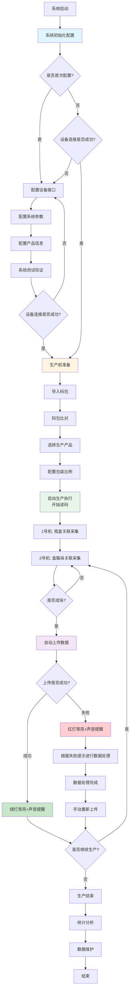
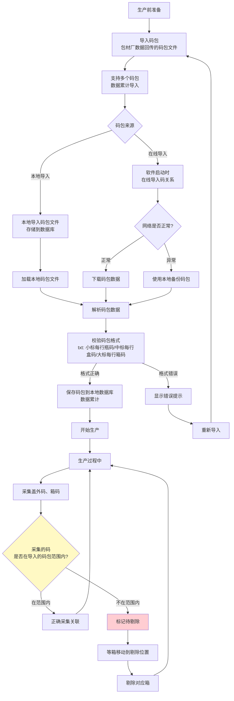
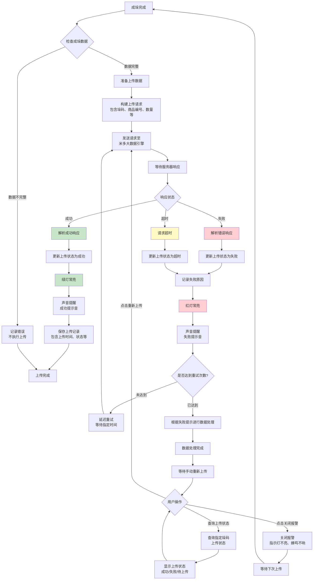
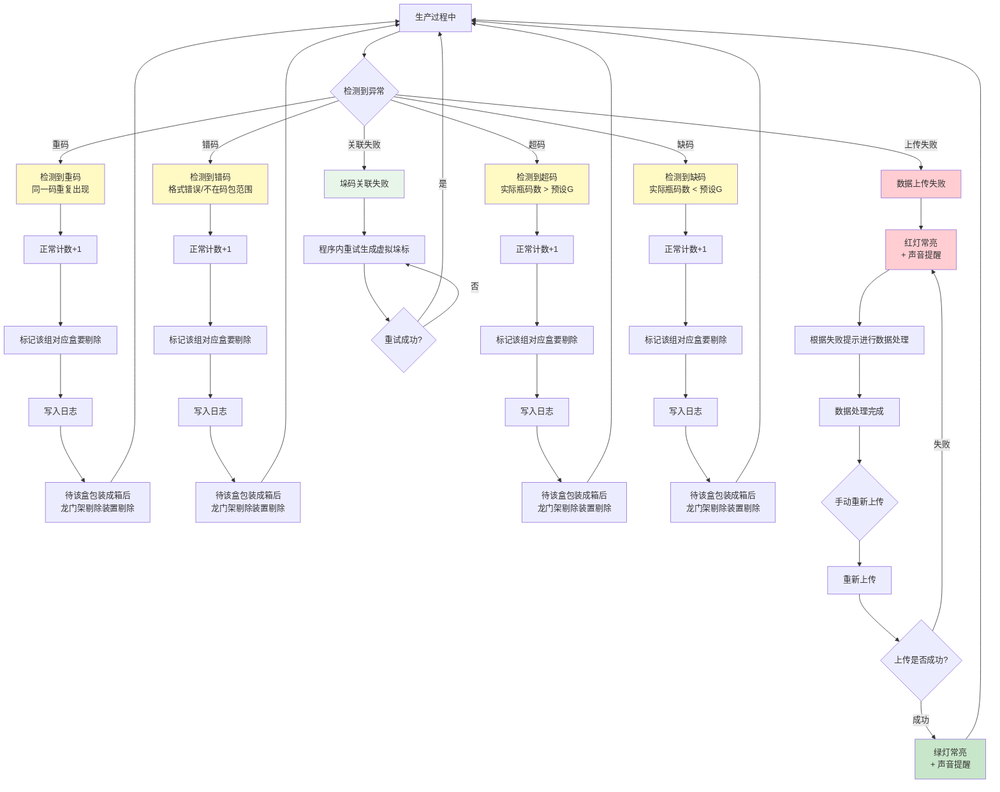

## 一、文档头


| 项目     | 内容                                                   |
| ------ | ---------------------------------------------------- |
| 文档名称   | 赋码采集关联系统重构T1.2（石湾）- AI文档                             |
| 产品线/模块 | 赋码采集关联系统 / 石湾产线                                      |
| 版本     | T1.2                                                 |
| 迭代类型   | 重构升级迭代                                               |
| 作者     | 魏喜胜                                                  |
| 审批人    | 伍林波                                                  |
| 创建日期   | 2026-02-04                                           |
| 更新时间   | 2026-02-06、02-12、02-13、02-15、02-16、02-17、02-20、02-25 |


## 二、项目目的

### 2.1 商业目标

| 目标 | 说明 |
|-----|------|
| 技术自主可控 | 将石湾赋码采集关联系统从第三方C#技术栈重构为自主可控的Java技术栈，摆脱对第三方供应商的技术依赖，降低维护成本和响应延迟 |
| 业务功能完善 | 在保持旧版软件核心功能的基础上，新增码包管理、码关系比对、自动上传等关键功能，优化用户体验和操作流程，提升生产效率和数据准确性 |
| 品牌价值提升 | 通过及时响应需求变更、快速修复问题、提供稳定可靠的产品，改善客户使用体验，维护和提升公司品牌形象 |

### 2.2 客户价值

| 价值 | 说明 |
|-----|------|
| 稳定性提升 | 解决旧版软件问题频发、维护不及时的问题，提供稳定可靠的软件系统，减少因软件故障导致的生产中断和数据错误 |
| 功能增强 | 新增码包导入、码关系比对、自动上传等功能，提升数据管理能力和追溯准确性，减少人工操作和错误风险 |
| 操作优化 | 通过按钮帮助提示、密码保护等设计优化，降低误操作风险，提升操作人员的使用体验和工作效率 |

## 三、现状背景与问题陈述

### 3.1 现状背景

**业务现状**：

| 项目 | 内容 |
|-----|------|
| 硬件配置 | 工控机2台、采集相机5台、箱剔除装置、报警灯2盏 |
| 1号机 | 2台瓶码采集相机交叉去重采集瓶数据，1台盒码采集相机采集盒数据 |
| 2号机 | 接收1号机数据，1台盒码采集相机采集盒数据，进行盒箱垛关联 |
| 现状问题 | 软件使用过程中几乎每天都会出现问题，有大有小，大问题需要手动操作数据库修正数据 |

### 3.2 问题陈述

| 问题类型 | 具体表现 |
|---------|---------|
| 技术依赖问题 | 第三方开发的软件维护工作不及时，出现问题时掣肘较大；有需求变更时不能及时响应，对公司品牌造成一定影响 |
| 功能缺失问题 | 缺少码包导入和管理功能、码关系比对功能、操作帮助提示 |
| 数据质量问题 | 软件使用过程几乎每天都会出现问题，影响入库和出货；大问题需手动改库修正，效率低易出错；缺少码包比对机制，米多作为兜底方需校验并告知 |
| 操作安全问题 | 产线重要参数及设置页面缺少密码保护，工人可能误操作改配置导致产线无法生产 |

### 3.3 需求来源

石湾产线日常使用中的问题反馈和功能需求；与致美斋产线软件功能的对比分析；产线操作人员的实际使用体验反馈。

## 四、用户范围

### 4.1 核心用户角色

| 角色 | 重要度 | 职责 | 诉求 |
|-----|-------|------|------|
| 生产线操作员 | 主要 | 日常生产操作，使用软件进行生产任务执行和数据采集 | 简单易用界面、清晰状态提示和报警信息、操作帮助提示、最小化人工干预支持无人值守 |
| 生产管理员 | 重要 | 生产计划制定、任务分配、数据查询分析、数据维护 | 实时生产进度监控、码包导入和管理、数据查询和维护、异常情况及时预警 |
| 系统管理员 | 次要 | 系统配置、设备管理、参数设置 | 系统参数配置、设备连接和状态监控、密码保护机制、系统日志和异常信息查看 |
| 质量管理员 | 次要 | 产品质量追溯、问题排查、数据统计 | 完整产品追溯链路（四级关联：瓶-盒-箱-垛）、快速问题定位、码关系查询和维护、详细质量统计报表 |

### 4.2 用户使用场景

| 场景 | 主要动作 |
|-----|---------|
| 日常生产场景 | 操作员启动软件、选择生产产品、开始数据采集；系统自动采集瓶码盒码箱码建立四级关联；达到预设数量后自动生成垛码；系统自动上传数据，回传信息控制指示灯和声音提醒 |
| 数据维护场景 | 管理员导入码包数据、进行码关系比对；发现包材损坏等进行码替换；查询码关系排查质量问题；处理异常数据、取消关联操作 |
| 系统配置场景 | 系统管理员配置读码器、扫码枪等设备参数；设置包装比例、超时时间等业务参数；配置报警灯、剔除装置等硬件设备 |

## 五、实现思路

### 5.1 产品定位

赋码采集关联系统重构T1.2（石湾版）在保持旧版核心功能基础上，采用 Java11+JavaFX17 技术栈重构升级的**系统级桌面应用程序**。软件定位为**石湾产线专用的四级关联采集关联系统**，由两个独立软件组成：**瓶盒关联软件（1号机）和盒箱垛关联软件（2号机）**，共同完成瓶-盒-箱-垛四级码关联，提供码包管理、数据采集、关联建立、数据上传等完整功能。

### 5.2 结构归母

本软件属于**赋码采集关联系统产品线**下的**石湾产线专用系统级版本**，与致美斋产线二级关联版本属同一产品线不同业务场景适配。采用统一 Java 技术架构和开发规范，针对石湾产线四级关联模式和硬件配置专门适配。

| 软件 | 部署 | 职责 |
|-----|------|------|
| 瓶盒关联软件（1号机） | 工控机1号机 | 瓶盒关联数据采集 |
| 盒箱垛关联软件（2号机） | 工控机2号机 | 盒箱垛关联数据采集、数据管理、数据上传 |

### 5.3 设计理念

| 理念 | 要点 |
|-----|------|
| 功能完整性 | 保持旧版所有核心功能，新增码包管理、码关系比对、自动上传 |
| 操作友好性 | 按钮帮助提示（"？"）、密码保护、清晰状态提示 |
| 技术先进性 | Java11+JavaFX17，可维护、可扩展、稳定 |
| 数据准确性 | 码包比对、重码检测、数据校验 |

### 5.4 设计思路

**双软件架构**：保持两个独立软件，分别打包出两个安装程序，共用部分代码复用。详见**八、页面清单与关系**。

| 设计要点 | 说明 |
|---------|------|
| 包装比例 | 必须通过配置参数设置（G/N/M 可配置），不能写死在代码中 |
| 码位数配置 | 系统设置中配置大标、中标、小标位数；采集时校验，不符则告警关联失败；-1 表示不校验 |
| 码包在线拉取 | 统一 URL + type 参数；不通过系统配置；URL 和 type 由代码或配置文件提供 |
| 新增功能 | 码包导入与比对、自动上传与指示灯控制 |
| 设计优化 | 操作帮助（按钮旁"？"）、重要参数密码保护（详见十一） |

## 六、版本迭代规划

### 6.1 迭代阶段划分

**T1.2版本（当前迭代）**：

| 维度 | 内容 |
|-----|------|
| 目标 | 完成石湾产线软件重构，实现旧版功能同步和新增功能开发 |
| 1号机功能 | 数据采集、系统设置 |
| 2号机功能 | 数据采集、手工采集、码包管理、数据查询、数据替换、取消关联（单个+批量合并）、生产统计、数据上传、系统设置 |
| 新增功能 | 码包导入、码包下载和比对、自动上传和指示灯控制 |
| 设计优化 | 操作帮助提示、密码保护机制、取消关联功能合并优化 |
| 交付物 | 瓶盒关联软件安装程序（1号机）、盒箱垛关联软件安装程序（2号机）、技术文档（含共用部分说明）、用户手册（两个软件分别说明） |

---

## 八、页面清单与关系

### 8.1 软件架构说明

```
┌─────────────────────────────────────────────────────────────────────────────┐
│  石湾赋码采集关联系统（双软件，两套安装包）                                    │
├─────────────────────────────────────────────────────────────────────────────┤
│                                                                             │
│  ┌──────────────────────┐         ┌──────────────────────┐                 │
│  │ 瓶盒关联（1号机）     │         │ 盒箱垛关联（2号机）    │                 │
│  │ 工控机1号机           │         │ 工控机2号机            │                 │
│  ├──────────────────────┤         ├──────────────────────┤                 │
│  │ P01-01 数据采集       │   DB    │ P02-01 数据采集       │                 │
│  │ P01-02 系统设置       │ ──────→ │ P02-02 手工采集       │                 │
│  │                      │ 同步    │ P02-03 码包管理       │                 │
│  │ 数据库：访问2号机DB   │         │ P02-04~08 数据管理    │ ──→ 米多大数据   │
│  │ 必配：2号机IP、端口、 │         │ P02-09 系统设置       │                 │
│  │ 库名、用户、连接测试  │         │ 数据库：本机部署，1号机访问 │                 │
│  └──────────────────────┘         └──────────────────────┘                 │
│           │                                  │                              │
│           └──────────────┬───────────────────┘                              │
│                          ↓ 共用                                              │
│  ┌─────────────────────────────────────────────────────────────────────┐   │
│  │ 底层：Java11+JavaFX17、DB访问、设备驱动、工具类                        │   │
│  │ UI：表格、表单、按钮、消息、状态标签、密码、帮助                        │   │
│  │ 业务：码包、查询、替换、取消关联（仅2号机）                             │   │
│  └─────────────────────────────────────────────────────────────────────┘   │
└─────────────────────────────────────────────────────────────────────────────┘
```

| 软件 | 部署 | 页面数 | 数据库 |
|-----|------|-------|-------|
| 瓶盒关联 | 1号机 | 2 | 访问2号机DB，必配：2号机IP、端口、库名、用户、连接测试 |
| 盒箱垛关联 | 2号机 | 9 | 本机部署，供1号机+2号机共用 |

**码位数配置**（系统设置中新增）：支持配置大标、中标、小标的位数（输入框）。采集校验时，若实际采码位数与配置不符则异常告警、关联失败。-1 表示不校验该类型位数。

### 8.2 页面清单

#### 8.2.1 瓶盒关联软件（1号机）页面清单


| 页面编号   | 页面名称     | 页面类型 | 功能描述           | 所属软件   |
| ------ | -------- | ---- | -------------- | ------ |
| P01-01 | 主界面-瓶盒关联 | 功能页面 | 1号机瓶盒关联数据采集主界面 | 瓶盒关联软件 |
| P01-02 | 系统设置     | 弹窗页面 | 设备配置、参数设置      | 瓶盒关联软件 |


#### 8.2.2 盒箱垛关联软件（2号机）页面清单


| 页面编号   | 页面名称      | 页面类型 | 功能描述                                     | 所属软件    |
| ------ | --------- | ---- | ---------------------------------------- | ------- |
| P02-01 | 主界面-盒箱垛关联 | 功能页面 | 2号机盒箱垛关联数据采集主界面                          | 盒箱垛关联软件 |
| P02-02 | 手工采集      | 功能页面 | 相机损坏时瓶盒关联备用方案，仅支持瓶盒关联                    | 盒箱垛关联软件 |
| P02-03 | 码包管理      | 功能页面 | 码包导入与管理（Tab 内容区）；比对逻辑在采集时使用              | 盒箱垛关联软件 |
| P02-04 | 数据查询      | 功能页面 | 单一查询，输入码后查出该码所属垛的全部数据（垛-箱-盒-瓶）；左侧分层表格，右侧详情；输入码对应单元格红色字体，选中行展示详情 | 盒箱垛关联软件 |
| P02-05 | 数据替换      | 功能页面 | 码替换功能（已有功能：码替换，供参考）                      | 盒箱垛关联软件 |
| P02-06 | 取消关联      | 功能页面 | 单个取消关联和批量取消关联（合并为一个功能模块）                 | 盒箱垛关联软件 |
| P02-07 | 生产统计      | 功能页面 | 生产数据统计（垛数可点击查看列表，支持筛选）和上传状态查询            | 盒箱垛关联软件 |
| P02-08 | 数据上传      | 功能页面 | 手动上传、上传信息展示区（接收自动上传日志）、垛码状态查询与管理         | 盒箱垛关联软件 |
| P02-09 | 系统设置      | 弹窗页面 | 设备配置、参数设置                                | 盒箱垛关联软件 |


#### 8.2.3 共用弹窗页面清单


| 页面编号   | 页面名称 | 页面类型 | 功能描述                                              | 所属软件   |
| ------ | ---- | ---- | ------------------------------------------------- | ------ |
| P03-01 | 操作帮助 | 弹窗页面 | 系统操作指南、功能说明、常见问题及异常处理；通过菜单「帮助(H)」→「操作帮助」触发，两个软件共用 | 两个软件共用 |


### 8.3 页面关系

#### 8.3.1 瓶盒关联软件（1号机）页面关系

- **弹窗形式**：P01-02（系统设置）通过菜单「配置」以模态对话框打开；P03-01（操作帮助）通过菜单「帮助(H)」→「操作帮助」以模态对话框打开
- **数据流向**：P01-01（瓶盒关联）→ 数据同步（数据库/网络）→ P02-01（盒箱垛关联）

#### 8.3.2 盒箱垛关联软件（2号机）页面关系

- **Tab形式**：P02-01~08 共8个Tab，点击切换
- **弹窗形式**：P02-09（系统设置）通过菜单「配置」以模态对话框打开；P03-01（操作帮助）通过菜单「帮助(H)」→「操作帮助」以模态对话框打开
- **数据流向**：P01-01 → 数据同步 → P02-01；P02-01 → 数据上传 → 米多大数据引擎
- **功能依赖**：P02-01 采集时使用 P02-03 提供的码包数据；P02-08 依赖 P02-01 的成垛数据

#### 8.3.3 共用弹窗页面关系

P03-01（操作帮助）由两个软件共用，分别通过各自的菜单「帮助(H)」→「操作帮助」触发

## 九、整体业务流程

### 9.1 业务流程阶段划分

#### 9.1.1 整体业务流程图




#### 9.1.2 业务流程阶段说明

| 阶段 | 角色 | 动作 | 页面 | 产出物 |
|-----|------|------|------|-------|
| 阶段一：系统初始化配置 | 系统管理员 | 配置设备接口、系统参数、产品信息；配置完成后校验设备连接（首次+非首次启动均需） | P01-02、P02-09 | 系统配置参数、设备连接状态 |
| 阶段二：生产前准备 | 生产管理员 | 导入码包、选择生产产品、配置包装比例 | P02-03、P01-01、P02-01 | 码包数据、产品名称、产品编号、生产单号 |
| 阶段三：生产执行 | 生产线操作员 | 启动采集、监控状态、处理异常 | P01-01、P02-01 | 四级关联数据（瓶-盒-箱-垛） |
| 阶段四：数据上传 | 系统自动执行 | 自动上传、状态反馈、指示灯控制 | P02-08 | 上传状态、指示灯状态 |
| 阶段五：数据维护 | 生产管理员、质量管理员 | 查询码关系、替换码、取消关联（单个+批量） | P02-04、P02-05、P02-06 | 修正后的数据 |
| 阶段六：统计分析 | 生产管理员、质量管理员 | 查询生产统计、查询上传状态 | P02-07、P02-08 | 统计数据、上传状态报告 |

#### 9.1.3 码包比对流程图




**码包比对流程说明**：详见**十、全局规则库**10.1.1。

### 9.2 核心业务流程：四级关联采集流程

**模式43：商品包装比例为1：M：N：G（石湾产线模式）** — 1垛:M箱:N盒:G瓶（最小计量单位），可配置。

**工厂实际链路说明**（供参考）：
1. 2台瓶码采集相机采集瓶码
2. 6瓶推入盒包装，继续移动，盒码采集相机读取盒码并关联
3. 至此1号机瓶盒关联逻辑结束
4. 盒继续在产线移动，工人包装4盒到一箱，过龙门架
5. 龙门架有2台相机：侧边相机读箱码，上边相机扫4个盒码，校验盒箱关系
6. 校验不通过或之前标记要剔除的，龙门架剔除装置剔除，工人不装垛

#### 9.2.1 四级关联采集流程图

```mermaid
graph TD
    Start[生产任务启用] --> CheckCode[码包比对<br/>生产前]
    CheckCode --> CheckResult{包材厂数据回传?}
    CheckResult -->|有数据回传| NormalCheck[正常比对]
    CheckResult -->|无数据回传| MidoCheck[软件校验并告知操作人员]
    NormalCheck --> Stage1
    MidoCheck --> Stage1
    
    Stage1[阶段1: 瓶盒关联 - 1号机]
    Stage1 --> CollectBottle[2台瓶码采集相机<br/>采集瓶码]
    CollectBottle --> ValidateBottle{校验瓶码有效性}
    ValidateBottle -->|有效| CountBottle[瓶码计数+1]
    ValidateBottle -->|无效<br/>重码/错码| MarkBox[正常计数+1<br/>标记该组对应盒要剔除]
    CountBottle --> CheckBoxCount{计数达到G个?<br/>可配置，如6瓶}
    MarkBox --> CheckBoxCount
    CheckBoxCount -->|否| CollectBottle
    CheckBoxCount -->|是| BoxPack[6瓶推入盒包装<br/>继续移动]
    BoxPack --> CollectBox[盒码采集相机<br/>读取盒码]
    CollectBox --> ValidateCount{校验瓶码实际数量<br/>与预设G比较}
    ValidateCount -->|=G 正常| CountBox[盒码计数+1<br/>建立盒码关联]
    ValidateCount -->|大于G 超码| MarkCountBox[正常计数+1<br/>标记该盒要剔除]
    ValidateCount -->|小于G 缺码| MarkCountBox
    MarkCountBox --> CountBox
    CountBox --> SyncData[瓶盒关联数据<br/>同步至2号机]
    
    SyncData --> Stage1End[1号机瓶盒关联逻辑结束]
    Stage1End --> Stage2[阶段2: 盒箱垛关联 - 2号机]
    
    Stage2 --> Conveyor[盒继续在产线移动]
    Conveyor --> ManualPack[工人包装4盒到一箱]
    ManualPack --> Gate[过龙门架]
    Gate --> GateCamera[龙门架2台相机:<br/>侧边读箱码+上方扫4盒码]
    GateCamera --> CheckMarked{该箱是否<br/>已标记要剔除?}
    CheckMarked -->|是| MarkReject[执行剔除]
    CheckMarked -->|否| ValidateBoxCarton[校验盒箱关系<br/>4盒码与箱码对应]
    ValidateBoxCarton -->|校验不通过| MarkReject
    ValidateBoxCarton -->|校验通过| ValidateCarton{校验小标/中标/大标<br/>码包比对}
    ValidateCarton -->|无效或码包不通过| MarkReject
    ValidateCarton -->|有效且码包通过| CountCarton[箱码计数+1<br/>建立盒箱关联]
    MarkReject --> RejectGate[龙门架剔除装置剔除<br/>工人不装垛]
    RejectGate --> NextBox[下一箱]
    
    CountCarton --> LoadPallet[工人正常装垛<br/>未剔除即上垛]
    LoadPallet --> CheckPalletCount{计数达到M个?<br/>可配置，如70箱}
    CheckPalletCount -->|否| NextBox
    CheckPalletCount -->|是| AssociatePallet[生成虚拟垛标<br/>关联垛码]
    NextBox --> Gate
    
    AssociatePallet --> GenPallet[生成虚拟垛标<br/>一般不会失败]
    GenPallet --> RetryCheck{极端失败?}
    RetryCheck -->|是| RetryGen[程序内重试生成]
    RetryGen --> GenPallet
    RetryCheck -->|否| SuccessPallet[建立完整码关系]
    SuccessPallet --> AutoUpload[自动上传数据<br/>至米多大数据引擎]
    
    AutoUpload --> UploadResult{上传是否成功?}
    UploadResult -->|成功| GreenLight[绿灯常亮<br/>+ 声音提醒]
    UploadResult -->|失败| RedLight[红灯常亮<br/>+ 声音提醒]
    GreenLight --> Complete[完成一垛的采集生产]
    RedLight --> RetryUpload[手动重新上传]
    RetryUpload --> AutoUpload
    
    style Stage1 fill:#e3f2fd
    style Stage2 fill:#e8f5e9
    style Stage1End fill:#e3f2fd
    style Gate fill:#fff3e0
    style GateCamera fill:#fff3e0
    style CheckMarked fill:#fff9c4
    style RejectGate fill:#ffcdd2
    style ValidateBottle fill:#fff9c4
    style ValidateCount fill:#fff9c4
    style MarkCountBox fill:#ffcdd2
    style ValidateCarton fill:#fff9c4
    style GenPallet fill:#e8f5e9
    style SuccessPallet fill:#c8e6c9
    style GreenLight fill:#c8e6c9
    style RedLight fill:#ffcdd2
```




#### 9.2.2 关键控制点

| 控制点 | 说明 |
|-------|------|
| 码包比对 | 生产前导入、成垛前校验；米多兜底 |
| 剔除控制 | 龙门架剔除；瓶码无效时标记待剔除 |
| 虚拟垛标 | 程序内重试，无需手动修正 |
| 自动上传 | 失败→数据处理→手动重传 |
| 设计考虑 | 剔除标记在产线中保留，剔除位置可读取 |

#### 9.2.3 数据上传流程图




### 9.3 异常处理流程

#### 9.3.1 异常处理流程图




#### 9.3.2 异常处理说明

详见**十、全局规则库**10.1.2 数据采集规则（码有效性）、10.1.3 数据关联规则（含虚拟垛标生成规则）、10.1.4 数据上传规则。

## 十、全局规则库

### 10.1 业务规则

#### 10.1.1 码包管理规则

**页面职责**：码包导入（在线/本地/更新）、列表展示、查看/删除；**不展示比对结果**，比对逻辑在采集流程内执行。

**支持的码包类型**：盖外码小标、盒外码中标、箱外码大标。

| 规则类型 | 要点 |
|---------|------|
| 导入 | 包材厂回传文件；多码包累加；按名称搜索；不存内码；在线+本地；本地导入时用户选择类型；在线导入时统一 URL + type 参数（不通过系统配置） |
| 格式 | txt；盖外码小标=每行一个瓶码；盒外码中标=每行一个盒码；箱外码大标=每行一个箱码 |
| 比对 | 采集码在对应类型码包范围内→正常关联；不在→标记剔除 |
| 删除 | 仅当该码包内**无任何已关联码**时允许删除；存在已关联码则禁止（码替换时新码需在码包内校验） |
| 使用完 | 码包内码全部关联后保留在库，不可删除；T1.2 期不自动归档 |
| 米多兜底 | 无包材厂回传时，软件校验并告知 |

**成垛前码包比对**（每箱采集完成、判断成垛前执行）：
```
小标校验：箱内瓶码 ∈ 盖外码小标码包？ ─否→ 标记剔除
中标校验：箱内盒码 ∈ 盒外码中标码包？ ─否→ 标记剔除
大标校验：箱码 ∈ 箱外码大标码包 且 不重复？ ─否→ 标记剔除
通过条件：小标✓ 且 中标✓ 且 大标✓ → 计入箱数、参与成垛
```

#### 10.1.2 数据采集规则

**四级关联**（G/N/M 可配置）：
```
瓶码(2相机去重) → 每G瓶→1盒码 → 每N盒→1箱码 → 每M箱→1垛码(虚拟)
```

**码有效性**：

| 类型 | 判定 | 处理 |
|-----|------|------|
| 有效码 | 合格 | 计数+1 |
| 重码 | 系统中已存在 | 计数+1，标记盒剔除，写日志 |
| 错码 | 格式错误/不在码包 | 同上 |
| 超码 | 瓶码数>G | 同上 |
| 缺码 | 瓶码数<G | 同上 |

**码位数校验**（系统设置可配置大标、中标、小标位数）：采集时校验实际采码位数是否与配置一致。例如大标配置6位，实际采到7位→不符合大标要求→异常告警、关联失败。-1 表示不校验该类型位数。

**剔除控制**：龙门架剔除（盒箱校验不通过/码包不通过/已标记）；1号机标记→数据同步2号机→产线到达时按箱剔除

**剔除后工人处理规则**（前提：实物不丢弃，最小影响生产）

| 剔除场景 | 工人实物处理 | 工人系统操作 |
|---------|-------------|-------------|
| 瓶码重码/错码/超码/缺码 | 开箱换问题瓶或整盒 | 实物修复→**重新上线**→系统重采 |
| 盒箱校验不通过 | 核对4盒与箱码，换错盒/错箱 | 同上 |
| 小标/中标/大标码包不通过 | 换瓶/盒/箱使码在对应类型码包范围内 | 同上 |
| 已标记要剔除的箱 | 按1号机异常类型处理 | 同上 |

**成垛数据中码错误**（实物未剔除）：

| 场景 | 工人系统操作 |
|-----|-------------|
| 码损坏/印刷错误 | **码替换**：扫旧码→扫新码→密码确认；新码须在码包内且未用 |
| 关联关系错误 | **取消关联**：垛→箱→盒→瓶逐级解除；已上传先解云端 |

**相机损坏**：**手工采集**（P02-02）瓶盒关联，人工扫码补录。

#### 10.1.3 数据关联规则

| 规则 | 要点 |
|-----|------|
| 瓶盒关联(1号机) | 2相机采瓶码；无效仍计数+标记剔除；每G瓶→1盒码；实时同步2号机 |
| 盒箱垛关联(2号机) | 接收1号机；每N盒→1箱；成垛前码包比对；每M箱→1垛(虚拟垛标) |
| 强制满垛 | 未达M箱可强制结束，忽略箱数差异 |
| 提取未成垛 | 输入/扫箱码→查订单→确认→回显主页面继续生产 |

**虚拟垛标生成规则**（格式在系统设置→基础设置→虚拟垛标规则中配置）：
| 项目 | 规则 |
|------|------|
| 生成时机 | 箱码计数达到 M 箱（可配置）时触发 |
| 生成方式 | 程序自动生成虚拟垛标，建立 M 箱与垛码的关联 |
| 格式 | 前缀+年月日+序号+产线号，如 V20260226001A、V20260226002A；前缀默认 V、时间取当前日期、序号 3 位起自动递增、产线号可配置 |
| 配置位置 | 系统设置→基础设置→虚拟垛标规则 |
| 成功 | 一般情况生成成功，计入垛数、触发自动上传 |
| 失败处理 | 极端失败时程序内自动重试；无需人工干预 |

**退出软件前判断**：
```
点击退出
  ↓
是否在采集中？ ─是→ 提示「请先停止采集」→ 停止后再判断
  ↓ 否
是否满垛？ ─否→ 弹窗「存在未满垛(X箱)，是否暂存？」
  ↓              ├ 暂存 → 存库标记未成垛 → 允许退出
  ↓              ├ 不暂存 → 允许退出
  ↓              └ 取消 → 返回主界面
  ↓ 是/无未满垛
常规退出确认 → 退出
```
1号机：若有未同步数据，提示确认；2号机按上述执行。

#### 10.1.4 数据上传规则

| 规则 | 要点 |
|-----|------|
| 自动上传 | 成垛→上传米多；成功=绿灯+声音；失败=红灯+声音+报警 |
| 关闭报警 | 主界面按钮，重置灯/蜂鸣 |
| 状态管理 | 失败→数据处理→手动重传；支持查询/重置未上传/标记已上传 |

#### 10.1.5 数据维护规则

**码替换**：盖外码/盒码/箱外码；扫旧码→扫新码→密码123456确认；新码须在码包内、未使用、格式正确、≠原码；记日志。

**取消关联**（单个+批量，同页Tab切换）：

| 规则 | 要点 |
|-----|------|
| 确认 | 弹窗二次确认+密码123456 |
| 解除顺序 | 垛→箱→盒→瓶，从大到小逐级，不可一次全解 |
| 识别展示 | 显示上级关联、完整链路，提示从最高层解除 |
| 云端检查 | 已上传→先查云端→云端解除→再处理本地 |
| 单个模式 | 扫同包装内两码→识别→解除该包装全部关联 |
| 批量模式 | 扫大码→识别包装单元→批量解除 |

### 10.2 权限规则

#### 10.2.1 操作权限

| 角色 | 权限 |
|-----|------|
| 生产线操作员 | 查看主界面数据采集信息；启动/停止数据采集；查看操作日志和异常信息；查看数据查询结果（只读，仅2号机） |
| 生产管理员 | 所有操作员权限；码包导入和管理；数据查询、码替换、取消关联；生产统计查询；数据上传管理 |
| 系统管理员 | 所有生产管理员权限；系统设置和参数配置（需密码保护）；设备配置和管理；取消关联、码替换（均需密码123456） |

#### 10.2.2 密码保护规则

**需要密码保护的功能**：系统设置页面（设备配置、参数设置、码位数配置）；取消关联操作（单个和批量）；码替换操作；重要参数修改（包装比例、超时时间等）。密码：123456。

**密码保护机制**：访问时弹窗提示输入密码；输入错误提示错误信息不允许继续；验证成功后允许操作，每次访问都需重新验证（不保存登录状态）。

## 十一、全局非功能性需求

### 11.1 性能需求

| 类型 | 指标 |
|-----|------|
| 响应时间 | 码识别≤100ms、界面操作≤500ms、界面切换≤1秒、数据查询≤3秒、数据上传≤5秒、码包比对≤10秒 |
| 吞吐量 | 每分钟处理≥1000个码；单机单用户；24小时×7天连续运行；最多5台相机 |
| 资源占用 | CPU≤50%、内存≤2GB、磁盘增长≤500MB/月、启动≤30秒 |

### 11.2 可靠性需求

| 类型 | 指标 |
|-----|------|
| 系统可用性 | ≥99.5%；7×24连续运行；异常自动恢复 |
| 数据准确性 | 数据/码识别/关联关系准确性≥99.9% |
| 故障恢复 | ≤3分钟；断电保护数据不丢失；异常数据自动修复 |
| 数据备份 | 每日自动备份保留30天；UPS断电保护；数据库定期备份 |
| 系统稳定性 | 连续运行7天无崩溃；无内存泄漏；异常时优雅降级 |

### 11.3 安全性需求

| 类型 | 要点 |
|-----|------|
| 数据安全 | 敏感配置加密存储；本地数据库访问控制；不存储内码 |
| 操作安全 | 完整操作日志；重要操作密码保护；支持屏幕锁定 |
| 系统安全 | 防SQL注入；防未授权访问；操作审计和日志追溯 |

### 11.4 可维护性需求

| 类型 | 要点 |
|-----|------|
| 代码规范 | 遵循Java开发规范；MVC模式；注释完整 |
| 文档完整 | 技术文档、用户手册、API文档、数据库设计文档 |
| 监控告警 | 本地监控和声光报警；异常日志记录；远程桌面维护（可选） |
| 日志分析 | 运行日志；日志级别配置；日志轮转和清理 |
| 版本管理 | 应用版本自动更新；配置参数版本管理；数据库版本迁移 |

### 11.5 兼容性需求

| 类型 | 要点 |
|-----|------|
| 操作系统 | Windows 7及以上、Windows 10/11、Windows Server 2016/2019/2022 |
| 运行环境 | Java 11/17/21 JRE、JavaFX 17 |
| 数据库 | MySQL 8.0+、连接池、主从复制（可选） |
| 硬件 | 最低4GB推荐8GB内存、100GB磁盘、分辨率1024x768~1920x1080、鼠标键盘及触摸屏（可选） |
| 设备接口 | RS232/RS485、TCP/IP、USB、Modbus（PLC通信） |

### 11.6 用户体验需求

| 类型 | 要点 |
|-----|------|
| 界面设计 | 文字最小16px、重要信息20px以上加粗；按钮≥48×80px；输入框≥48px；减少弹窗 |
| 操作友好性 | 按钮旁"？"帮助；清晰状态提示和声光报警；操作反馈及时 |
| 容错设计 | 异常优雅处理；清晰错误提示；操作撤销和恢复（如适用） |

## 十二、调用公共组件和UI规则库

### 12.0 共用组件架构说明

两个独立软件的共用部分（底层框架、业务组件、UI组件、数据同步）详见**八、页面清单与关系**之 8.1。共用部分作为独立Maven模块或JAR包，两软件分别引用，打包时分别打包成两个安装程序。

### 12.1 公共组件

| 组件 | 规格 |
|-----|------|
| 数据表格 | 分页10/20/50/100条（默认20）；排序、筛选；行选择；表头18px加粗、内容16-18px；行高≥48px、斑马纹；超长换行、悬停提示 |
| 表单组件 | 输入框/下拉≥48px、文字18px；标签18px加粗；复选框/单选框≥24×24 |
| 按钮组件 | ≥48×80px；文字18-20px加粗；间距≥12px；主操作醒目背景；危险操作红色 |
| 消息提示 | 成功绿/警告橙/错误红，字≥20px；区域高度≥60px |
| 状态标签 | 高≥36px、内边距≥8px、字18px；不同状态不同颜色 |
| 密码输入 | 显示/隐藏切换；验证失败错误提示；高48px、字18px |
| 帮助提示 | 按钮旁"？"，点击显示帮助；帮助信息≥18px |

### 12.2 UI规则库

| 类型 | 规则 |
|-----|------|
| 字体规则 | 主字体微软雅黑；标题24-32px、重要20-24px、正文18-20px、表头18px、表格内容16-18px、按钮18-20px；最小≥14px |
| 颜色规则 | 主色#4a90e2；成功#4CAF50、警告#FF9800、错误#F44336；对比度≥4.5:1 |
| 布局规则 | 左340px、中自适应(最小600px)、右336px；左=订单/规格/上传区、中=接收/日志/报警、右=统计/控制；最大宽1276px；间距≥16px、内边距≥20px |
| 交互规则 | 页面内操作优先、减少弹窗；删除/退出等不可逆操作用弹窗确认；反馈及时 |
| 表格设计 | 边框≥1px、行高≥48px、斑马纹；超长换行+悬停18px提示；列宽≥80px；操作按钮间距≥16px |

